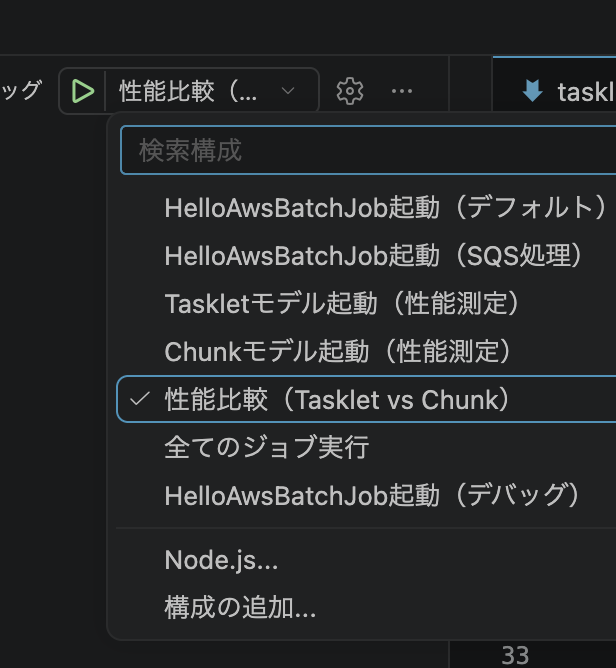

TaskLetとchunkの比較
1. 性能検証結果と考察（Tasklet vs Chunk　chunkサイズ10000件）
1000万件のデータ処理検証において、Taskletモデル（約34.1秒）がChunkモデル（約42.8秒）よりも高速に処理を完了した。この逆転現象が生じた要因と、実務における技術的考察は以下の通りである。

逆転現象の要因（インメモリ処理の特性）
実DBへのネットワークI/O（通信）が発生しない純粋な内部処理であったためである。外部通信がない環境下では、Taskletは純粋なCPU上のループ処理（Javaのforループ等）となるため極めて高速に動作する。

Chunkモデルのオーバーヘッド
Chunkモデルは、一定件数（チャンク）ごとのメモリ集約、疑似的なトランザクション境界の分割、およびJobRepositoryへの進捗メタデータの記録など、フレームワークによる「安全装置（状態管理）」を裏側で実行している。実DB接続がない状態では、この緻密な管理プロセス自体が処理の足枷（オーバーヘッド）となる。

考察の結論（実務における使い分け）
ネットワーク越しの実DB通信を伴う大量データ処理においては、通信回数を劇的に削減できるChunkモデル（バルクインサート等）が圧倒的に有利となる。一方、外部通信を伴わないフラグ制御や内部計算のみの処理であれば、フレームワークのオーバーヘッドを伴わないTaskletモデルを選択するのがアーキテクチャとして適切である。

2.実DBと接続したらどうなるか？
Tasklet内でループ処理を用いて一件ずつInsertを行うと、
１　アプリからDBへ、１件分のINSERT文をネットワーク経由で送信する
２　DBが処理を行い、アプリへレスポンスを送る
この往復が1000万回発生する

逆にChunkの場合だとchunkサイズを10000と設定していた場合
10000件分のINSERT文をメモリ上へストックしてそこからDBに送信する
この往復回数が1000回となるので劇的に性能が上がる。

公式
Spring Batch Reference Documentation: TaskletStep
https://docs.spring.io/spring-batch/reference/step/tasklet.html

3. 基本構成と階層構造
Spring Batchの実行単位は、以下の明確な包含関係と役割で構成される。

JobLauncher: 外部トリガーから呼び出され、Jobを起動する役割。
Job: バッチ処理の全体定義（構成と順序の定義）。
Step: Jobを構成する個々の処理単位。

※一目でjobを確認するなら画像部分か.vscode/launch.json

実処理（Tasklet または Chunk）: Stepの内部で実際に実行されるロジック。

JobRepository: ジョブとステップの実行状態や履歴（メタデータ）をDBに永続化するコンポーネント。Spring Bootの自動構成（Auto Configuration）により、引数に記述するだけでフレームワークから自動注入（DI）されるため、開発者が生成処理を書く必要はない。

3. 非同期処理とキュー（Queue）の役割
JobLauncherを起動する外部トリガーや、データ連携において重要な役割を果たすのが「キュー（Queue）」である。キューは、システム間でデータを非同期に受け渡すための待ち行列システム（AWSのSQSやRabbitMQなど）を指す。

役割: 別のシステムやユーザーの画面操作で発生した「処理要求（メッセージ）」をキューに順次溜めておき、バッチ処理（ワーカー）がそれを定期的に取得（ポーリング）して処理を実行する。

メリット: アクセスが急増して要求が殺到した際でも、データはキューに安全に保持される。バッチ側は自身の処理能力のペースに合わせてデータを取得できるため、サーバーのメモリやCPUをパンクさせることなく、安定して処理を継続できる。

4. Stepの実装モデル（TaskletとChunk）
Jobを構成するStepの実処理には2種類のモデルが存在する。両者は対等な選択肢であり、フレームワーク仕様としてどちらかが優先されることはない。用途に応じて適切なモデルを選択する。

Taskletモデル
仕様: Taskletインターフェースのexecute()メソッドに一連の処理を記述する方式。アーキテクチャ上はWebのController層に相当し、ビジネスロジックはService層（トランザクション境界）へ委譲する設計が推奨される。

ユースケース: データ量が少ない処理や、手続き(DBの準備・後片付け（事前/事後処理）フラグ（状態）の管理:)
・システム操作を実装する場面で選択される。
キューの監視とメッセージ取得: キューからメッセージを少数取得し、処理対象か判定するバッチの「トリガー（入り口）」となる処理。
外部APIの単発呼び出し: 外部システムへデータを1回送信して結果を受け取る処理。
ファイルやディレクトリの操作: ZIPファイルの解凍、古いログの削除、連携用ディレクトリの作成。
単発のデータベース操作: 処理開始前の特定テーブルの全件クリア（TRUNCATE）や、ストアドプロシージャの呼び出し。
ステータス制御: 全体の「バッチ実行中フラグ」のオン/オフなどの状態管理。

Chunkモデル
仕様: 処理を ItemReader（読込）、ItemProcessor（加工）、ItemWriter（書込）の3インターフェースに分割する方式。DDDにマッピングする場合、ReaderとWriterはInfrastructure層、ProcessorはApplication層に相当する。指定したチャンクサイズ単位で、フレームワークが自動的にトランザクションを管理（コミット/ロールバック）する。

ユースケース: 大量の「データそのもの」をメモリ枯渇させずに安全に連続処理する場面で選択される。
大容量ファイルのDB取り込み: 数GBある巨大なCSVを1行ずつ読み込み、バリデーションを行い、数千件ごとにまとめてデータベースへ保存する処理。
データベース間の大規模なデータ移行: 古いシステムから対象レコードを読み出し、フォーマット変換後、別データベースへバルクインサート（一括挿入）する処理。
定期的な集計・一括更新処理: 月末に全ユーザーの利用履歴を読み出し、翌月の請求金額を計算して連続で書き込んでいく月次バッチ処理。

4.DB接続時
1. ItemReader ＝ 「少しずつ SELECT する係」
ご想像の通り、SELECT文を発行します。
ただし、1000万件を一度にSELECT *するとJavaのメモリがパンクしてしまうため、Spring BatchのReader（JdbcCursorItemReaderやJpaPagingItemReaderなど）は、「カーソル」や「ページング」という技術を使って、DBから少しずつ（例：1万件ずつ）データを舐めるようにSELECTしてくるという特殊技能を持っている。

2. ItemProcessor ＝ 「Javaのメモリ上で加工・判定する係」
DBとは直接通信しない。ReaderがSELECTしてきた1件のデータ（Javaのオブジェクト）を受け取り、計算したり、ステータスを書き換えたりする。
（例：SELECTしてきたユーザーの年齢を計算し、「大人フラグ」をtrueにする、など）

3. ItemWriter ＝ 「まとめて INSERT / UPDATE / DELETE する係」
Processorが加工し終わったデータを一定の件数（チャンク）までメモリ上に溜め込み、限界に達した瞬間にバルク（一括）でSQLを発行する。

INSERT: 新しいテーブルへデータを移行する時。（INSERT INTO ... VALUES (...), (...), (...)）
UPDATE: 既存データのステータスや金額を更新する時。（UPDATE ... SET ...）
DELETE: 不要になったデータを一括削除する時。（DELETE FROM ... WHERE id IN (...)）

5. 安全装置について
バッチ処理における「安全装置」とは、エラー発生時にデータを保護し、安全に途中からやり直す（リスタートする）ための仕組みである。この安全装置の有無と作動方式が、TaskletとChunkにおける最大の仕様の違いとなる。

2. Taskletの特性（オーバーヘッドの排除）
Taskletは、フレームワーク側で細かな安全装置（途中の状態保存など）を稼働させないモデルである。

ループ処理をTasklet内で記述した場合、途中の進捗をJobRepositoryへ書き込むという足枷（オーバーヘッド）が存在しないため、インメモリ処理においては非常に高速に完了する。
しかし、本番環境で異常終了した場合、「どこまで処理したか」という記録が残らない。そのため、復旧するには開発者自身で未処理データを抽出するロジックを実装するか、データを初期化して最初からやり直す必要がある。

3. Chunkの特性（安全装置による堅牢性）
Chunkは、大量データを安全に処理するために、フレームワークが強固な安全装置を強制的に稼働させるモデルである。

データの処理中、一定件数（チャンク）ごとに「トランザクションの確定（コミット）」と「JobRepositoryへの進捗メタデータの書き込み（UPDATE）」を繰り返す。
この「こまめなDB通信と状態保存」が処理の足枷（オーバーヘッド）となり、Taskletと比較して実行時間が長くなる要因である。しかし、この安全装置が常に稼働しているからこそ、途中でクラッシュしてもデータベースの不整合を防ぎ、未処理箇所から安全にリスタートすることが可能となる。