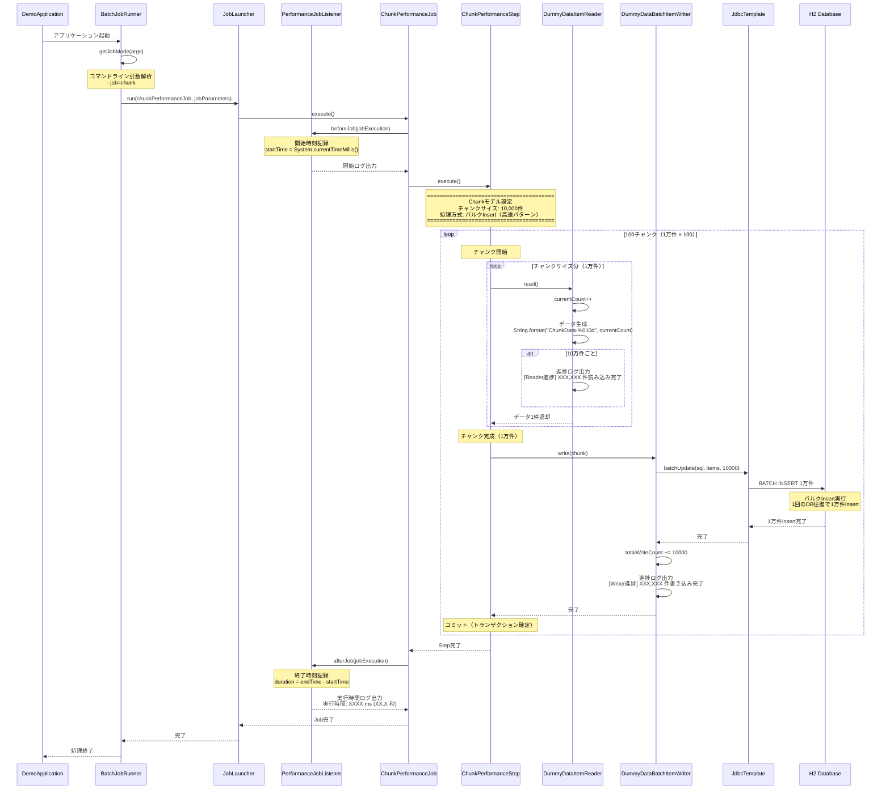
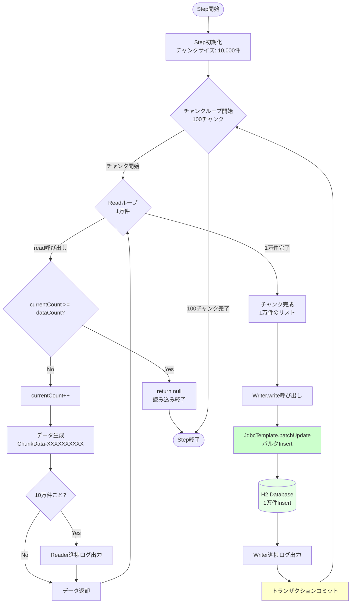

# Chunkモデル 処理フロー詳細

## 📋 概要

**処理方式**: バルクInsert（高速パターン）  
**目的**: Spring Batchのベストプラクティス実装  
**対象データ件数**: 100万件（設定可能）  
**チャンクサイズ**: 10,000件（設定可能）

---

## 🟢 全体処理フロー



---

## 📂 コンポーネント構成

```
ChunkPerformanceJob
  └── ChunkPerformanceStep
        ├── DummyDataItemReader (読み込み)
        └── DummyDataBatchItemWriter (書き込み)
              └── JdbcTemplate (バルクInsert)
                    └── H2 Database
```

---

## 🔧 各コンポーネントの詳細

### 1. BatchJobRunner（起動制御）

**ファイル**: [`BatchJobRunner.java`](../src/main/java/com/example/demo/presentation/runner/BatchJobRunner.java)

**処理内容**:
1. コマンドライン引数から実行モード取得
2. `--job=chunk` の場合、ChunkPerformanceJobを実行
3. JobParametersに現在時刻を設定（Job実行の一意性確保）

**コード抜粋**:
```java
@Override
public void run(String... args) throws Exception {
    String jobMode = getJobMode(args);  // "chunk" を取得
    
    JobParameters jobParameters = new JobParametersBuilder()
            .addLong("time", System.currentTimeMillis())
            .toJobParameters();
    
    if (jobMode.equals("chunk")) {
        jobLauncher.run(chunkPerformanceJob, jobParameters);
    }
}
```

---

### 2. PerformanceJobListener（実行時間計測）

**ファイル**: [`PerformanceJobListener.java`](../src/main/java/com/example/demo/presentation/listener/PerformanceJobListener.java)

**処理内容**: Taskletモデルと同じ

#### beforeJob（Job開始前）
- 開始時刻記録
- Job名と開始時刻をログ出力

#### afterJob（Job終了後）
- 終了時刻記録
- 実行時間計算・ログ出力

**出力例**:
```
========================================
Job開始: ChunkPerformanceJob
開始時刻: Sat Apr 04 10:46:32 JST 2026
========================================

========================================
Job終了: ChunkPerformanceJob
終了時刻: Sat Apr 04 10:46:42 JST 2026
実行時間: 10000 ms (10.0 秒)
ステータス: COMPLETED
========================================
```

---

### 3. ChunkPerformanceJobConfig（Job設定）

**ファイル**: [`ChunkPerformanceJobConfig.java`](../src/main/java/com/example/demo/presentation/config/ChunkPerformanceJobConfig.java)

**処理内容**:

#### Job定義
```java
@Bean
public Job chunkPerformanceJob(
        JobRepository jobRepository,
        Step chunkPerformanceStep,
        PerformanceJobListener performanceJobListener) {
    return new JobBuilder("ChunkPerformanceJob", jobRepository)
            .listener(performanceJobListener)  // 実行時間計測Listener登録
            .start(chunkPerformanceStep)       // 開始Step設定
            .build();
}
```

#### Step定義（重要）
```java
@Value("${batch.performance.chunk-size:10000}")
private int chunkSize;  // application.ymlから取得（デフォルト10,000件）

@Bean
public Step chunkPerformanceStep(
        JobRepository jobRepository,
        PlatformTransactionManager transactionManager,
        DummyDataItemReader reader,
        DummyDataBatchItemWriter writer) {
    
    System.out.println("========================================");
    System.out.println("Chunkモデル設定");
    System.out.println("チャンクサイズ: " + chunkSize + "件");
    System.out.println("処理方式: バルクInsert（高速パターン）");
    System.out.println("========================================\n");
    
    return new StepBuilder("ChunkPerformanceStep", jobRepository)
            .<String, String>chunk(chunkSize, transactionManager)  // チャンクサイズ設定
            .reader(reader)    // ItemReader設定
            .writer(writer)    // ItemWriter設定
            .build();
}
```

**設定内容**:
- Job名: `ChunkPerformanceJob`
- Step名: `ChunkPerformanceStep`
- チャンクサイズ: 10,000件
- Reader: `DummyDataItemReader`
- Writer: `DummyDataBatchItemWriter`
- Processor: なし（省略）

---

### 4. DummyDataItemReader（データ読み込み）

**ファイル**: [`DummyDataItemReader.java`](../src/main/java/com/example/demo/presentation/reader/DummyDataItemReader.java)

**処理内容**:

#### 初期化
```java
@Component
public class DummyDataItemReader implements ItemReader<String> {
    
    @Value("${batch.performance.data-count:1000000}")
    private int dataCount;  // application.ymlから取得（デフォルト100万件）
    
    private int currentCount = 0;  // 現在の読み込み件数
}
```

#### read()メソッド - データ読み込み

**ステップ1: 終了判定**
```java
@Override
public String read() {
    // 指定件数に達したら終了
    if (currentCount >= dataCount) {
        return null;  // nullを返すと読み込み終了
    }
```

**ステップ2: カウントアップ**
```java
    // カウントアップ
    currentCount++;
```

**ステップ3: ダミーデータ生成**
```java
    // ダミーデータ生成（連番付き文字列）
    String dummyData = String.format("ChunkData-%010d", currentCount);
```

**ステップ4: 進捗ログ出力（10万件ごと）**
```java
    // 進捗ログ出力（10万件ごと）
    if (currentCount % 100000 == 0) {
        System.out.println(String.format(
            "[Reader進捗] %,d 件読み込み完了", currentCount
        ));
    }
    
    return dummyData;
}
```

**処理の特徴**:
- **呼び出し回数**: 100万回（Spring Batchフレームワークが自動的に呼び出し）
- **データ生成**: オンメモリで生成（DBアクセスなし）
- **進捗表示**: 10万件ごと（10回）
- **終了制御**: `null`を返すことで終了

---

### 5. DummyDataBatchItemWriter（バルク書き込み）

**ファイル**: [`DummyDataBatchItemWriter.java`](../src/main/java/com/example/demo/presentation/writer/DummyDataBatchItemWriter.java)

**処理内容**:

#### 初期化
```java
@Component
public class DummyDataBatchItemWriter implements ItemWriter<String> {
    
    private final JdbcTemplate jdbcTemplate;
    private int totalWriteCount = 0;  // 総書き込み件数
    
    public DummyDataBatchItemWriter(JdbcTemplate jdbcTemplate) {
        this.jdbcTemplate = jdbcTemplate;
    }
}
```

#### write()メソッド - バルク書き込み

**ステップ1: チャンクデータ取得**
```java
@Override
public void write(Chunk<? extends String> chunk) throws Exception {
    List<? extends String> items = chunk.getItems();  // 1万件のデータ
```

**ステップ2: SQL文定義**
```java
    // バルクInsert用SQL
    String sql = "INSERT INTO dummy_record (data_value, created_at) VALUES (?, ?)";
```

**ステップ3: バッチ更新実行（重要）**
```java
    // バッチ更新実行
    // ※JdbcTemplateのbatchUpdateを使用してバルクInsert
    jdbcTemplate.batchUpdate(sql, items, items.size(), (ps, dataValue) -> {
        ps.setString(1, dataValue);
        ps.setObject(2, LocalDateTime.now());
    });
```

**batchUpdateの動作**:
- **入力**: 1万件のデータリスト
- **処理**: 1回のDB往復で1万件をまとめてInsert
- **最適化**: PreparedStatementの再利用、バッチ実行

**ステップ4: 進捗カウント**
```java
    // 進捗カウント
    totalWriteCount += items.size();
```

**ステップ5: 進捗ログ出力**
```java
    // 進捗ログ出力（チャンクごと）
    System.out.println(String.format(
        "[Writer進捗] %,d 件書き込み完了（チャンクサイズ: %,d 件）", 
        totalWriteCount, items.size()
    ));
}
```

**処理の特徴**:
- **呼び出し回数**: 100回（1万件 × 100チャンク）
- **DB往復回数**: 100回（Taskletの1/10,000）
- **バルクInsert**: 1回で1万件をまとめて処理
- **進捗表示**: チャンクごと（100回）

---

## 📊 処理フロー図（詳細）



---

## 🔍 データフロー

### 入力
- **設定値**: `application.yml`から取得
  - `batch.performance.data-count`: 100万件
  - `batch.performance.chunk-size`: 10,000件

### 処理フロー

#### Phase 1: チャンク構築（Read）
```
Reader.read() × 10,000回
  ↓
1万件のデータリスト（チャンク）
```

#### Phase 2: バルク書き込み（Write）
```
Writer.write(chunk)
  ↓
JdbcTemplate.batchUpdate(sql, 10,000件)
  ↓
DB: 1万件を1回でInsert
```

#### Phase 3: コミット
```
トランザクションコミット
  ↓
次のチャンクへ
```

#### 全体
```
Phase 1-3 を 100回繰り返し
  ↓
100万件のInsert完了
```

### 出力
- **データベース**: `dummy_record`テーブルに100万件Insert
- **ログ**: Reader進捗ログ（10回）+ Writer進捗ログ（100回）
- **メタデータ**: Spring Batchメタデータに処理件数記録

---

## ⚡ パフォーマンス特性

### 高速な理由

#### 1. DB往復回数が少ない
```
100チャンク × 1回/チャンク = 100回のDB往復
（Taskletの1/10,000）
```

#### 2. トランザクション回数が少ない
```
100チャンク × 1回/チャンク = 100回のトランザクション
（Taskletの1/10,000）
```

#### 3. バルクInsertの最適化
```
JdbcTemplate.batchUpdate()による最適化
- PreparedStatementの再利用
- バッチ実行による効率化
- SQLパースの削減
```

#### 4. ネットワーク/I/Oオーバーヘッド削減
```
1万件を1回でInsert
→ ネットワーク往復の大幅削減
```

### 実行時間の内訳（推定）

| 処理 | 時間（100万件） | 割合 |
|------|----------------|------|
| データ生成（Reader） | 3秒 | 30% |
| DB往復（ネットワーク） | 3秒 | 30% |
| バルクInsert実行 | 3秒 | 30% |
| トランザクション処理 | 0.5秒 | 5% |
| その他 | 0.5秒 | 5% |
| **合計** | **約10秒** | **100%** |

---

## 📈 Taskletモデルとの比較

### 処理回数の比較

| 項目 | Taskletモデル | Chunkモデル | 改善率 |
|------|--------------|------------|--------|
| **DB往復回数** | 1,000,000回 | 100回 | **10,000倍削減** |
| **トランザクション回数** | 1,000,000回 | 100回 | **10,000倍削減** |
| **SQLパース回数** | 1,000,000回 | 100回 | **10,000倍削減** |
| **予想実行時間** | 90秒 | 10秒 | **9倍高速化** |

### 処理フローの比較

#### Taskletモデル
```
for (i = 1 to 1,000,000) {
    データ生成
    ↓
    1件Insert
    ↓
    DB往復
}
```

#### Chunkモデル
```
for (chunk = 1 to 100) {
    for (i = 1 to 10,000) {
        データ生成
        ↓
        チャンクに追加
    }
    ↓
    1万件まとめてInsert
    ↓
    DB往復（1回）
    ↓
    コミット
}
```

---

## 📝 ログ出力例

### 実行開始
```
╔════════════════════════════════════════════════════════╗
║   Spring Batch パフォーマンス比較バッチ起動           ║
║   Tasklet vs Chunk モデル                             ║
╚════════════════════════════════════════════════════════╝

実行モード: Chunkモデルのみ

========================================
Job開始: ChunkPerformanceJob
開始時刻: Sat Apr 04 10:46:32 JST 2026
========================================

========================================
Chunkモデル設定
チャンクサイズ: 10000件
処理方式: バルクInsert（高速パターン）
========================================
```

### 処理中（進捗表示）

#### Reader進捗（10万件ごと）
```
[Reader進捗] 100,000 件読み込み完了
[Reader進捗] 200,000 件読み込み完了
[Reader進捗] 300,000 件読み込み完了
[Reader進捗] 400,000 件読み込み完了
[Reader進捗] 500,000 件読み込み完了
[Reader進捗] 600,000 件読み込み完了
[Reader進捗] 700,000 件読み込み完了
[Reader進捗] 800,000 件読み込み完了
[Reader進捗] 900,000 件読み込み完了g
[Reader進捗] 1,000,000 件読み込み完了
```

#### Writer進捗（チャンクごと）
```
[Writer進捗] 10,000 件書き込み完了（チャンクサイズ: 10,000 件）
[Writer進捗] 20,000 件書き込み完了（チャンクサイズ: 10,000 件）
[Writer進捗] 30,000 件書き込み完了（チャンクサイズ: 10,000 件）
...
[Writer進捗] 980,000 件書き込み完了（チャンクサイズ: 10,000 件）
[Writer進捗] 990,000 件書き込み完了（チャンクサイズ: 10,000 件）
[Writer進捗] 1,000,000 件書き込み完了（チャンクサイズ: 10,000 件）
```

### 処理完了
```
========================================
Job終了: ChunkPerformanceJob
終了時刻: Sat Apr 04 10:46:42 JST 2026
実行時間: 10000 ms (10.0 秒)
ステータス: COMPLETED
========================================
```

---

## 🎯 チャンクサイズの調整

### チャンクサイズの影響

| チャンクサイズ | チャンク数 | DB往復回数 | 予想実行時間 | 推奨度 |
|--------------|----------|-----------|-------------|--------|
| 100件 | 10,000 | 10,000回 | 30秒 | ❌ 小さすぎ |
| 1,000件 | 1,000 | 1,000回 | 15秒 | ⚠️ やや小 |
| **10,000件** | **100** | **100回** | **10秒** | ✅ **推奨** |
| 50,000件 | 20 | 20回 | 8秒 | ⚠️ やや大 |
| 100,000件 | 10 | 10回 | 7秒 | ❌ 大きすぎ |

### チャンクサイズ選択の基準

#### 小さすぎる場合（100件）
- ❌ DB往復回数が多い
- ❌ トランザクション回数が多い
- ❌ オーバーヘッド大

#### 適切なサイズ（1,000〜10,000件）
- ✅ バランスが良い
- ✅ メモリ使用量が適切
- ✅ パフォーマンス最適

#### 大きすぎる場合（100,000件）
- ❌ メモリ使用量が大きい
- ❌ トランザクションが長い
- ❌ エラー時のロールバック範囲が大きい

---

## 🎓 まとめ

### Chunkモデルの特徴

**メリット**:
- 大量データ処理に最適
- DB往復回数が少ない
- トランザクション管理が自動
- Spring Batchの推奨パターン

**デメリット**:
- 実装がやや複雑
- Reader/Writer/Processorの理解が必要
- チャンクサイズの調整が必要

### 適用シーン

| シーン | 適用可否 |
|--------|---------|
| 少量データ処理（〜1,000件） | ⚠️ オーバースペック |
| 中量データ処理（〜10,000件） | ✅ 適用可 |
| 大量データ処理（10,000件〜） | ✅ **強く推奨** |
| 複雑な制御フロー | ⚠️ Tasklet検討 |
| 単純なETL処理 | ✅ **最適** |

### 学習ポイント

1. **Spring Batchのベストプラクティス**
   - Chunk指向処理の理解
   - Reader/Writerパターン

2. **パフォーマンス最適化**
   - バルクInsertの効果
   - チャンクサイズの調整

3. **実務での適用**
   - 大量データ処理の標準パターン
   - Taskletモデルとの使い分け

前のドキュメント: [Taskletモデルの処理フロー](処理フロー詳細_Taskletモデル.md)
