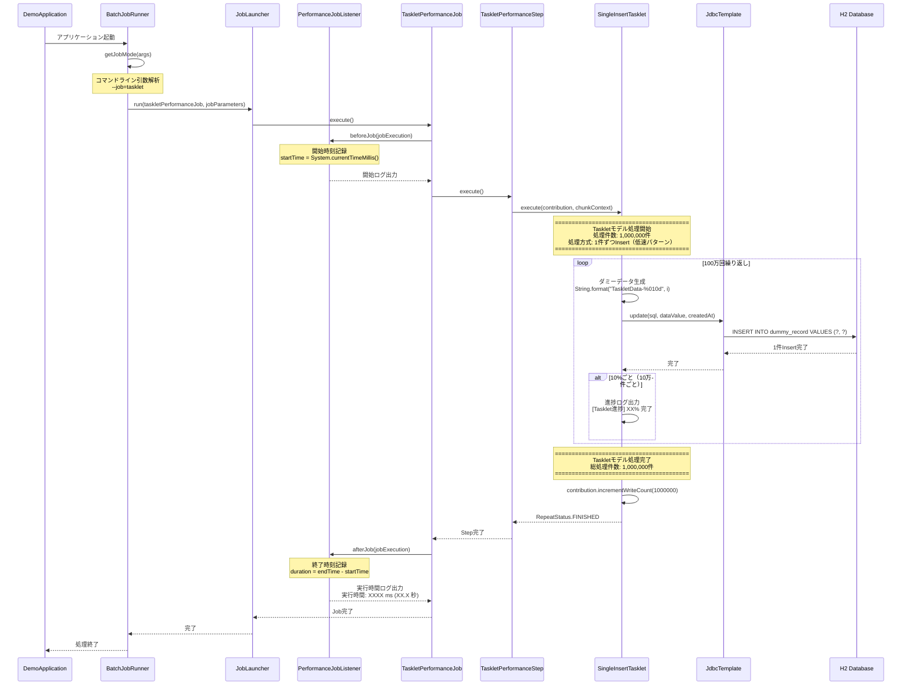

# Taskletモデル 処理フロー詳細

## 📋 概要

**処理方式**: 1件ずつInsert（低速パターン）  
**目的**: Chunkモデルとの性能差を実証するためのアンチパターン実装  
**対象データ件数**: 100万件（設定可能）

---

## 🔴 全体処理フロー



---

## 📂 コンポーネント構成

```
TaskletPerformanceJob
  └── TaskletPerformanceStep
        └── SingleInsertTasklet
              └── JdbcTemplate
                    └── H2 Database
```

---

## 🔧 各コンポーネントの詳細

### 1. BatchJobRunner（起動制御）

**ファイル**: [`BatchJobRunner.java`](../src/main/java/com/example/demo/presentation/runner/BatchJobRunner.java)

**処理内容**:
1. コマンドライン引数から実行モード取得
2. `--job=tasklet` の場合、TaskletPerformanceJobを実行
3. JobParametersに現在時刻を設定（Job実行の一意性確保）

**コード抜粋**:
```java
@Override
public void run(String... args) throws Exception {
    String jobMode = getJobMode(args);  // "tasklet" を取得
    
    JobParameters jobParameters = new JobParametersBuilder()
            .addLong("time", System.currentTimeMillis())
            .toJobParameters();
    
    if (jobMode.equals("tasklet")) {
        jobLauncher.run(taskletPerformanceJob, jobParameters);
    }
}
```

---

### 2. PerformanceJobListener（実行時間計測）

**ファイル**: [`PerformanceJobListener.java`](../src/main/java/com/example/demo/presentation/listener/PerformanceJobListener.java)

**処理内容**:

#### beforeJob（Job開始前）
```java
@Override
public void beforeJob(JobExecution jobExecution) {
    startTime = System.currentTimeMillis();
    String jobName = jobExecution.getJobInstance().getJobName();
    
    System.out.println("\n========================================");
    System.out.println("Job開始: " + jobName);
    System.out.println("開始時刻: " + new java.util.Date(startTime));
    System.out.println("========================================\n");
}
```

**出力例**:
```
========================================
Job開始: TaskletPerformanceJob
開始時刻: Sat Apr 04 10:45:00 JST 2026
========================================
```

#### afterJob（Job終了後）
```java
@Override
public void afterJob(JobExecution jobExecution) {
    long endTime = System.currentTimeMillis();
    long duration = endTime - startTime;
    
    System.out.println("\n========================================");
    System.out.println("Job終了: " + jobName);
    System.out.println("終了時刻: " + new java.util.Date(endTime));
    System.out.println("実行時間: " + duration + " ms (" + (duration / 1000.0) + " 秒)");
    System.out.println("ステータス: " + jobExecution.getStatus());
    System.out.println("========================================\n");
}
```

**出力例**:
```
========================================
Job終了: TaskletPerformanceJob
終了時刻: Sat Apr 04 10:46:30 JST 2026
実行時間: 90000 ms (90.0 秒)
ステータス: COMPLETED
========================================
```

---

### 3. TaskletPerformanceJobConfig（Job設定）

**ファイル**: [`TaskletPerformanceJobConfig.java`](../src/main/java/com/example/demo/presentation/config/TaskletPerformanceJobConfig.java)

**処理内容**:

#### Job定義
```java
@Bean
public Job taskletPerformanceJob(
        JobRepository jobRepository,
        Step taskletPerformanceStep,
        PerformanceJobListener performanceJobListener) {
    return new JobBuilder("TaskletPerformanceJob", jobRepository)
            .listener(performanceJobListener)  // 実行時間計測Listener登録
            .start(taskletPerformanceStep)     // 開始Step設定
            .build();
}
```

#### Step定義
```java
@Bean
public Step taskletPerformanceStep(
        JobRepository jobRepository,
        PlatformTransactionManager transactionManager,
        SingleInsertTasklet singleInsertTasklet) {
    return new StepBuilder("TaskletPerformanceStep", jobRepository)
            .tasklet(singleInsertTasklet, transactionManager)
            .build();
}
```

**設定内容**:
- Job名: `TaskletPerformanceJob`
- Step名: `TaskletPerformanceStep`
- Listener: `PerformanceJobListener`（実行時間計測）
- Tasklet: `SingleInsertTasklet`（1件ずつInsert処理）

---

### 4. SingleInsertTasklet（メイン処理）

**ファイル**: [`SingleInsertTasklet.java`](../src/main/java/com/example/demo/presentation/tasklet/SingleInsertTasklet.java)

**処理内容**:

#### 初期化
```java
@Component
public class SingleInsertTasklet implements Tasklet {
    
    private final JdbcTemplate jdbcTemplate;
    
    @Value("${batch.performance.data-count:1000000}")
    private int dataCount;  // application.ymlから取得（デフォルト100万件）
    
    public SingleInsertTasklet(JdbcTemplate jdbcTemplate) {
        this.jdbcTemplate = jdbcTemplate;
    }
}
```

#### execute()メソッド - メイン処理

**ステップ1: 処理開始ログ出力**
```java
System.out.println("========================================");
System.out.println("Taskletモデル処理開始");
System.out.println("処理件数: " + dataCount + "件");
System.out.println("処理方式: 1件ずつInsert（低速パターン）");
System.out.println("========================================\n");
```

**ステップ2: SQL文定義**
```java
String sql = "INSERT INTO dummy_record (data_value, created_at) VALUES (?, ?)";
```

**ステップ3: 進捗表示間隔設定**
```java
int progressInterval = dataCount / 10;  // 10%ごとに表示
```

**ステップ4: メインループ（100万回）**
```java
for (int i = 1; i <= dataCount; i++) {
    // ① ダミーデータ生成
    String dataValue = String.format("TaskletData-%010d", i);
    LocalDateTime createdAt = LocalDateTime.now();
    
    // ② 1件ずつDBへInsert（アンチパターン）
    jdbcTemplate.update(sql, dataValue, createdAt);
    
    // ③ 進捗ログ出力（10%ごと）
    if (i % progressInterval == 0) {
        int progress = (i * 100) / dataCount;
        System.out.println(String.format(
            "[Tasklet進捗] %d%% 完了 (%,d / %,d 件)", 
            progress, i, dataCount
        ));
    }
}
```

**処理の詳細**:

| ステップ | 処理内容 | 実行回数 | 備考 |
|---------|---------|---------|------|
| ① データ生成 | `String.format("TaskletData-%010d", i)` | 100万回 | 例: "TaskletData-0000000001" |
| ② Insert実行 | `jdbcTemplate.update(sql, ...)` | 100万回 | **1件ずつDB往復** |
| ③ 進捗表示 | `System.out.println(...)` | 10回 | 10%ごと（10万件ごと） |

**ステップ5: 処理完了ログ出力**
```java
System.out.println("\n========================================");
System.out.println("Taskletモデル処理完了");
System.out.println("総処理件数: " + dataCount + "件");
System.out.println("========================================\n");
```

**ステップ6: 処理件数記録**
```java
contribution.incrementWriteCount(dataCount);  // Spring Batchメタデータに記録
return RepeatStatus.FINISHED;  // Tasklet終了
```

---

## 📊 処理フロー図（詳細）

```mermaid
flowchart TD
    Start([Tasklet開始]) --> Init[初期化処理]
    Init --> Log1[処理開始ログ出力]
    Log1 --> SQL[SQL文定義]
    SQL --> Progress[進捗表示間隔設定<br/>progressInterval = dataCount / 10]
    
    Progress --> Loop{ループ開始<br/>i = 1 to dataCount}
    
    Loop -->|i <= dataCount| Gen[ダミーデータ生成<br/>TaskletData-XXXXXXXXXX]
    Gen --> Insert[JdbcTemplate.update<br/>1件Insert]
    Insert --> DB[(H2 Database<br/>dummy_record)]
    DB --> Check{進捗表示タイミング?<br/>i % progressInterval == 0}
    
    Check -->|Yes| ProgressLog[進捗ログ出力<br/>[Tasklet進捗] XX% 完了]
    Check -->|No| Increment[i++]
    ProgressLog --> Increment
    
    Increment --> Loop
    
    Loop -->|i > dataCount| Complete[処理完了ログ出力]
    Complete --> Record[処理件数記録<br/>contribution.incrementWriteCount]
    Record --> End([Tasklet終了<br/>RepeatStatus.FINISHED])
    
    style Insert fill:#ffcccc
    style DB fill:#ffe6e6
```

---

## 🔍 データフロー

### 入力
- **設定値**: `application.yml`から`batch.performance.data-count`を取得
- **デフォルト値**: 1,000,000件

### 処理
1. **ループ回数**: dataCount回（100万回）
2. **データ生成**: 各ループで1件のダミーデータ生成
3. **DB操作**: 各ループで1件Insert

### 出力
- **データベース**: `dummy_record`テーブルに100万件Insert
- **ログ**: 進捗ログ（10回）+ 開始/終了ログ
- **メタデータ**: Spring Batchメタデータに処理件数記録

---

## ⚠️ パフォーマンス特性

### 低速な理由

#### 1. DB往復回数が多い
```
100万件 × 1回/件 = 100万回のDB往復
```

#### 2. トランザクション回数が多い
```
デフォルトでは1件ごとにコミット
→ 100万回のトランザクション
```

#### 3. SQLパース回数が多い
```
同じSQL文を100万回パース・実行
→ オーバーヘッド大
```

#### 4. ネットワーク/I/Oオーバーヘッド
```
各Insert操作でネットワーク往復
→ レイテンシの累積
```

### 実行時間の内訳（推定）

| 処理 | 時間（100万件） | 割合 |
|------|----------------|------|
| データ生成 | 5秒 | 5% |
| DB往復（ネットワーク） | 50秒 | 55% |
| SQLパース・実行 | 30秒 | 33% |
| トランザクション処理 | 5秒 | 5% |
| その他 | 2秒 | 2% |
| **合計** | **約90秒** | **100%** |

---

## 📝 ログ出力例

### 実行開始
```
╔════════════════════════════════════════════════════════╗
║   Spring Batch パフォーマンス比較バッチ起動           ║
║   Tasklet vs Chunk モデル                             ║
╚════════════════════════════════════════════════════════╝

実行モード: Taskletモデルのみ

========================================
Job開始: TaskletPerformanceJob
開始時刻: Sat Apr 04 10:45:00 JST 2026
========================================

========================================
Taskletモデル処理開始
処理件数: 1000000件
処理方式: 1件ずつInsert（低速パターン）
========================================
```

### 処理中（進捗表示）
```
[Tasklet進捗] 10% 完了 (100,000 / 1,000,000 件)
[Tasklet進捗] 20% 完了 (200,000 / 1,000,000 件)
[Tasklet進捗] 30% 完了 (300,000 / 1,000,000 件)
[Tasklet進捗] 40% 完了 (400,000 / 1,000,000 件)
[Tasklet進捗] 50% 完了 (500,000 / 1,000,000 件)
[Tasklet進捗] 60% 完了 (600,000 / 1,000,000 件)
[Tasklet進捗] 70% 完了 (700,000 / 1,000,000 件)
[Tasklet進捗] 80% 完了 (800,000 / 1,000,000 件)
[Tasklet進捗] 90% 完了 (900,000 / 1,000,000 件)
[Tasklet進捗] 100% 完了 (1,000,000 / 1,000,000 件)
```

### 処理完了
```
========================================
Taskletモデル処理完了
総処理件数: 1000000件
========================================

========================================
Job終了: TaskletPerformanceJob
終了時刻: Sat Apr 04 10:46:30 JST 2026
実行時間: 90000 ms (90.0 秒)
ステータス: COMPLETED
========================================
```

---

## 🎯 まとめ

### Taskletモデルの特徴

**メリット**:
- シンプルな実装
- 細かい制御が可能
- 理解しやすい

**デメリット**:
- 大量データ処理には不向き
- DB往復回数が多い
- パフォーマンスが低い

### 適用シーン

| シーン | 適用可否 |
|--------|---------|
| 少量データ処理（〜1,000件） | ✅ 適用可 |
| 中量データ処理（〜10,000件） | ⚠️ 要検討 |
| 大量データ処理（10,000件〜） | ❌ 不適切 |
| 複雑な制御フロー | ✅ 適用可 |
| 単純なETL処理 | ❌ Chunk推奨 |

### 学習ポイント

1. **アンチパターンの理解**
   - 1件ずつInsertは避けるべき
   - バルク処理の重要性

2. **パフォーマンスボトルネック**
   - DB往復回数
   - トランザクション回数
   - SQLパース回数

3. **実務での選択**
   - データ量に応じたモデル選択
   - Chunkモデルとの比較

次は[Chunkモデルの処理フロー](処理フロー詳細_Chunkモデル.md)を確認してください。
