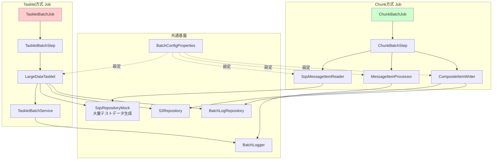

# Tasklet vs Chunk 比較学習プラン

## 🎓 学習目的

**両方式を実装して性能差を実測し、Spring Batchの理解を深める**

- Tasklet方式の特性と限界を体験
- Chunk方式の効率性を実感
- 大量データ処理における設計判断力を養う

---

## 🏗️ 実装戦略: 2つのJobを並行実装

### アーキテクチャ概要



---

## 📂 ディレクトリ構造

```
src/main/java/com/example/demo/
├── domain/
│   ├── model/
│   │   ├── SqsMessage.java              # 共通ドメインモデル
│   │   └── ProcessedData.java           # 処理済みデータモデル
│   ├── entity/
│   │   └── BatchLogEntity.java          # 既存
│   └── repository/
│       ├── SqsRepository.java           # 既存
│       ├── S3Repository.java            # 既存
│       └── BatchLogRepository.java      # 既存
│
├── infrastructure/
│   ├── repository/
│   │   ├── SqsRepositoryMock.java       # 大量データ対応版に改修
│   │   ├── S3RepositoryMock.java        # 既存
│   │   └── BatchLogRepositoryImpl.java  # バッチINSERT追加
│   └── common/logging/
│       ├── BatchLogger.java             # 既存
│       └── ConsoleBatchLogger.java      # 既存
│
├── application/
│   └── service/
│       ├── BatchProcessService.java     # 既存（Tasklet用）
│       ├── TaskletBatchService.java     # 大量データTasklet用（新規）
│       └── MessageProcessService.java   # Chunk用ビジネスロジック（新規）
│
└── presentation/
    ├── config/
    │   ├── BatchConfigProperties.java   # 共通設定プロパティ（新規）
    │   ├── TaskletJobConfig.java        # Tasklet Job設定（新規）
    │   └── ChunkJobConfig.java          # Chunk Job設定（新規）
    │
    ├── tasklet/
    │   ├── HelloAwsTasklet.java         # 既存（小規模用として保持）
    │   └── LargeDataTasklet.java        # 大量データTasklet（新規）
    │
    ├── reader/
    │   └── SqsMessageItemReader.java    # Chunk用Reader（新規）
    │
    ├── processor/
    │   └── MessageItemProcessor.java    # Chunk用Processor（新規）
    │
    ├── writer/
    │   └── CompositeDataItemWriter.java # Chunk用Writer（新規）
    │
    ├── listener/
    │   ├── PerformanceMetricsListener.java  # 性能測定リスナー（新規）
    │   └── ChunkProgressListener.java       # 進捗監視リスナー（新規）
    │
    └── runner/
        └── BatchJobRunner.java          # 既存（Job選択機能追加）
```

---

## ⚙️ 設定ファイル設計

### application.yml

```yaml
spring:
  profiles:
    active: local
  
  datasource:
    url: jdbc:h2:mem:batch_db
    driver-class-name: org.h2.Driver
    username: sa
    password: 
  
  h2:
    console:
      enabled: true
      path: /h2-console
  
  sql:
    init:
      mode: always
      schema-locations: classpath:schema.sql
  
  batch:
    job:
      enabled: false  # 手動起動
    jdbc:
      initialize-schema: always

mybatis:
  mapper-locations: classpath:mybatis/mapper/*.xml
  configuration:
    map-underscore-to-camel-case: true
    default-fetch-size: 100
    default-statement-timeout: 30

# バッチ共通設定
batch:
  config:
    # テストデータ設定
    test-data:
      total-messages: 10000        # 生成するメッセージ総数
      message-size-bytes: 1024     # 1メッセージのサイズ
    
    # Tasklet設定
    tasklet:
      batch-size: 100              # 一度に処理する件数
      commit-interval: 100         # コミット間隔
      enable-metrics: true         # メトリクス収集
    
    # Chunk設定
    chunk:
      chunk-size: 100              # チャンクサイズ
      skip-limit: 10               # スキップ上限
      retry-limit: 3               # リトライ上限
      enable-metrics: true         # メトリクス収集
    
    # SQS設定
    sqs:
      max-messages-per-poll: 10    # 1回のポーリング件数
      visibility-timeout: 300
      wait-time-seconds: 20
    
    # スレッド設定（Chunk用）
    thread:
      core-pool-size: 5
      max-pool-size: 10
      queue-capacity: 100
    
    # S3設定
    s3:
      batch-upload-size: 100       # バッチアップロード件数

logging:
  level:
    root: INFO
    com.example.demo: DEBUG
    org.springframework.batch: INFO
  pattern:
    console: "%d{yyyy-MM-dd HH:mm:ss} [%thread] %-5level %logger{36} - %msg%n"
```

### launch.json

```json
{
  "version": "0.2.0",
  "configurations": [
    {
      "type": "java",
      "name": "🔴 Tasklet - 100件テスト",
      "request": "launch",
      "mainClass": "com.example.demo.DemoApplication",
      "projectName": "demo",
      "args": [
        "--spring.profiles.active=local",
        "--job.name=taskletBatchJob",
        "--batch.config.test-data.total-messages=100",
        "--batch.config.tasklet.batch-size=10"
      ],
      "env": {
        "BATCH_MODE": "tasklet",
        "LOG_LEVEL": "DEBUG"
      }
    },
    {
      "type": "java",
      "name": "🔴 Tasklet - 1,000件テスト",
      "request": "launch",
      "mainClass": "com.example.demo.DemoApplication",
      "projectName": "demo",
      "args": [
        "--spring.profiles.active=local",
        "--job.name=taskletBatchJob",
        "--batch.config.test-data.total-messages=1000",
        "--batch.config.tasklet.batch-size=50"
      ],
      "env": {
        "BATCH_MODE": "tasklet"
      }
    },
    {
      "type": "java",
      "name": "🔴 Tasklet - 10,000件テスト",
      "request": "launch",
      "mainClass": "com.example.demo.DemoApplication",
      "projectName": "demo",
      "args": [
        "--spring.profiles.active=local",
        "--job.name=taskletBatchJob",
        "--batch.config.test-data.total-messages=10000",
        "--batch.config.tasklet.batch-size=100"
      ],
      "env": {
        "BATCH_MODE": "tasklet"
      }
    },
    {
      "type": "java",
      "name": "🟢 Chunk - 100件テスト",
      "request": "launch",
      "mainClass": "com.example.demo.DemoApplication",
      "projectName": "demo",
      "args": [
        "--spring.profiles.active=local",
        "--job.name=chunkBatchJob",
        "--batch.config.test-data.total-messages=100",
        "--batch.config.chunk.chunk-size=10",
        "--batch.config.thread.core-pool-size=1"
      ],
      "env": {
        "BATCH_MODE": "chunk",
        "LOG_LEVEL": "DEBUG"
      }
    },
    {
      "type": "java",
      "name": "🟢 Chunk - 1,000件テスト",
      "request": "launch",
      "mainClass": "com.example.demo.DemoApplication",
      "projectName": "demo",
      "args": [
        "--spring.profiles.active=local",
        "--job.name=chunkBatchJob",
        "--batch.config.test-data.total-messages=1000",
        "--batch.config.chunk.chunk-size=100",
        "--batch.config.thread.core-pool-size=1"
      ],
      "env": {
        "BATCH_MODE": "chunk"
      }
    },
    {
      "type": "java",
      "name": "🟢 Chunk - 10,000件テスト（シングルスレッド）",
      "request": "launch",
      "mainClass": "com.example.demo.DemoApplication",
      "projectName": "demo",
      "args": [
        "--spring.profiles.active=local",
        "--job.name=chunkBatchJob",
        "--batch.config.test-data.total-messages=10000",
        "--batch.config.chunk.chunk-size=100",
        "--batch.config.thread.core-pool-size=1"
      ],
      "env": {
        "BATCH_MODE": "chunk"
      }
    },
    {
      "type": "java",
      "name": "🚀 Chunk - 10,000件テスト（マルチスレッド）",
      "request": "launch",
      "mainClass": "com.example.demo.DemoApplication",
      "projectName": "demo",
      "args": [
        "--spring.profiles.active=local",
        "--job.name=chunkBatchJob",
        "--batch.config.test-data.total-messages=10000",
        "--batch.config.chunk.chunk-size=100",
        "--batch.config.thread.core-pool-size=5"
      ],
      "env": {
        "BATCH_MODE": "chunk-multi"
      }
    },
    {
      "type": "java",
      "name": "📊 比較テスト - 両方実行",
      "request": "launch",
      "mainClass": "com.example.demo.DemoApplication",
      "projectName": "demo",
      "args": [
        "--spring.profiles.active=local",
        "--job.name=taskletBatchJob,chunkBatchJob",
        "--batch.config.test-data.total-messages=1000"
      ],
      "env": {
        "BATCH_MODE": "comparison"
      }
    }
  ]
}
```

---

## 💻 実装詳細設計

### 1. Tasklet方式実装（大量データ対応版）

#### LargeDataTasklet.java

```java
/**
 * 大量データ処理用Tasklet
 * 学習目的: Taskletでの大量データ処理の限界を体験
 */
@Component
@StepScope
public class LargeDataTasklet implements Tasklet {
    
    private final BatchLogger logger;
    private final TaskletBatchService batchService;
    private final BatchConfigProperties config;
    private final PerformanceMetricsCollector metricsCollector;
    
    @Value("#{jobParameters['totalMessages']}")
    private Integer totalMessages;
    
    @Override
    public RepeatStatus execute(StepContribution contribution, ChunkContext chunkContext) 
            throws Exception {
        
        long startTime = System.currentTimeMillis();
        logger.info("========================================");
        logger.info("Tasklet方式 - 大量データ処理開始");
        logger.info("処理予定件数: {}", totalMessages != null ? totalMessages : "全件");
        logger.info("========================================");
        
        try {
            // バッチサイズごとに処理（疑似チャンク）
            int batchSize = config.getTasklet().getBatchSize();
            int processedCount = 0;
            int totalCount = totalMessages != null ? totalMessages : Integer.MAX_VALUE;
            
            while (processedCount < totalCount) {
                int currentBatchSize = Math.min(batchSize, totalCount - processedCount);
                
                // バッチ処理実行
                int processed = batchService.processBatch(currentBatchSize);
                
                if (processed == 0) {
                    break; // データなし
                }
                
                processedCount += processed;
                
                // 進捗ログ
                if (processedCount % 1000 == 0) {
                    logger.info("進捗: {}/{} 件処理完了", processedCount, totalCount);
                }
                
                // メトリクス記録
                metricsCollector.recordBatchProcessed(processed);
            }
            
            long duration = System.currentTimeMillis() - startTime;
            
            // 最終結果
            logger.info("========================================");
            logger.info("Tasklet方式 - 処理完了");
            logger.info("処理件数: {} 件", processedCount);
            logger.info("処理時間: {} ms ({} 秒)", duration, duration / 1000.0);
            logger.info("スループット: {} 件/秒", 
                processedCount * 1000.0 / duration);
            logger.info("========================================");
            
            // メトリクス保存
            metricsCollector.saveMetrics("tasklet", processedCount, duration);
            
            contribution.setExitStatus(ExitStatus.COMPLETED);
            return RepeatStatus.FINISHED;
            
        } catch (Exception ex) {
            logger.error("Tasklet処理エラー", ex);
            contribution.setExitStatus(ExitStatus.FAILED);
            throw ex;
        }
    }
}
```

#### TaskletBatchService.java

```java
/**
 * Tasklet用バッチ処理サービス
 * バッチサイズごとにトランザクション制御
 */
@Service
public class TaskletBatchService {
    
    private final BatchLogger logger;
    private final SqsRepository sqsRepository;
    private final S3Repository s3Repository;
    private final BatchLogRepository batchLogRepository;
    private final BatchConfigProperties config;
    
    /**
     * バッチ処理実行
     * @param batchSize 処理件数
     * @return 実際に処理した件数
     */
    @Transactional
    public int processBatch(int batchSize) {
        // SQSからメッセージ取得
        List<SqsMessage> messages = receiveMessages(batchSize);
        
        if (messages.isEmpty()) {
            return 0;
        }
        
        // メッセージ処理
        List<ProcessedData> processedList = new ArrayList<>();
        for (SqsMessage message : messages) {
            try {
                ProcessedData data = processMessage(message);
                processedList.add(data);
            } catch (Exception ex) {
                logger.error("メッセージ処理エラー: {}", message.getMessageId(), ex);
                // エラーは記録して継続
            }
        }
        
        // S3へアップロード（バッチ）
        if (!processedList.isEmpty()) {
            s3Repository.uploadBatch(processedList);
        }
        
        // DBへ記録（バッチINSERT）
        List<BatchLogEntity> logs = processedList.stream()
            .map(data -> new BatchLogEntity("TaskletBatchJob", data.getMessageId(), "SUCCESS"))
            .collect(Collectors.toList());
        
        if (!logs.isEmpty()) {
            batchLogRepository.insertBatch(logs);
        }
        
        return processedList.size();
    }
    
    private List<SqsMessage> receiveMessages(int maxMessages) {
        List<SqsMessage> allMessages = new ArrayList<>();
        int remaining = maxMessages;
        
        while (remaining > 0) {
            int pollSize = Math.min(remaining, config.getSqs().getMaxMessagesPerPoll());
            List<SqsMessage> messages = sqsRepository.receiveMessages(pollSize);
            
            if (messages.isEmpty()) {
                break;
            }
            
            allMessages.addAll(messages);
            remaining -= messages.size();
        }
        
        return allMessages;
    }
    
    private ProcessedData processMessage(SqsMessage message) {
        // ビジネスロジック
        return new ProcessedData(
            message.getMessageId(),
            "Processed: " + message.getBody(),
            LocalDateTime.now()
        );
    }
}
```

### 2. Chunk方式実装

#### SqsMessageItemReader.java

```java
/**
 * SQSメッセージItemReader
 * 学習目的: Chunk方式の効率的な読み込みを体験
 */
@Component
@StepScope
public class SqsMessageItemReader implements ItemReader<SqsMessage> {
    
    private final SqsRepository sqsRepository;
    private final BatchConfigProperties config;
    private final BatchLogger logger;
    
    private Queue<SqsMessage> messageBuffer = new ConcurrentLinkedQueue<>();
    private int readCount = 0;
    
    @Value("#{jobParameters['totalMessages']}")
    private Integer maxMessages;
    
    @Override
    public SqsMessage read() {
        // バッファが空なら補充
        if (messageBuffer.isEmpty()) {
            refillBuffer();
        }
        
        // 最大件数チェック
        if (maxMessages != null && readCount >= maxMessages) {
            logger.debug("最大件数到達: {}", readCount);
            return null; // 読み込み終了
        }
        
        SqsMessage message = messageBuffer.poll();
        if (message != null) {
            readCount++;
            
            if (readCount % 1000 == 0) {
                logger.info("読み込み進捗: {} 件", readCount);
            }
        }
        
        return message;
    }
    
    private void refillBuffer() {
        int pollSize = config.getSqs().getMaxMessagesPerPoll();
        List<SqsMessage> messages = sqsRepository.receiveMessages(pollSize);
        
        if (!messages.isEmpty()) {
            messageBuffer.addAll(messages);
            logger.debug("バッファ補充: {} 件", messages.size());
        }
    }
}
```

#### MessageItemProcessor.java

```java
/**
 * メッセージItemProcessor
 * 学習目的: アイテム単位の処理とエラーハンドリング
 */
@Component
@StepScope
public class MessageItemProcessor implements ItemProcessor<SqsMessage, ProcessedData> {
    
    private final BatchLogger logger;
    private final MessageProcessService processService;
    
    private AtomicInteger processCount = new AtomicInteger(0);
    
    @Override
    public ProcessedData process(SqsMessage message) throws Exception {
        int count = processCount.incrementAndGet();
        
        if (count % 1000 == 0) {
            logger.info("処理進捗: {} 件", count);
        }
        
        try {
            return processService.processMessage(message);
        } catch (Exception ex) {
            logger.error("処理エラー: messageId={}", message.getMessageId(), ex);
            throw ex; // リトライ対象
        }
    }
}
```

#### CompositeDataItemWriter.java

```java
/**
 * CompositeItemWriter
 * 学習目的: チャンク単位の効率的な書き込み
 */
@Component
@StepScope
public class CompositeDataItemWriter implements ItemWriter<ProcessedData> {
    
    private final S3Repository s3Repository;
    private final BatchLogRepository batchLogRepository;
    private final BatchLogger logger;
    
    private AtomicInteger writeCount = new AtomicInteger(0);
    
    @Override
    public void write(Chunk<? extends ProcessedData> chunk) throws Exception {
        List<? extends ProcessedData> items = chunk.getItems();
        
        if (items.isEmpty()) {
            return;
        }
        
        int count = writeCount.addAndGet(items.size());
        logger.debug("書き込み: {} 件（累計: {}）", items.size(), count);
        
        // S3へバッチアップロード
        s3Repository.uploadBatch(items);
        
        // DBへバッチINSERT
        List<BatchLogEntity> logs = items.stream()
            .map(data -> new BatchLogEntity("ChunkBatchJob", data.getMessageId(), "SUCCESS"))
            .collect(Collectors.toList());
        
        batchLogRepository.insertBatch(logs);
        
        if (count % 1000 == 0) {
            logger.info("書き込み進捗: {} 件", count);
        }
    }
}
```

### 3. 性能測定リスナー

#### PerformanceMetricsListener.java

```java
/**
 * 性能測定リスナー
 * 学習目的: 両方式の性能差を可視化
 */
@Component
public class PerformanceMetricsListener implements StepExecutionListener {
    
    private final BatchLogger logger;
    private long startTime;
    
    @Override
    public void beforeStep(StepExecution stepExecution) {
        startTime = System.currentTimeMillis();
        logger.info("=== 性能測定開始 ===");
    }
    
    @Override
    public ExitStatus afterStep(StepExecution stepExecution) {
        long duration = System.currentTimeMillis() - startTime;
        
        int readCount = stepExecution.getReadCount();
        int writeCount = stepExecution.getWriteCount();
        int skipCount = stepExecution.getSkipCount();
        int commitCount = stepExecution.getCommitCount();
        int rollbackCount = stepExecution.getRollbackCount();
        
        double throughput = writeCount * 1000.0 / duration;
        
        logger.info("=== 性能測定結果 ===");
        logger.info("Job名: {}", stepExecution.getJobExecution().getJobInstance().getJobName());
        logger.info("Step名: {}", stepExecution.getStepName());
        logger.info("読み込み件数: {} 件", readCount);
        logger.info("書き込み件数: {} 件", writeCount);
        logger.info("スキップ件数: {} 件", skipCount);
        logger.info("コミット回数: {} 回", commitCount);
        logger.info("ロールバック回数: {} 回", rollbackCount);
        logger.info("処理時間: {} ms ({} 秒)", duration, duration / 1000.0);
        logger.info("スループット: {:.2f} 件/秒", throughput);
        logger.info("平均処理時間: {:.2f} ms/件", (double) duration / writeCount);
        logger.info("===================");
        
        // メトリクスをDBに保存
        saveMetrics(stepExecution, duration, throughput);
        
        return stepExecution.getExitStatus();
    }
    
    private void saveMetrics(StepExecution stepExecution, long duration, double throughput) {
        // 性能メトリクスをDBに保存（比較用）
        // 実装は省略
    }
}
```

---

## 📊 性能比較テストシナリオ

### テストケース一覧

| テストケース | データ件数 | Tasklet設定 | Chunk設定 | 目的 |
|------------|-----------|------------|-----------|------|
| TC1 | 100件 | バッチ10件 | チャンク10件、1スレッド | 基本動作確認 |
| TC2 | 1,000件 | バッチ50件 | チャンク100件、1スレッド | 中規模データ比較 |
| TC3 | 10,000件 | バッチ100件 | チャンク100件、1スレッド | 大規模データ比較 |
| TC4 | 10,000件 | - | チャンク100件、5スレッド | マルチスレッド効果 |
| TC5 | 10,000件 | - | チャンク500件、10スレッド | 最大性能測定 |

### 測定項目

1. **処理時間**: 開始〜終了までの総時間
2. **スループット**: 件数/秒
3. **メモリ使用量**: ヒープメモリ使用量
4. **コミット回数**: トランザクション回数
5. **CPU使用率**: プロセッサ負荷

### 期待される結果

```
【予測】10,000件処理の場合

Tasklet方式:
- 処理時間: 60-90秒
- スループット: 110-160件/秒
- コミット回数: 100回（バッチサイズ100）
- メモリ: 中程度

Chunk方式（シングルスレッド）:
- 処理時間: 30-50秒
- スループット: 200-330件/秒
- コミット回数: 100回（チャンクサイズ100）
- メモリ: 低

Chunk方式（マルチスレッド 5スレッド）:
- 処理時間: 10-20秒
- スループット: 500-1000件/秒
- コミット回数: 100回
- メモリ: 中程度
```

---

## 📝 実装計画（6フェーズ）

### Phase 1: 共通基盤整備

- [ ] [`BatchConfigProperties.java`](src/main/java/com/example/demo/presentation/config/BatchConfigProperties.java) 作成
- [ ] [`SqsMessage.java`](src/main/java/com/example/demo/domain/model/SqsMessage.java) ドメインモデル作成
- [ ] [`ProcessedData.java`](src/main/java/com/example/demo/domain/model/ProcessedData.java) ドメインモデル作成
- [ ] [`SqsRepositoryMock.java`](src/main/java/com/example/demo/infrastructure/repository/SqsRepositoryMock.java) を大量データ対応に改修
- [ ] [`BatchLogRepository.java`](src/main/java/com/example/demo/domain/repository/BatchLogRepository.java) にバッチINSERTメソッド追加
- [ ] [`BatchLogRepositoryImpl.java`](src/main/java/com/example/demo/infrastructure/repository/BatchLogRepositoryImpl.java) バッチINSERT実装
- [ ] [`BatchLogMapper.xml`](src/main/resources/mybatis/mapper/BatchLogMapper.xml) バッチINSERT SQL追加

### Phase 2: Tasklet方式実装（大量データ対応）

- [ ] [`TaskletBatchService.java`](src/main/java/com/example/demo/application/service/TaskletBatchService.java) 実装
- [ ] [`LargeDataTasklet.java`](src/main/java/com/example/demo/presentation/tasklet/LargeDataTasklet.java) 実装
- [ ] [`TaskletJobConfig.java`](src/main/java/com/example/demo/presentation/config/TaskletJobConfig.java) Job設定作成
- [ ] Tasklet方式の動作確認（100件、1,000件）

### Phase 3: Chunk方式実装

- [ ] [`MessageProcessService.java`](src/main/java/com/example/demo/application/service/MessageProcessService.java) 実装
- [ ] [`SqsMessageItemReader.java`](src/main/java/com/example/demo/presentation/reader/SqsMessageItemReader.java) 実装
- [ ] [`MessageItemProcessor.java`](src/main/java/com/example/demo/presentation/processor/MessageItemProcessor.java) 実装
- [ ] [`CompositeDataItemWriter.java`](src/main/java/com/example/demo/presentation/writer/CompositeDataItemWriter.java) 実装
- [ ] [`ChunkJobConfig.java`](src/main/java/com/example/demo/presentation/config/ChunkJobConfig.java) Job設定作成（シングルスレッド）
- [ ] Chunk方式の動作確認（100件、1,000件）

### Phase 4: 性能測定機能実装

- [ ] [`PerformanceMetricsListener.java`](src/main/java/com/example/demo/presentation/listener/PerformanceMetricsListener.java) 実装
- [ ] [`ChunkProgressListener.java`