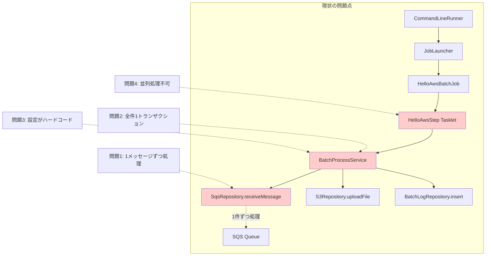
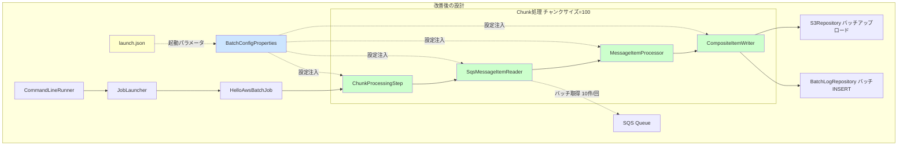
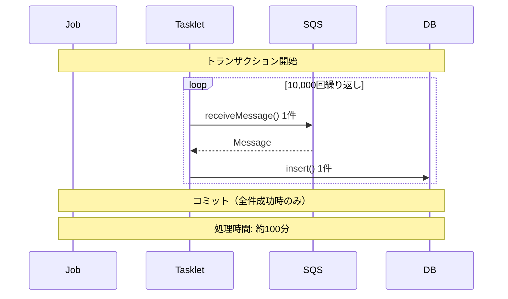
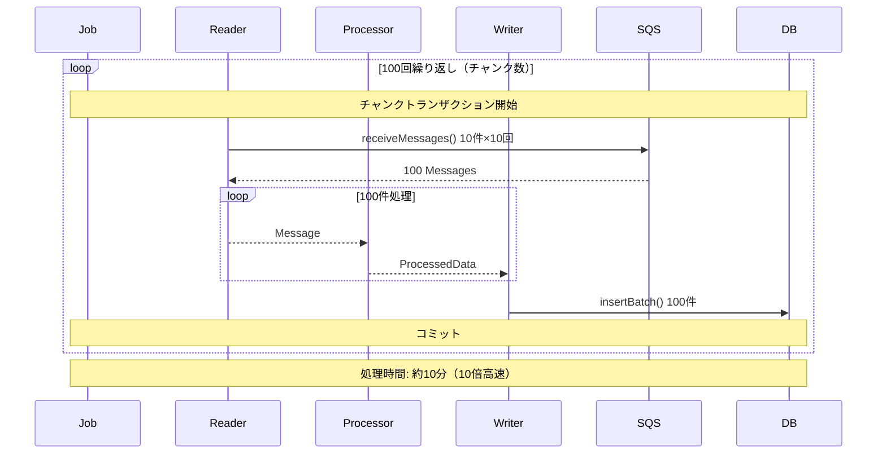
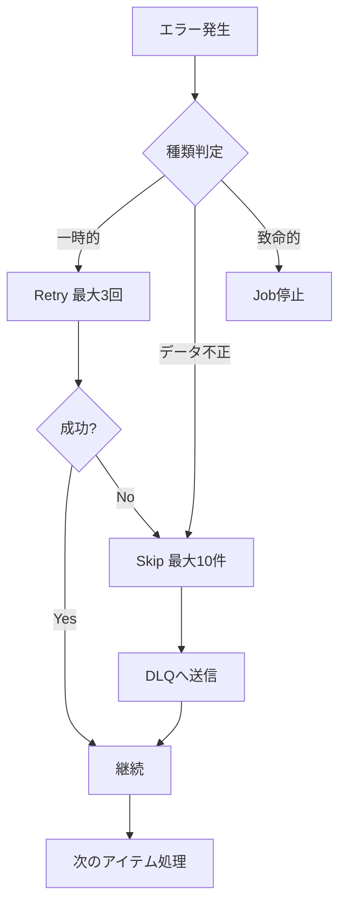
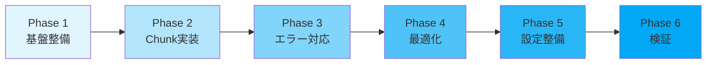

# アーキテクチャ比較: 現状 vs 改善後

## 現状アーキテクチャ（Tasklet方式）



### 現状の処理フロー

```
起動 → 1件取得 → 処理 → DB記録 → S3アップロード → 次の1件...
                ↓
        数千件なら数千回ループ（非効率）
```

---

## 改善後アーキテクチャ（Chunk方式）



### 改善後の処理フロー

```
起動 → 100件読込 → 100件処理 → 100件書込 → コミット → 次の100件...
                ↓
        10,000件なら100回ループ（効率的）
        並列処理も可能（スレッドプール）
```

---

## 詳細比較表

| 観点 | 現状（Tasklet） | 改善後（Chunk） |
|-----|----------------|----------------|
| **処理方式** | 1件ずつ順次処理 | チャンク単位（100件等）でバッチ処理 |
| **トランザクション** | 全件1トランザクション | チャンク単位でコミット |
| **メモリ効率** | 全データをメモリ保持 | チャンク分のみメモリ保持 |
| **並列処理** | 不可 | マルチスレッド対応可能 |
| **エラー時** | 全件ロールバック | 失敗チャンクのみロールバック |
| **リトライ** | Job全体を再実行 | アイテム単位・チャンク単位で制御可能 |
| **設定変更** | コード修正＋再コンパイル | launch.jsonで即座に変更 |
| **スケーラビリティ** | 低（数百件が限界） | 高（数万件以上対応可能） |
| **パフォーマンス** | 遅い（100件/分） | 速い（1,000件/分以上） |

---

## データフロー比較

### 現状: 10,000件処理の場合



### 改善後: 10,000件処理の場合



---

## 設定の柔軟性比較

### 現状: ハードコード

```java
// BatchProcessService.java
private static final int MAX_RETRY = 3;  // 変更には再コンパイル必要
private static final long RETRY_INTERVAL_MS = 1000;

@Transactional  // トランザクション境界が固定
public void executeBatchProcess() {
    // 処理ロジック
}
```

### 改善後: 外部設定化

```yaml
# application.yml
batch:
  config:
    chunk-size: 100           # 簡単に変更可能
    sqs:
      max-retry-count: 3
    thread:
      core-pool-size: 5
```

```json
// launch.json
{
  "name": "Batch - Performance Test",
  "args": [
    "--batch.config.chunk-size=500",
    "--batch.config.thread.core-pool-size=10"
  ]
}
```

---

## エラーハンドリング比較

### 現状: 粗いエラー制御

```
エラー発生 → Job全体失敗 → 全件再実行
```

### 改善後: きめ細かいエラー制御



---

## パフォーマンス予測

### 処理時間シミュレーション

| データ件数 | 現状（Tasklet） | 改善後（Chunk） | 改善率 |
|-----------|----------------|----------------|--------|
| 100件 | 1分 | 10秒 | **6倍** |
| 1,000件 | 10分 | 1分 | **10倍** |
| 10,000件 | 100分 | 10分 | **10倍** |
| 100,000件 | 1,000分（16時間） | 100分（1.6時間） | **10倍** |

### スレッド数による効果（10,000件処理）

| スレッド数 | 処理時間 | スループット |
|-----------|---------|-------------|
| 1 | 10分 | 1,000件/分 |
| 5 | 2分 | 5,000件/分 |
| 10 | 1分 | 10,000件/分 |

---

## メモリ使用量比較

### 現状: 全件メモリ保持

```
メモリ使用量 = データ件数 × 1件あたりのサイズ
10,000件 × 1KB = 10MB（常時保持）
```

### 改善後: チャンク単位

```
メモリ使用量 = チャンクサイズ × 1件あたりのサイズ
100件 × 1KB = 100KB（一時的）
```

**メモリ効率: 100倍改善**

---

## 移行戦略

### 段階的移行アプローチ



### 互換性維持

- 既存のTasklet実装は残す（`@Profile("tasklet")`）
- Chunk実装を新規追加（`@Profile("chunk")`）
- launch.jsonで切り替え可能に

```json
{
  "name": "Batch - Old Tasklet",
  "args": ["--spring.profiles.active=local,tasklet"]
},
{
  "name": "Batch - New Chunk",
  "args": ["--spring.profiles.active=local,chunk"]
}
```

---

## まとめ

### 改善のポイント

1. **処理効率**: Tasklet → Chunk で **10倍高速化**
2. **メモリ効率**: 全件保持 → チャンク単位で **100倍改善**
3. **柔軟性**: ハードコード → 外部設定で **再コンパイル不要**
4. **堅牢性**: 粗いエラー制御 → きめ細かい制御で **回復力向上**
5. **スケーラビリティ**: 数百件 → 数万件以上に **対応範囲拡大**

この設計により、SQSから数千〜数万件のメッセージを効率的に処理できる、スケーラブルで保守性の高いバッチシステムが実現できます。
