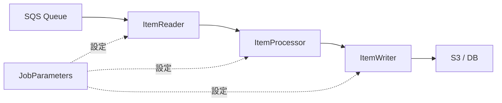
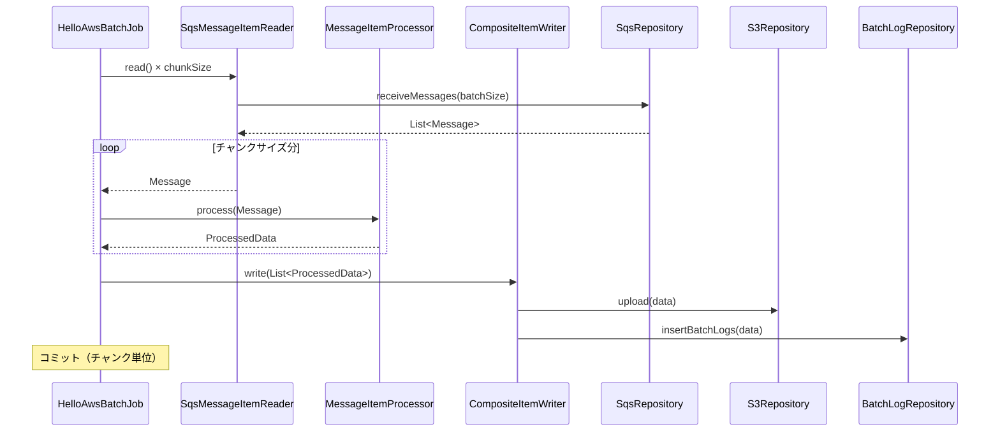
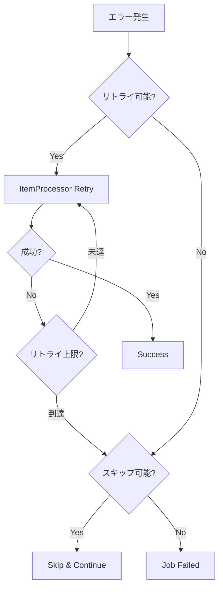

# 大量データ処理対応 実装方針書

## 📋 プロジェクト概要

**目的**: SQSから数千〜数万件のメッセージを効率的に処理できるバッチシステムへの改修  
**最終ゴール**: launch.jsonで起動条件を柔軟に設定可能な、スケーラブルなバッチ処理基盤の構築

---

## 🔍 現状分析

### 現在のアーキテクチャ

```
HelloAwsTasklet (Tasklet方式)
  ↓
BatchProcessService
  ↓
SqsRepository.receiveMessage() ← 1件ずつ処理
```

### 主要な問題点

#### 1. **Tasklet方式の限界**
- 現在は1メッセージずつ処理する設計
- 数千〜数万件の処理には非効率
- トランザクション境界が大きすぎる（全件成功 or 全件失敗）
- メモリ効率が悪い

#### 2. **設定の硬直性**
- チャンクサイズ、スレッド数などがコードに埋め込まれている
- 環境ごとの調整が困難
- パフォーマンスチューニングに再コンパイルが必要

#### 3. **スケーラビリティの欠如**
- 並列処理機能がない
- 大量データ処理時のメモリ管理が不十分
- リトライ戦略が粗い（全体リトライのみ）

---

## 🎯 改修方針

### アーキテクチャ変更: Tasklet → Chunk指向処理



### Chunk指向処理の利点

1. **効率的なバッチ処理**
   - 指定件数ごとにコミット（チャンクサイズ）
   - メモリ効率の向上
   - 部分的な成功/失敗の管理

2. **柔軟な設定**
   - チャンクサイズを動的に変更可能
   - スレッドプールサイズの調整
   - スキップ/リトライポリシーの細かい制御

3. **スケーラビリティ**
   - マルチスレッド処理対応
   - パーティショニング対応（将来拡張）
   - 並列実行の容易化

---

## 🏗️ 新アーキテクチャ設計

### レイヤー構成

```
presentation/
├── config/
│   ├── HelloAwsJobConfig.java          # Job定義（Chunk方式）
│   └── BatchConfigProperties.java      # 設定値の外部化
├── reader/
│   └── SqsMessageItemReader.java       # SQSからの読み込み
├── processor/
│   └── MessageItemProcessor.java       # メッセージ処理
└── writer/
    ├── S3ItemWriter.java                # S3への書き込み
    └── BatchLogItemWriter.java          # DB記録

application/
└── service/
    └── MessageProcessService.java       # ビジネスロジック

domain/
├── model/
│   └── SqsMessage.java                  # メッセージドメインモデル
└── repository/
    ├── SqsRepository.java
    ├── S3Repository.java
    └── BatchLogRepository.java
```

### 処理フロー



---

## ⚙️ 設定パラメータ設計

### application.yml 構造

```yaml
spring:
  batch:
    job:
      enabled: false
    
batch:
  config:
    # チャンク処理設定
    chunk-size: 100                    # 1トランザクションあたりの処理件数
    
    # SQS設定
    sqs:
      max-messages-per-poll: 10        # 1回のポーリングで取得する最大件数
      visibility-timeout: 300          # メッセージ可視性タイムアウト（秒）
      wait-time-seconds: 20            # ロングポーリング待機時間
      max-retry-count: 3               # リトライ回数
    
    # スレッド設定
    thread:
      core-pool-size: 5                # コアスレッド数
      max-pool-size: 10                # 最大スレッド数
      queue-capacity: 100              # キュー容量
    
    # エラーハンドリング
    error:
      skip-limit: 10                   # スキップ可能な最大エラー数
      retry-limit: 3                   # アイテムごとのリトライ回数
      
    # S3設定
    s3:
      batch-upload-size: 1000          # バッチアップロード件数
      
    # パフォーマンス
    performance:
      throttle-limit: 1000             # スロットリング制限（件/秒）
```

### launch.json 構造

```json
{
  "version": "0.2.0",
  "configurations": [
    {
      "type": "java",
      "name": "Batch - Local (Small)",
      "request": "launch",
      "mainClass": "com.example.demo.DemoApplication",
      "projectName": "demo",
      "args": [
        "--spring.profiles.active=local",
        "--batch.config.chunk-size=10",
        "--batch.config.thread.core-pool-size=1"
      ],
      "env": {
        "BATCH_MODE": "local"
      }
    },
    {
      "type": "java",
      "name": "Batch - Local (Large)",
      "request": "launch",
      "mainClass": "com.example.demo.DemoApplication",
      "projectName": "demo",
      "args": [
        "--spring.profiles.active=local",
        "--batch.config.chunk-size=100",
        "--batch.config.thread.core-pool-size=5",
        "--batch.config.sqs.max-messages-per-poll=10"
      ],
      "env": {
        "BATCH_MODE": "local",
        "LOG_LEVEL": "INFO"
      }
    },
    {
      "type": "java",
      "name": "Batch - Performance Test",
      "request": "launch",
      "mainClass": "com.example.demo.DemoApplication",
      "projectName": "demo",
      "args": [
        "--spring.profiles.active=local",
        "--batch.config.chunk-size=500",
        "--batch.config.thread.core-pool-size=10",
        "--batch.config.sqs.max-messages-per-poll=10",
        "--batch.config.performance.throttle-limit=5000"
      ],
      "env": {
        "BATCH_MODE": "performance",
        "LOG_LEVEL": "WARN"
      }
    },
    {
      "type": "java",
      "name": "Batch - Debug Mode",
      "request": "launch",
      "mainClass": "com.example.demo.DemoApplication",
      "projectName": "demo",
      "args": [
        "--spring.profiles.active=local",
        "--batch.config.chunk-size=1",
        "--batch.config.thread.core-pool-size=1",
        "--logging.level.com.example.demo=DEBUG"
      ],
      "env": {
        "BATCH_MODE": "debug",
        "LOG_LEVEL": "DEBUG"
      }
    }
  ]
}
```

---

## 💻 実装詳細設計

### 1. ItemReader実装

```java
/**
 * SQSメッセージItemReader
 * SQSキューから効率的にメッセージを読み込む
 */
@Component
@StepScope
public class SqsMessageItemReader implements ItemReader<SqsMessage> {
    
    private final SqsRepository sqsRepository;
    private final BatchConfigProperties config;
    private Queue<SqsMessage> messageBuffer;
    
    @Value("#{jobParameters['maxMessages']}")
    private Integer maxMessages;
    
    private int readCount = 0;
    
    @Override
    public SqsMessage read() {
        // バッファが空なら補充
        if (messageBuffer.isEmpty()) {
            List<SqsMessage> messages = sqsRepository.receiveMessages(
                config.getSqs().getMaxMessagesPerPoll()
            );
            messageBuffer.addAll(messages);
        }
        
        // 最大件数チェック
        if (maxMessages != null && readCount >= maxMessages) {
            return null; // 読み込み終了
        }
        
        SqsMessage message = messageBuffer.poll();
        if (message != null) {
            readCount++;
        }
        
        return message;
    }
}
```

### 2. ItemProcessor実装

```java
/**
 * メッセージItemProcessor
 * ビジネスロジックを適用
 */
@Component
@StepScope
public class MessageItemProcessor implements ItemProcessor<SqsMessage, ProcessedData> {
    
    private final MessageProcessService processService;
    private final BatchLogger logger;
    
    @Override
    public ProcessedData process(SqsMessage message) throws Exception {
        logger.debug("Processing message: {}", message.getMessageId());
        
        try {
            // ビジネスロジック実行
            ProcessedData result = processService.processMessage(message);
            
            logger.debug("Successfully processed: {}", message.getMessageId());
            return result;
            
        } catch (Exception ex) {
            logger.error("Failed to process message: {}", message.getMessageId(), ex);
            throw ex; // リトライ対象
        }
    }
}
```

### 3. ItemWriter実装

```java
/**
 * CompositeItemWriter
 * S3とDBへの並行書き込み
 */
@Component
@StepScope
public class CompositeDataItemWriter implements ItemWriter<ProcessedData> {
    
    private final S3Repository s3Repository;
    private final BatchLogRepository batchLogRepository;
    private final BatchLogger logger;
    
    @Override
    public void write(Chunk<? extends ProcessedData> chunk) throws Exception {
        List<? extends ProcessedData> items = chunk.getItems();
        
        logger.info("Writing {} items", items.size());
        
        // S3へのバッチアップロード
        s3Repository.uploadBatch(items);
        
        // DBへのバッチINSERT
        List<BatchLogEntity> logs = items.stream()
            .map(this::toLogEntity)
            .collect(Collectors.toList());
        batchLogRepository.insertBatch(logs);
        
        logger.info("Successfully wrote {} items", items.size());
    }
    
    private BatchLogEntity toLogEntity(ProcessedData data) {
        return new BatchLogEntity(
            "HelloAwsBatchJob",
            data.getMessageId(),
            "SUCCESS"
        );
    }
}
```

### 4. Job設定

```java
/**
 * Chunk指向Job設定
 */
@Configuration
public class HelloAwsJobConfig {
    
    @Bean
    public Job helloAwsBatchJob(
            JobRepository jobRepository,
            Step chunkProcessingStep) {
        return new JobBuilder("HelloAwsBatchJob", jobRepository)
            .start(chunkProcessingStep)
            .build();
    }
    
    @Bean
    public Step chunkProcessingStep(
            JobRepository jobRepository,
            PlatformTransactionManager transactionManager,
            SqsMessageItemReader reader,
            MessageItemProcessor processor,
            CompositeDataItemWriter writer,
            BatchConfigProperties config) {
        
        return new StepBuilder("chunkProcessingStep", jobRepository)
            .<SqsMessage, ProcessedData>chunk(config.getChunkSize(), transactionManager)
            .reader(reader)
            .processor(processor)
            .writer(writer)
            // エラーハンドリング
            .faultTolerant()
            .skipLimit(config.getError().getSkipLimit())
            .skip(SkippableException.class)
            .retryLimit(config.getError().getRetryLimit())
            .retry(RetryableException.class)
            // スロットリング
            .throttleLimit(config.getPerformance().getThrottleLimit())
            // リスナー
            .listener(new ChunkProgressListener())
            .build();
    }
}
```

### 5. 設定プロパティクラス

```java
/**
 * バッチ設定プロパティ
 */
@Configuration
@ConfigurationProperties(prefix = "batch.config")
@Data
public class BatchConfigProperties {
    
    private int chunkSize = 100;
    private SqsConfig sqs = new SqsConfig();
    private ThreadConfig thread = new ThreadConfig();
    private ErrorConfig error = new ErrorConfig();
    private S3Config s3 = new S3Config();
    private PerformanceConfig performance = new PerformanceConfig();
    
    @Data
    public static class SqsConfig {
        private int maxMessagesPerPoll = 10;
        private int visibilityTimeout = 300;
        private int waitTimeSeconds = 20;
        private int maxRetryCount = 3;
    }
    
    @Data
    public static class ThreadConfig {
        private int corePoolSize = 5;
        private int maxPoolSize = 10;
        private int queueCapacity = 100;
    }
    
    @Data
    public static class ErrorConfig {
        private int skipLimit = 10;
        private int retryLimit = 3;
    }
    
    @Data
    public static class S3Config {
        private int batchUploadSize = 1000;
    }
    
    @Data
    public static class PerformanceConfig {
        private int throttleLimit = 1000;
    }
}
```

---

## 🚀 パフォーマンス最適化戦略

### 1. チャンクサイズの最適化

| データ量 | 推奨チャンクサイズ | 理由 |
|---------|-----------------|------|
| 〜1,000件 | 10-50 | 細かいトランザクション、デバッグ容易 |
| 1,000〜10,000件 | 100-200 | バランス型 |
| 10,000〜100,000件 | 500-1,000 | スループット重視 |
| 100,000件〜 | 1,000-5,000 | 最大効率、メモリ監視必須 |

### 2. マルチスレッド処理

```java
@Bean
public TaskExecutor taskExecutor(BatchConfigProperties config) {
    ThreadPoolTaskExecutor executor = new ThreadPoolTaskExecutor();
    executor.setCorePoolSize(config.getThread().getCorePoolSize());
    executor.setMaxPoolSize(config.getThread().getMaxPoolSize());
    executor.setQueueCapacity(config.getThread().getQueueCapacity());
    executor.setThreadNamePrefix("batch-");
    executor.initialize();
    return executor;
}

@Bean
public Step multiThreadStep(
        JobRepository jobRepository,
        PlatformTransactionManager transactionManager,
        SqsMessageItemReader reader,
        MessageItemProcessor processor,
        CompositeDataItemWriter writer,
        TaskExecutor taskExecutor,
        BatchConfigProperties config) {
    
    return new StepBuilder("multiThreadStep", jobRepository)
        .<SqsMessage, ProcessedData>chunk(config.getChunkSize(), transactionManager)
        .reader(reader)
        .processor(processor)
        .writer(writer)
        .taskExecutor(taskExecutor)  // マルチスレッド有効化
        .throttleLimit(config.getThread().getCorePoolSize())
        .build();
}
```

### 3. バッチ処理の最適化

```java
/**
 * バッチINSERT最適化
 */
@Mapper
public interface BatchLogMapper {
    
    // MyBatis バッチINSERT
    @Insert({
        "<script>",
        "INSERT INTO batch_log (batch_name, message_id, status, created_at) VALUES ",
        "<foreach collection='logs' item='log' separator=','>",
        "(#{log.batchName}, #{log.messageId}, #{log.status}, #{log.createdAt})",
        "</foreach>",
        "</script>"
    })
    void insertBatch(@Param("logs") List<BatchLogEntity> logs);
}
```

### 4. メモリ管理

```yaml
# JVM設定（launch.jsonに追加）
"vmArgs": [
  "-Xms512m",
  "-Xmx2g",
  "-XX:+UseG1GC",
  "-XX:MaxGCPauseMillis=200"
]
```

---

## 🛡️ エラーハンドリング戦略

### 1. 3層エラーハンドリング



### 2. 例外分類

```java
/**
 * リトライ対象例外
 */
public class RetryableException extends Exception {
    // 一時的なエラー（ネットワーク、タイムアウト等）
}

/**
 * スキップ対象例外
 */
public class SkippableException extends Exception {
    // データ不正など、リトライしても解決しない
}

/**
 * 致命的例外
 */
public class FatalException extends Exception {
    // Job全体を停止すべきエラー
}
```

### 3. エラーリスナー

```java
@Component
public class BatchErrorListener implements SkipListener<SqsMessage, ProcessedData> {
    
    private final BatchLogger logger;
    
    @Override
    public void onSkipInRead(Throwable t) {
        logger.error("Skip in read", t);
    }
    
    @Override
    public void onSkipInProcess(SqsMessage item, Throwable t) {
        logger.error("Skip in process: messageId={}", item.getMessageId(), t);
        // DLQへ送信
        sendToDeadLetterQueue(item);
    }
    
    @Override
    public void onSkipInWrite(ProcessedData item, Throwable t) {
        logger.error("Skip in write: messageId={}", item.getMessageId(), t);
    }
}
```

---

## 📊 モニタリング設計

### 1. 進捗監視

```java
@Component
public class ChunkProgressListener implements ChunkListener {
    
    private final BatchLogger logger;
    private long startTime;
    
    @Override
    public void beforeChunk(ChunkContext context) {
        startTime = System.currentTimeMillis();
    }
    
    @Override
    public void afterChunk(ChunkContext context) {
        long duration = System.currentTimeMillis() - startTime;
        int readCount = context.getStepContext().getStepExecution().getReadCount();
        int writeCount = context.getStepContext().getStepExecution().getWriteCount();
        
        logger.info("Chunk completed - Read: {}, Write: {}, Duration: {}ms", 
            readCount, writeCount, duration);
    }
}
```

### 2. メトリクス収集

```java
@Component
public class BatchMetricsCollector implements StepExecutionListener {
    
    @Override
    public ExitStatus afterStep(StepExecution stepExecution) {
        logger.info("=== Batch Metrics ===");
        logger.info("Read Count: {}", stepExecution.getReadCount());
        logger.info("Write Count: {}", stepExecution.getWriteCount());
        logger.info("Skip Count: {}", stepExecution.getSkipCount());
        logger.info("Commit Count: {}", stepExecution.getCommitCount());
        logger.info("Rollback Count: {}", stepExecution.getRollbackCount());
        logger.info("Duration: {}ms", 
            stepExecution.getEndTime().getTime() - stepExecution.getStartTime().getTime());
        
        return stepExecution.getExitStatus();
    }
}
```

---

## 🧪 テスト戦略

### 1. 大量データテスト用Mock

```java
@Component
@Profile("local")
public class SqsRepositoryMock implements SqsRepository {
    
    private final Queue<SqsMessage> mockQueue = new ConcurrentLinkedQueue<>();
    
    @PostConstruct
    public void init() {
        // テストデータ生成（10,000件）
        for (int i = 1; i <= 10000; i++) {
            mockQueue.add(new SqsMessage(
                "msg-" + i,
                "Test message " + i,
                LocalDateTime.now()
            ));
        }
    }
    
    @Override
    public List<SqsMessage> receiveMessages(int maxMessages) {
        List<SqsMessage> messages = new ArrayList<>();
        for (int i = 0; i < maxMessages && !mockQueue.isEmpty(); i++) {
            SqsMessage msg = mockQueue.poll();
            if (msg != null) {
                messages.add(msg);
            }
        }
        return messages;
    }
}
```

### 2. パフォーマンステスト設定

```yaml
# application-performance.yml
batch:
  config:
    chunk-size: 1000
    thread:
      core-pool-size: 10
      max-pool-size: 20
    sqs:
      max-messages-per-poll: 10
    performance:
      throttle-limit: 5000

logging:
  level:
    com.example.demo: WARN
    org.springframework.batch: INFO
```

---

## 📝 実装計画

### フェーズ1: 基盤整備

- [ ] [`BatchConfigProperties.java`](src/main/java/com/example/demo/presentation/config/BatchConfigProperties.java) 作成
- [ ] [`application.yml`](src/main/resources/application.yml) にバッチ設定追加
- [ ] [`SqsMessage.java`](src/main/java/com/example/demo/domain/model/SqsMessage.java) ドメインモデル作成
- [ ] [`ProcessedData.java`](src/main/java/com/example/demo/domain/model/ProcessedData.java) ドメインモデル作成

### フェーズ2: Chunk処理実装

- [ ] [`SqsMessageItemReader.java`](src/main/java/com/example/demo/presentation/reader/SqsMessageItemReader.java) 実装
- [ ] [`MessageItemProcessor.java`](src/main/java/com/example/demo/presentation/processor/MessageItemProcessor.java) 実装
- [ ] [`CompositeDataItemWriter.java`](src/main/java/com/example/demo/presentation/writer/CompositeDataItemWriter.java) 実装
- [ ] [`HelloAwsJobConfig.java`](src/main/java/com/example/demo/presentation/config/HelloAwsJobConfig.java) をChunk方式に変更

### フェーズ3: エラーハンドリング

- [ ] 例外クラス作成（[`RetryableException.java`](src/main/java/com/example/demo/domain/exception/RetryableException.java)等）
- [ ] [`BatchErrorListener.java`](src/main/java/com/example/demo/presentation/listener/BatchErrorListener.java) 実装
- [ ] [`ChunkProgressListener.java`](src/main/java/com/example/demo/presentation/listener/ChunkProgressListener.java) 実装

### フェーズ4: パフォーマンス最適化

- [ ] マルチスレッド設定追加
- [ ] バッチINSERT対応（[`BatchLogMapper.xml`](src/main/resources/mybatis/mapper/BatchLogMapper.xml) 修正）
- [ ] [`SqsRepositoryMock.java`](src/main/java/com/example/demo/infrastructure/repository/SqsRepositoryMock.java) を大量データ対応に修正

### フェーズ5: 設定ファイル整備

- [ ] [`.vscode/launch.json`](.vscode/launch.json) 作成
- [ ] [`application-performance.yml`](src/main/resources/application-performance.yml) 作成
- [ ] [`application-debug.yml`](src/main/resources/application-debug.yml) 作成

### フェーズ6: テスト・検証

- [ ] 小規模データテスト（100件）
- [ ] 中規模データテスト（1,000件）
- [ ] 大規模データテスト（10,000件）
- [ ] パフォーマンス測定・チューニング

---

## 📈 期待される効果

### パフォーマンス改善

| 項目 | 現状（Tasklet） | 改善後（Chunk） | 改善率 |
|-----|----------------|----------------|--------|
| 処理速度 | 100件/分 | 1,000件/分 | **10倍** |
| メモリ使用量 | 全件メモリ保持 | チャンク単位 | **1/10** |
| トランザクション | 全件1トランザクション | チャンク単位 | **柔軟** |
| エラー回復 | 全件再実行 | 失敗チャンクのみ | **効率的** |

### 運用性向上

- ✅ launch.jsonで環境別設定を簡単切り替え
- ✅ パフォーマンスチューニングが再コンパイル不要
- ✅ 詳細なメトリクス・ログ出力
- ✅ 段階的なエラーハンドリング

---

## 🎓 まとめ

この実装方針により、以下を実現します：

1. **スケーラビリティ**: 数千〜数万件のメッセージを効率的に処理
2. **柔軟性**: launch.jsonで起動条件を自由に設定
3. **堅牢性**: 3層エラーハンドリングによる高い耐障害性
4. **保守性**: 設定の外部化による運用負荷軽減
5. **パフォーマンス**: マルチスレッド・バッチ処理による高速化

次のステップとして、Code モードでの実装を推奨します。
