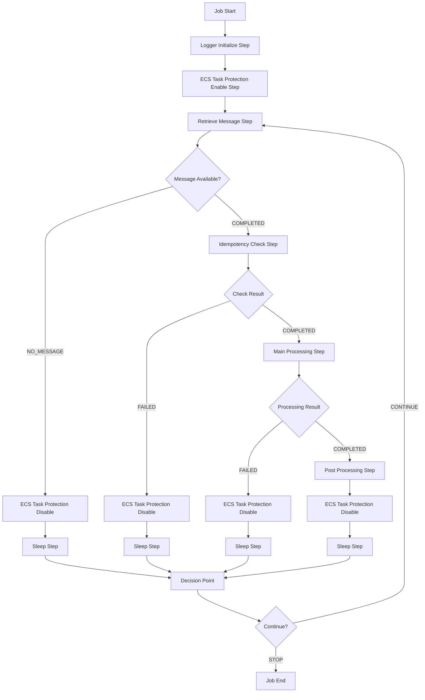
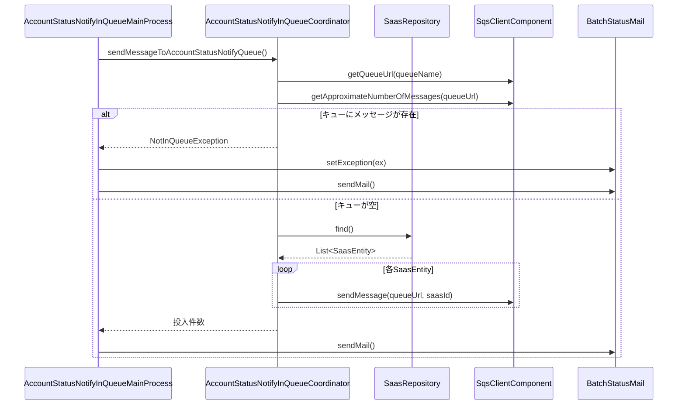
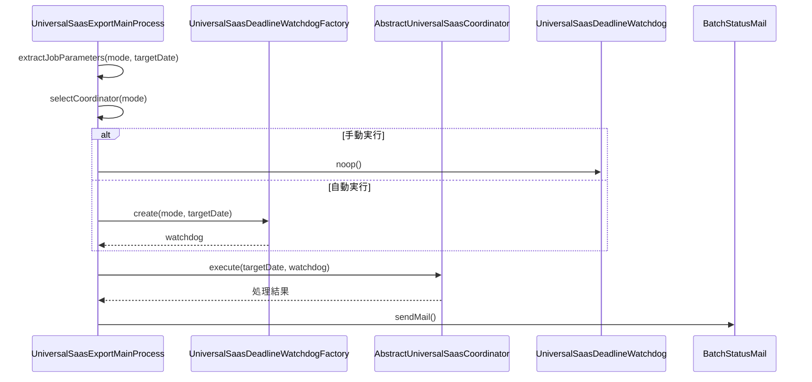
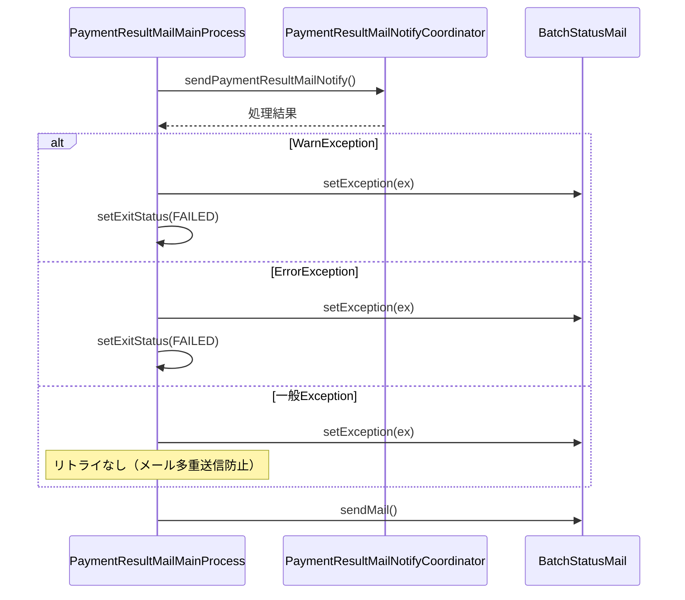
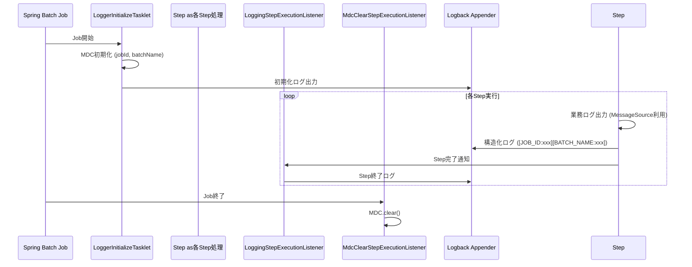

# Spring Batch 詳細設計書 - 複数バッチ分析

## はじめに

本設計書は、Hestiaプロジェクトの Spring Batch で実装された3つの異なるアーキテクチャパターンを持つバッチ処理について分析し、ローカル環境での実行方法を含む詳細な設計情報を提供します。

**対象バッチ:**
1. **AccountStatusNotifyInQueueMainProcess** - SQS キュー投入系
2. **UniversalSaasExportMainProcess** - データエクスポート系
3. **PaymentResultMailMainProcess** - メール送信系

---

## 1. バッチ処理概要

### 1.1 AccountStatusNotifyInQueueMainProcess

- **バッチ名/ID:** AccountStatusNotifyInQueue
- **目的:** 顧客口座登録状況通知データをSQSキューに投入する処理
- **起動トリガー:** スケジューラーまたは手動実行によるキュー投入準備処理

### 1.2 UniversalSaasExportMainProcess

- **バッチ名/ID:** UniversalSaasExport
- **目的:** 汎用SaaS連携ファイルの出力処理（予定データまたは結果データ）
- **起動トリガー:** 日次実行（手動実行時は対象日付指定可能）

### 1.3 PaymentResultMailMainProcess

- **バッチ名/ID:** PaymentResultMail
- **目的:** 支払結果に関するメール通知の送信処理
- **起動トリガー:** 支払処理完了後のメール通知処理

---

## 2. 処理フロー設計

### 2.1 共通Spring Batchフロー



### 2.2 バッチ別処理シーケンス

#### 2.2.1 AccountStatusNotifyInQueueMainProcess



#### 2.2.2 UniversalSaasExportMainProcess



#### 2.2.3 PaymentResultMailMainProcess



---

## 3. クラス・メソッド詳細

### 3.1 AccountStatusNotifyInQueueMainProcess

| クラス名 | メソッド名 | 処理内容詳細 | 備考 |
| :--- | :--- | :--- | :--- |
| AccountStatusNotifyInQueueMainProcess | execute() | メイン処理エントリポイント | Taskletインターフェース実装 |
| AccountStatusNotifyInQueueCoordinator | sendMessageToAccountStatusNotifyQueue() | SQSへのメッセージ投入処理 | キュー重複チェック付き |
| SaasRepository | find() | 承認済みSaaSエンティティ取得 | ドメインリポジトリパターン |
| SqsClientComponent | sendMessage() | SQSメッセージ送信 | AWS SDK ラッパー |

### 3.2 UniversalSaasExportMainProcess

| クラス名 | メソッド名 | 処理内容詳細 | 備考 |
| :--- | :--- | :--- | :--- |
| UniversalSaasExportMainProcess | execute() | モード別処理振り分け | Strategy パターン |
| AbstractUniversalSaasCoordinator | execute() | 抽象コーディネーター | Template Method パターン |
| UniversalSaasDeadlineWatchdogFactory | create() | 締切監視プロセス生成 | Factory パターン |
| UniversalSaasDeadlineWatchdog | (監視処理) | 締切時間による処理監視 | AutoCloseable 実装 |

### 3.3 PaymentResultMailMainProcess

| クラス名 | メソッド名 | 処理内容詳細 | 備考 |
| :--- | :--- | :--- | :--- |
| PaymentResultMailMainProcess | execute() | メール送信処理エントリポイント | 段階的例外処理 |
| PaymentResultMailNotifyCoordinator | sendPaymentResultMailNotify() | 支払結果メール送信コーディネート | ビジネスロジック集約 |

---

## 4. Tasklet 構成詳細

### 4.1 共通Tasklet構成

各バッチは以下の共通Stepで構成されます：

**Step名 / モデル:**
- **Logger Initialize Step:** (Tasklet) - ログ初期化処理
- **ECS Task Protection Enable Step:** (Tasklet) - ECSタスク保護有効化
- **Retrieve Message Step:** (Tasklet) - SQSからメッセージ受信
- **Idempotency Check Step:** (Tasklet) - 冪等性チェック
- **Main Processing Step:** (Tasklet) - メイン業務処理
- **Post Processing Step:** (Tasklet) - 後処理
- **ECS Task Protection Disable Step:** (Tasklet) - ECSタスク保護無効化
- **Sleep Step:** (Tasklet) - 次回実行までの待機

### 4.2 バッチ固有処理

#### 4.2.1 AccountStatusNotifyInQueueMainProcess
- **Reader:** T_SAAS テーブルから承認済みデータ取得
- **Processor:** SaasEntity → SaasId 抽出処理
- **Writer:** AWS SQS へのメッセージ投入

#### 4.2.2 UniversalSaasExportMainProcess
- **Reader:** モードに応じた動的データ取得
- **Processor:** ファイル形式への変換処理
- **Writer:** AWS S3 への CSV ファイル出力

#### 4.2.3 PaymentResultMailMainProcess
- **Reader:** 支払結果データ取得
- **Processor:** メールテンプレート生成処理
- **Writer:** AWS SES によるメール送信

---

## 5. データ入出力 (I/O)

### 5.1 入力リソース

| バッチ名 | データソース | 具体的リソース |
| :--- | :--- | :--- |
| AccountStatusNotifyInQueue | T_SAAS テーブル | 承認済みSaaSエンティティ |
| UniversalSaasExport | 複数テーブル | モードに応じた動的データソース |
| PaymentResultMail | T_PAYMENT テーブル | 支払結果データ |

### 5.2 出力リソース

| バッチ名 | 出力先 | 具体的リソース |
| :--- | :--- | :--- |
| AccountStatusNotifyInQueue | AWS SQS | 指定キューへのメッセージ |
| UniversalSaasExport | AWS S3 | flexpay/plan/ または flexpay/result/ |
| PaymentResultMail | AWS SES | 支払結果通知メール |

---

## 6. 例外処理とリトライ戦略

### 6.1 AccountStatusNotifyInQueueMainProcess

```java
// NotInQueueException: キューに既存メッセージがある場合
catch (NotInQueueException ex) {
    // 警告レベルでログ出力、処理停止
    log.error("impossible.retry", exceptionFormatter.generateExceptionString(ex));
    return RepeatStatus.FINISHED;
}

// 一般例外: 想定外エラー
catch (Exception ex) {
    // エラーレベルでログ出力、処理停止
    log.error("in.queue", exceptionFormatter.generateExceptionString(ex));
    return RepeatStatus.FINISHED;
}
```

### 6.2 UniversalSaasExportMainProcess

```java
// 一般例外: ファイル出力エラー等
catch (Exception ex) {
    // ExitStatus.FAILED 設定でリトライ可能
    contribution.setExitStatus(ExitStatus.FAILED);
    log.error("possible.retry.unexpected", exceptionFormatter.generateExceptionString(ex));
    return RepeatStatus.FINISHED;
}
```

### 6.3 PaymentResultMailMainProcess

```java
// WarnException: リトライ可能な警告
catch (WarnException ex) {
    contribution.setExitStatus(ExitStatus.FAILED);
    log.warn("possible.retry.warn", exceptionFormatter.generateExceptionString(ex));
}

// ErrorException: 非リトライ可能なエラー
catch (ErrorException ex) {
    contribution.setExitStatus(ExitStatus.FAILED);
    log.error("possible.retry.error", exceptionFormatter.generateExceptionString(ex));
}

// 一般Exception: メール多重送信防止のためリトライなし
catch (Exception ex) {
    // ExitStatus設定なし = リトライしない
    log.error("impossible.retry.unexpected", exceptionFormatter.generateExceptionString(ex));
}
```

---

## 7. コーディング上の懸念点・改善提案

### 7.1 メモリ効率

**懸念点:**
- UniversalSaasExportMainProcess で大量データの一括読み込みの可能性
- Chunk処理ではなくTasklet処理のため、メモリ使用量が不明

**改善提案:**
```java
// Chunk処理への移行検討
@Bean
public Step chunkProcessingStep() {
    return stepBuilderFactory.get("chunkStep")
        .<InputType, OutputType>chunk(1000)
        .reader(itemReader())
        .processor(itemProcessor())
        .writer(itemWriter())
        .build();
}
```

### 7.2 トランザクション

**懸念点:**
- ResourcelessTransactionManager使用でDB更新時のロールバック制御が不完全

**改善提案:**
```java
// 実DBトランザクション使用
@Bean
public DataSourceTransactionManager transactionManager(DataSource dataSource) {
    return new DataSourceTransactionManager(dataSource);
}
```

### 7.3 N+1問題

**懸念点:**
- AccountStatusNotifyInQueueCoordinator でのSaaSエンティティ個別SQS送信

**改善提案:**
```java
// バッチ送信の検討
public void sendMessages(List<SaasId> saasIds) {
    List<SendMessageBatchRequestEntry> entries = saasIds.stream()
        .map(id -> SendMessageBatchRequestEntry.builder()
            .id(id.toString())
            .messageBody(id.getValue())
            .build())
        .collect(Collectors.toList());
    
    sqsClient.sendMessageBatch(SendMessageBatchRequest.builder()
        .queueUrl(queueUrl)
        .entries(entries)
        .build());
}
```

### 7.4 定数の扱い

**懸念点:**
- ハードコーディングされた文字列リテラル

**改善提案:**
```java
public class BatchConstants {
    public static final String UNIVERSAL_SAAS_PLAN_MODE = "plan";
    public static final String UNIVERSAL_SAAS_RESULT_MODE = "result";
    public static final int DEFAULT_CHUNK_SIZE = 1000;
}
```

---

## 8. 実行手順とデータセット要件

### 8.1 起動コマンドと引数

#### A. 起動コマンド

```bash
# 基本実行コマンド
java -jar hestia-*.jar --batchName=<BATCH_NAME> [追加引数]

# プロファイル指定
java -jar hestia-*.jar --spring.profiles.active=local --batchName=<BATCH_NAME>
```

#### B. バッチ別引数詳細

**AccountStatusNotifyInQueueMainProcess:**
```bash
java -jar hestia-*.jar \
  --spring.profiles.active=local \
  --batchName=AccountStatusNotifyInQueue
```

**引数説明:**
- `batchName`: `AccountStatusNotifyInQueue` (固定)
- 追加引数不要

**UniversalSaasExportMainProcess:**
```bash
# 自動実行（当日データ）
java -jar hestia-*.jar \
  --spring.profiles.active=local \
  --batchName=UniversalSaasExport \
  --mode=plan

# 手動実行（指定日データ）
java -jar hestia-*.jar \
  --spring.profiles.active=local \
  --batchName=UniversalSaasExport \
  --mode=result \
  --targetDate=2024-01-01
```

**引数説明:**
- `batchName`: `UniversalSaasExport` (固定)
- `mode`: `plan` または `result` (必須)
- `targetDate`: `YYYY-MM-DD` 形式 (手動実行時のみ)

**PaymentResultMailMainProcess:**
```bash
java -jar hestia-*.jar \
  --spring.profiles.active=local \
  --batchName=PaymentResultMail
```

**引数説明:**
- `batchName`: `PaymentResultMail` (固定)
- 追加引数不要

### 8.2 ローカル環境セットアップ

#### A. 必要な環境変数

```bash
# データベース接続
export DB_ENDPOINT=localhost
export DB_NAME=hestia_local
export DB_SECRET_ID=local-db-secret

# AWS設定
export AWS_REGION=ap-northeast-1
export BUCKET_NAME=hestia-local-bucket
export BUCKET_NAME_UNIVERSAL_SAAS=hestia-universal-saas-local
export SQS_QUEUE_NAME=hestia-local-queue

# Redis
export ELASTICACHE_ENDPOINT=localhost
export ELASTICACHE_PORT=6379
export ELASTICACHE_SECRET_ID=local-redis-secret

# メール設定
export SES_MAIL_FROM=noreply@example.com
export OPS_MANAGER_MAIL=ops@example.com

# ECS (ローカルでは無効化)
export ECS_AGENT_URI=""
```

#### B. Docker Compose でのローカル環境

```yaml
version: '3.8'
services:
  mysql:
    image: mysql:8.0
    environment:
      MYSQL_ROOT_PASSWORD: root
      MYSQL_DATABASE: hestia_local
    ports:
      - "3306:3306"
    
  redis:
    image: redis:7-alpine
    ports:
      - "6379:6379"
      
  localstack:
    image: localstack/localstack
    environment:
      SERVICES: s3,sqs,ses,secretsmanager
    ports:
      - "4566:4566"
```

#### C. 初期データセット要件

**T_SAAS テーブル:**
```sql
INSERT INTO T_SAAS (saas_id, saas_name, status, created_at, updated_at) VALUES
(1, 'Test SaaS 1', 'APPROVED', NOW(), NOW()),
(2, 'Test SaaS 2', 'APPROVED', NOW(), NOW());
```

**T_PAYMENT テーブル:**
```sql
INSERT INTO T_PAYMENT (payment_id, customer_id, amount, status, created_at) VALUES
(1, 1, 1000, 'SUCCESS', NOW()),
(2, 2, 2000, 'FAILED', NOW());
```

**M_SYSTEM_CONFIG テーブル:**
```sql
INSERT INTO M_SYSTEM_CONFIG (config_key, config_value) VALUES
('UNIVERSAL_SAAS_PLAN_DEADLINE', '10:30:00'),
('UNIVERSAL_SAAS_RESULT_DEADLINE', '18:00:00');
```

### 8.3 実行前チェックリスト

- [ ] データベース接続確認
- [ ] SQS キューの作成・アクセス権限
- [ ] S3 バケットの作成・アクセス権限
- [ ] SES 設定（メール送信ドメイン認証）
- [ ] Redis 接続確認
- [ ] 必要な初期データの投入
- [ ] ログ出力先ディレクトリの作成

### 8.4 実行ログ例

**正常実行時:**
```
2024-01-01 10:00:00 INFO  - Tasklet start: Main Processing Step
2024-01-01 10:00:01 INFO  - メッセージを3件SQSキューへ投入しました
2024-01-01 10:00:02 INFO  - Tasklet end: Main Processing Step
```

**異常実行時:**
```
2024-01-01 10:00:00 ERROR - キューに既存メッセージが存在します
2024-01-01 10:00:01 INFO  - Tasklet end: Main Processing Step
```

---

## 9. ログ出力手法と設計戦略

### 9.1 ログ出力アーキテクチャ概要

このプロジェクトでは、Spring Batchバッチ処理において**構造化ログ**と**トレーサビリティ**を重視したログ出力手法を採用しています。

#### 9.1.1 使用技術スタック

| 技術・ライブラリ | 用途 | 設定ファイル |
| :--- | :--- | :--- |
| **SLF4J** | ログ抽象化フレームワーク | - |
| **Logback** | ログ実装 | [`src/main/resources/logback.xml`](src/main/resources/logback.xml) |
| **Lombok @Slf4j** | ログオブジェクト自動生成 | アノテーションベース |
| **MDC (Mapped Diagnostic Context)** | 構造化ログ情報 | - |
| **Spring MessageSource** | 多言語対応メッセージ | [`src/main/resources/messages.properties`](src/main/resources/messages.properties) |

#### 9.1.2 ログ出力フロー



### 9.2 詳細実装解析

#### 9.2.1 Logback設定 (`logback.xml`)

```xml
<appender name="STDOUT" class="ch.qos.logback.core.ConsoleAppender">
    <target>System.out</target>
    <encoder>
        <!-- 構造化ログパターン: 日時 + レベル + MDC情報 + クラス名 + メッセージ + スレッド -->
        <pattern>%d{yyyy-MM-dd'T'HH:mm:ss.SSSXXX} %-5level [JOB_ID:%X{jobId}] [BATCH_NAME:%X{batchName}] [%logger{0}] : %msg [%thread]%n</pattern>
    </encoder>
</appender>
```

**特徴:**
- **ISO 8601形式**の日時出力
- **MDC変数**（`%X{jobId}`, `%X{batchName}`）による動的情報埋め込み
- **標準出力/エラー出力分離**（WARN以下は stdout、ERROR以上は stderr）
- **フィルター機能**による出力制御

#### 9.2.2 MDC（Mapped Diagnostic Context）管理

**初期化処理** - [`LoggerInitializeTasklet.java`](hestia-core/src/main/java/jp/co/techfirm/hestia/application/tasklet/LoggerInitializeTasklet.java):
```java
@Override
public RepeatStatus execute(StepContribution contribution, ChunkContext chunkContext) {
    JobParameters jobParameters =
        chunkContext.getStepContext().getStepExecution().getJobParameters();
    
    // batchNameパラメータを取得
    String batchName = jobParameters.getString("batchName");
    
    // jobIdの取得
    StepExecution stepExecution = StepSynchronizationManager.getContext().getStepExecution();
    Long jobExecutionId = stepExecution.getJobExecutionId();
    
    // MDCに設定 → 以降の全ログに自動付加
    MDC.put("batchName", batchName);
    MDC.put("jobId", jobExecutionId.toString());
    
    return RepeatStatus.FINISHED;
}
```

**クリア処理** - [`MdcClearStepExecutionListener.java`](hestia-core/src/main/java/jp/co/techfirm/hestia/application/listener/MdcClearStepExecutionListener.java):
```java
@Override
public void afterJob(JobExecution jobExecution) {
    // ジョブ終了後にMDCをクリア（メモリリーク防止）
    MDC.clear();
}
```

#### 9.2.3 MessageSource多言語対応ログ

**メッセージ定義** - [`messages.properties`](src/main/resources/messages.properties):
```properties
# バッチ共通メッセージ
log.info.tasklet.start={0} 開始
log.info.tasklet.end={0} 終了
log.info.in.queue.num=SQSメッセージ投入数: {0}

# エラーレベル別メッセージ
log.error.impossible.retry=【リトライ不可】エラーが発生しました。 {0}
log.warn.possible.retry=エラーが発生しました。リトライ対象となります。 {0}
log.warn.possible.retry.warn=【リトライ可能】【warn】エラーが発生しました。 {0}
```

**使用例** - バッチ処理内:
```java
@RequiredArgsConstructor
@Slf4j
public class AccountStatusNotifyInQueueMainProcess implements Tasklet {
    
    private final MessageSource messageSource;
    
    @Override
    public RepeatStatus execute(StepContribution contribution, ChunkContext chunkContext) {
        // 開始ログ（多言語対応）
        log.info(
            messageSource.getMessage(
                "log.info.tasklet.start",
                new String[]{contribution.getStepExecution().getStepName()},
                Locale.getDefault()));
        
        // 処理結果ログ
        log.info(
            messageSource.getMessage(
                "log.info.in.queue.num",
                new String[]{sendMessageNum.toString()},
                Locale.getDefault()));
                
        return RepeatStatus.FINISHED;
    }
}
```

### 9.3 ログレベル戦略とトレーサビリティ

#### 9.3.1 レベル別使い分け

| ログレベル | 用途 | 実装例 |
| :--- | :--- | :--- |
| **INFO** | 正常フロー、処理開始/終了 | `log.info("tasklet.start")` |
| **WARN** | リトライ可能エラー、業務警告 | `catch (WarnException ex)` |
| **ERROR** | システムエラー、リトライ不可エラー | `catch (Exception ex)` |
| **DEBUG** | 詳細実行情報（本番では無効化） | 開発時のみ使用 |

#### 9.3.2 例外処理とログ出力パターン

**段階的例外処理** - [`PaymentResultMailMainProcess.java`](hestia-core/src/main/java/jp/co/techfirm/hestia/application/tasklet/mainProcess/PaymentResultMailMainProcess.java):
```java
try {
    // メイン処理
    paymentResultEmailCoordinator.sendPaymentResultMailNotify();
    this.batchStatusMail.sendMail();
    
} catch (WarnException ex) {
    // リトライ可能な警告 → WARN レベル
    this.batchStatusMail.setException(ex);
    log.warn(messageSource.getMessage("log.warn.possible.retry.warn",
        new String[]{exceptionFormatterService.generateExceptionString(ex)},
        Locale.getDefault()));
    contribution.setExitStatus(ExitStatus.FAILED);
    
} catch (ErrorException ex) {
    // 非リトライ可能なエラー → ERROR レベル
    this.batchStatusMail.setException(ex);
    log.error(messageSource.getMessage("log.warn.possible.retry.error",
        new String[]{exceptionFormatterService.generateExceptionString(ex)},
        Locale.getDefault()));
    contribution.setExitStatus(ExitStatus.FAILED);
    
} catch (Exception ex) {
    // 一般例外 → ERROR レベル、ただしリトライ設定なし（メール多重送信防止）
    this.batchStatusMail.setException(ex);
    log.error(messageSource.getMessage("log.error.possible.impossible.retry.unexpected",
        new String[]{exceptionFormatterService.generateExceptionString(ex)},
        Locale.getDefault()));
    // contribution.setExitStatus(ExitStatus.FAILED); をコメントアウト
}
```

#### 9.3.3 ステップ単位のログ管理

**LoggingStepExecutionListener** - [`LoggingStepExecutionListener.java`](hestia-core/src/main/java/jp/co/techfirm/hestia/application/listener/LoggingStepExecutionListener.java):
```java
@Override
public ExitStatus afterStep(StepExecution stepExecution) {
    // ステップ終了ログ（ステップ名 + 終了ステータス）
    log.info(
        messageSource.getMessage(
            "log.info.step.listener.after.step",
            new String[]{
                stepExecution.getStepName(),
                stepExecution.getExitStatus().getExitCode()
            },
            Locale.getDefault()));
            
    // 特殊ステータスの継承処理
    if ("NO_MESSAGE".equals(stepExecution.getExitStatus().getExitCode())) {
        return new ExitStatus("NO_MESSAGE");
    }
    
    return stepExecution.getExitStatus();
}
```

### 9.4 実際のログ出力例

#### 9.4.1 正常実行時のログ

```
2024-01-01T10:00:00.123+09:00 INFO  [JOB_ID:1001] [BATCH_NAME:AccountStatusNotifyInQueue] [LoggerInitializeTa] : Logger初期化完了 [batch-thread-1]
2024-01-01T10:00:00.234+09:00 INFO  [JOB_ID:1001] [BATCH_NAME:AccountStatusNotifyInQueue] [AccountStatusNoti] : Main Processing Step 開始 [batch-thread-1]
2024-01-01T10:00:01.345+09:00 INFO  [JOB_ID:1001] [BATCH_NAME:AccountStatusNotifyInQueue] [AccountStatusNoti] : SQSメッセージ投入数: 3 [batch-thread-1]
2024-01-01T10:00:01.456+09:00 INFO  [JOB_ID:1001] [BATCH_NAME:AccountStatusNotifyInQueue] [LoggingStepExecuti] : ステップ Main Processing Step 終了 ステータス: COMPLETED [batch-thread-1]
2024-01-01T10:00:01.567+09:00 INFO  [JOB_ID:1001] [BATCH_NAME:AccountStatusNotifyInQueue] [AccountStatusNoti] : Main Processing Step 終了 [batch-thread-1]
```

#### 9.4.2 異常実行時のログ

```
2024-01-01T10:00:00.123+09:00 INFO  [JOB_ID:1002] [BATCH_NAME:AccountStatusNotifyInQueue] [AccountStatusNoti] : Main Processing Step 開始 [batch-thread-1]
2024-01-01T10:00:00.234+09:00 ERROR [JOB_ID:1002] [BATCH_NAME:AccountStatusNotifyInQueue] [AccountStatusNoti] : 【リトライ不可】エラーが発生しました。 jp.co.techfirm.hestia.application.exception.NotInQueueException: キューに既存メッセージが存在します
        at jp.co.techfirm.hestia.application.coordinator.AccountStatusNotifyInQueueCoordinator.sendMessageToAccountStatusNotifyQueue(AccountStatusNotifyInQueueCoordinator.java:54) [batch-thread-1]
2024-01-01T10:00:00.345+09:00 INFO  [JOB_ID:1002] [BATCH_NAME:AccountStatusNotifyInQueue] [LoggingStepExecuti] : ステップ Main Processing Step 終了 ステータス: COMPLETED [batch-thread-1]
```

### 9.5 ログ監視・運用における活用方法

#### 9.5.1 検索・フィルタリング戦略

**jobId による処理追跡:**
```bash
# 特定ジョブのログのみ抽出
grep "JOB_ID:1001" application.log

# 特定バッチのエラーログのみ抽出
grep -E "ERROR.*BATCH_NAME:AccountStatusNotifyInQueue" application.log
```

**ログ解析パターン:**
```bash
# 投入メッセージ数の統計取得
grep "SQSメッセージ投入数" application.log | awk -F': ' '{sum+=$2} END {print "合計投入数:", sum}'

# バッチ実行時間の分析
grep -E "(開始|終了)" application.log | grep "AccountStatusNotifyInQueue"
```

#### 9.5.2 アラート設定指針

**CloudWatch Logs や ELK Stack での監視:**
```json
{
  "error_alert": {
    "condition": "ERROR AND BATCH_NAME:*",
    "threshold": 1,
    "action": "send_notification"
  },
  "retry_warning": {
    "condition": "リトライ可能",
    "threshold": 5,
    "timeframe": "5min"
  }
}
```

### 9.6 ログ設計のベストプラクティス

#### 9.6.1 採用されている優良パターン

1. **構造化ログ**: MDC による文脈情報の自動付加
2. **責務分離**: ビジネスログ（MessageSource）とシステムログ（固定メッセージ）の分離
3. **レベル戦略**: リトライ可否に応じた適切なレベル設定
4. **リソース管理**: MDC のライフサイクル管理（初期化〜クリア）
5. **国際化対応**: メッセージプロパティによる多言語対応

#### 9.6.2 改善検討ポイント

**非同期ログ出力の導入:**
```xml
<!-- logback.xml への追加検討 -->
<appender name="ASYNC" class="ch.qos.logback.classic.AsyncAppender">
    <appender-ref ref="STDOUT"/>
    <queueSize>512</queueSize>
    <neverBlock>true</neverBlock>
</appender>
```

**ログ出力の構造化強化:**
```java
// 構造化ログライブラリ（Structured Logging）の活用検討
log.info("バッチ処理完了",
    kv("jobId", jobExecutionId),
    kv("batchName", batchName),
    kv("processedCount", processedCount),
    kv("duration", duration));
```

---

## 10. アーキテクチャ学習ポイント

### 9.1 SQS キュー投入パターン (AccountStatusNotifyInQueue)

**学習要素:**
- メッセージキューを活用した非同期処理パターン
- キュー重複チェックによるデータ整合性確保
- AWS SQS との統合方法

### 9.2 ファイル出力パターン (UniversalSaasExport)

**学習要素:**
- Strategy パターンによる処理切り替え
- 締切監視による処理制御
- S3 を活用したファイル管理

### 9.3 メール送信パターン (PaymentResultMail)

**学習要素:**
- 段階的例外処理による障害対応
- メール多重送信防止の実装
- SES を活用したメール送信

### 9.4 共通フレームワークパターン

**学習要素:**
- Spring Batch の Job/Step 構成
- 冪等性チェックによる再実行安全性
- ECS タスク保護によるコンテナ管理
- 設定外部化による環境対応

---

## 10. まとめ

本設計書で分析した3つのバッチ処理は、それぞれ異なるアーキテクチャパターンを持ち、Spring Batch の様々な活用方法を学ぶことができます。

**重要なポイント:**
1. **共通基盤**: 統一されたJob/Step構成による保守性向上
2. **例外処理**: バッチ処理特有の障害対応戦略
3. **AWS統合**: クラウドネイティブなバッチ処理の実装
4. **設定管理**: 環境依存設定の外部化

ローカル環境での実行を通して、実際のバッチ処理の動作を確認し、プロダクションレベルのSpring Batchアプリケーションの理解を深めることができます。