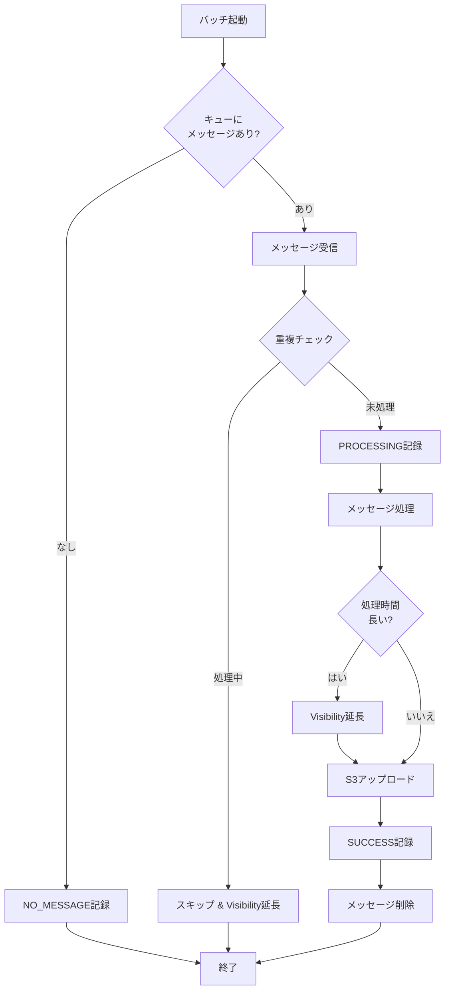
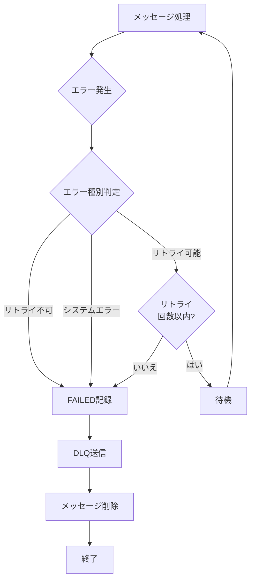

# SQS処理改修 実装仕様書（完全版）

## 📋 概要

本ドキュメントは、SQS処理の改修に関する詳細な実装仕様を記載しています。

**改修の主な目的**:
1. キューメッセージの存在チェック機能の追加
2. メッセージ処理中の重複実行防止
3. エラーハンドリング・失敗時の処理強化
4. メッセージ削除（Acknowledge）機能の追加
5. リトライ・DLQ対応の追加

---

## 🎯 改修のポイント

### 現在の問題点
1. ✗ キューにメッセージがあるかチェックしていない
2. ✗ メッセージ削除（Acknowledge）機能がない → 重複処理のリスク
3. ✗ エラー時の詳細なハンドリングが不足
4. ✗ 重複実行防止機能がない
5. ✗ DLQ（Dead Letter Queue）対応がない

### 改修後
1. ✓ バッチ実行前にキューのメッセージ数をチェック
2. ✓ 処理成功後にメッセージを削除
3. ✓ エラー種別に応じた適切なハンドリング
4. ✓ messageIdによる重複実行防止
5. ✓ 失敗メッセージのDLQ送信

---

## 📁 ディレクトリ構造（改修後）

```
demo/src/main/java/com/example/demo/
├── domain/
│   ├── entity/
│   │   └── BatchLogEntity.java          # 改修: フィールド追加
│   ├── exception/                        # 新規
│   │   └── BatchProcessException.java   # 新規: カスタム例外
│   ├── model/                            # 新規
│   │   ├── SqsMessage.java              # 新規: SQSメッセージDTO
│   │   └── BatchErrorType.java          # 新規: エラー種別Enum
│   └── repository/
│       ├── SqsRepository.java           # 改修: メソッド追加
│       └── BatchLogRepository.java      # 改修: メソッド追加
├── infrastructure/
│   └── repository/
│       └── SqsRepositoryMock.java       # 改修: 全面改修
└── application/
    └── service/
        └── BatchProcessService.java     # 改修: 大幅改修
```

---

## 🔧 詳細実装仕様

### 1. SqsMessage.java（新規作成）

**パス**: `demo/src/main/java/com/example/demo/domain/model/SqsMessage.java`

```java
package com.example.demo.domain.model;

import java.time.LocalDateTime;

/**
 * SQSメッセージDTO
 * SQSから受信したメッセージの情報を保持
 */
public class SqsMessage {
    
    private final String messageId;
    private final String content;
    private final String receiptHandle;
    private final LocalDateTime receivedAt;
    
    public SqsMessage(String messageId, String content, String receiptHandle) {
        this.messageId = messageId;
        this.content = content;
        this.receiptHandle = receiptHandle;
        this.receivedAt = LocalDateTime.now();
    }
    
    public String getMessageId() {
        return messageId;
    }
    
    public String getContent() {
        return content;
    }
    
    public String getReceiptHandle() {
        return receiptHandle;
    }
    
    public LocalDateTime getReceivedAt() {
        return receivedAt;
    }
    
    @Override
    public String toString() {
        return "SqsMessage{" +
                "messageId='" + messageId + '\'' +
                ", content='" + content + '\'' +
                ", receiptHandle='" + receiptHandle + '\'' +
                ", receivedAt=" + receivedAt +
                '}';
    }
}
```

---

### 2. BatchErrorType.java（新規作成）

**パス**: `demo/src/main/java/com/example/demo/domain/model/BatchErrorType.java`

```java
package com.example.demo.domain.model;

/**
 * バッチ処理エラー種別
 */
public enum BatchErrorType {
    
    RETRYABLE("リトライ可能"),
    NON_RETRYABLE("リトライ不可"),
    SYSTEM_ERROR("システムエラー");
    
    private final String description;
    
    BatchErrorType(String description) {
        this.description = description;
    }
    
    public String getDescription() {
        return description;
    }
    
    /**
     * 例外からエラー種別を判定
     */
    public static BatchErrorType fromException(Exception ex) {
        String message = ex.getMessage();
        String className = ex.getClass().getSimpleName();
        
        // タイムアウト系
        if (className.contains("Timeout") || message.contains("timeout")) {
            return RETRYABLE;
        }
        
        // ネットワーク系
        if (className.contains("Network") || className.contains("Connection")) {
            return RETRYABLE;
        }
        
        // データ形式エラー
        if (className.contains("Parse") || className.contains("Format")) {
            return NON_RETRYABLE;
        }
        
        // ビジネスロジックエラー
        if (className.contains("IllegalArgument") || className.contains("Validation")) {
            return NON_RETRYABLE;
        }
        
        // その他はシステムエラー
        return SYSTEM_ERROR;
    }
}
```

---

### 3. BatchProcessException.java（新規作成）

**パス**: `demo/src/main/java/com/example/demo/domain/exception/BatchProcessException.java`

```java
package com.example.demo.domain.exception;

import com.example.demo.domain.model.BatchErrorType;

/**
 * バッチ処理例外
 */
public class BatchProcessException extends RuntimeException {
    
    private final BatchErrorType errorType;
    private final String messageId;
    
    public BatchProcessException(String message, BatchErrorType errorType) {
        super(message);
        this.errorType = errorType;
        this.messageId = null;
    }
    
    public BatchProcessException(String message, BatchErrorType errorType, String messageId) {
        super(message);
        this.errorType = errorType;
        this.messageId = messageId;
    }
    
    public BatchProcessException(String message, Throwable cause, BatchErrorType errorType) {
        super(message, cause);
        this.errorType = errorType;
        this.messageId = null;
    }
    
    public BatchProcessException(String message, Throwable cause, BatchErrorType errorType, String messageId) {
        super(message, cause);
        this.errorType = errorType;
        this.messageId = messageId;
    }
    
    public BatchErrorType getErrorType() {
        return errorType;
    }
    
    public String getMessageId() {
        return messageId;
    }
    
    public boolean isRetryable() {
        return errorType == BatchErrorType.RETRYABLE;
    }
}
```

---

### 4. SqsRepository.java（改修）

**変更点**: メソッド追加

```java
package com.example.demo.domain.repository;

import com.example.demo.domain.model.SqsMessage;

public interface SqsRepository {
    
    // 既存メソッド（戻り値の型を変更）
    SqsMessage receiveMessage();
    void sendMessage(String message);
    int getApproximateNumberOfMessages();
    
    // 新規追加メソッド
    void deleteMessage(String receiptHandle);
    void changeMessageVisibility(String receiptHandle, int visibilityTimeout);
    void sendToDLQ(String originalMessage, String errorDetails);
}
```

---

### 5. BatchLogEntity.java（改修）

**変更点**: フィールド追加

新規追加フィールド:
- `String messageId` - SQSメッセージID
- `String receiptHandle` - SQSレシートハンドル
- `String errorDetails` - エラー詳細
- `Integer retryCount` - リトライ回数
- `LocalDateTime startedAt` - 処理開始時刻
- `LocalDateTime completedAt` - 処理完了時刻

---

### 6. schema.sql（改修）

**変更点**: カラム追加とインデックス作成

```sql
-- バッチログテーブル
CREATE TABLE IF NOT EXISTS batch_log (
    id BIGINT AUTO_INCREMENT PRIMARY KEY,
    batch_name VARCHAR(255) NOT NULL,
    message TEXT,
    status VARCHAR(50) NOT NULL,
    created_at TIMESTAMP NOT NULL,
    -- 新規追加
    message_id VARCHAR(255),
    receipt_handle VARCHAR(255),
    error_details TEXT,
    retry_count INT DEFAULT 0,
    started_at TIMESTAMP,
    completed_at TIMESTAMP
);

-- インデックス
CREATE INDEX IF NOT EXISTS idx_batch_name ON batch_log(batch_name);
CREATE INDEX IF NOT EXISTS idx_created_at ON batch_log(created_at);
CREATE INDEX IF NOT EXISTS idx_message_id ON batch_log(message_id);
CREATE INDEX IF NOT EXISTS idx_status ON batch_log(status);
CREATE INDEX IF NOT EXISTS idx_message_id_status ON batch_log(message_id, status);
```

---

## 📊 処理フロー図

### 改修後の正常系フロー



### 改修後のエラー系フロー



---

## ✅ 実装チェックリスト

### Phase 1: 基盤整備
- [ ] `SqsMessage.java` の作成
- [ ] `BatchErrorType.java` の作成
- [ ] `BatchProcessException.java` の作成
- [ ] `schema.sql` の更新
- [ ] `BatchLogEntity.java` のフィールド追加

### Phase 2: リポジトリ層
- [ ] `SqsRepository.java` インターフェース拡張
- [ ] `SqsRepositoryMock.java` の改修
- [ ] `BatchLogRepository.java` インターフェース拡張
- [ ] `BatchLogMapper.xml` の更新

### Phase 3: サービス層
- [ ] `BatchProcessService.hasMessagesInQueue()` 追加
- [ ] `BatchProcessService.receiveMessageWithRetry()` 改修
- [ ] `BatchProcessService.isMessageProcessing()` 追加
- [ ] `BatchProcessService.handleDuplicateProcessing()` 追加
- [ ] `BatchProcessService.extendVisibilityIfNeeded()` 追加
- [ ] `BatchProcessService.deleteMessage()` 追加
- [ ] `BatchProcessService.handleProcessingError()` 追加
- [ ] `BatchProcessService.recordFailureStatus()` 追加
- [ ] `BatchProcessService.sendToDLQ()` 追加

### Phase 4: プレゼンテーション層
- [ ] `HelloAwsTasklet.java` のキューチェック追加

### Phase 5: テスト
- [ ] 正常系テスト
- [ ] エラー系テスト
- [ ] 重複実行防止テスト
- [ ] DLQ送信テスト

---

## 🧪 テストシナリオ

### 1. 正常系テスト
- キューにメッセージがある場合の正常処理
- メッセージ削除の確認
- DBステータスの確認

### 2. メッセージなしテスト
- キューが空の場合の処理
- NO_MESSAGEステータスの記録

### 3. 重複実行防止テスト
- 同じメッセージIDの処理中チェック
- Visibility Timeout延長の確認

### 4. エラーハンドリングテスト
- リトライ可能エラーの処理
- リトライ不可エラーの処理
- DLQ送信の確認

### 5. Visibility Timeout延長テスト
- 長時間処理時の延長確認

---

## 📈 改修前後の比較

| 機能 | 改修前 | 改修後 |
|------|--------|--------|
| キューチェック | ❌ | ✅ |
| 重複実行防止 | ❌ | ✅ |
| メッセージ削除 | ❌ | ✅ |
| エラー詳細記録 | ⚠️ | ✅ |
| DLQ対応 | ❌ | ✅ |
| Visibility管理 | ❌ | ✅ |
| トレーサビリティ | ⚠️ | ✅ |

---

## ⚠️ 重要な注意事項

### 1. トランザクション管理
- メッセージ削除は成功時のみ実行
- DB更新とSQS操作の整合性に注意

### 2. Visibility Timeout
- デフォルト: 300秒（5分）
- 処理時間に応じた調整が必要

### 3. DLQ運用
- DLQの定期的な監視
- 失敗メッセージの再処理フロー

### 4. パフォーマンス
- DB検索のインデックス活用
- メモリ使用量の監視

---

**作成日**: 2026-04-04
**バージョン**: 1.0
**ステータス**: レビュー待ち

---

## 📝 補足: 完全なBatchProcessService実装例

889行目で途切れていた `private` メソッドの続きを含む、完全な実装例を以下に示します。

### DLQへの送信メソッド

```java
/**
 * DLQへの送信
 */
private void sendToDLQ(SqsMessage sqsMessage, Exception ex) {
    String errorDetails = getErrorDetails(ex);
    sqsRepository.sendToDLQ(sqsMessage.getContent(), errorDetails);
    logger.info("DLQへメッセージを送信しました - MessageId: %s", sqsMessage.getMessageId());
}

/**
 * エラー詳細の取得
 */
private String getErrorDetails(Exception ex) {
    StringWriter sw = new StringWriter();
    PrintWriter pw = new PrintWriter(sw);
    ex.printStackTrace(pw);
    return sw.toString();
}

/**
 * スリープ処理
 */
private void sleep(long millis) {
    try {
        Thread.sleep(millis);
    } catch (InterruptedException e) {
        Thread.currentThread().interrupt();
        throw new RuntimeException("スリープ処理が中断されました", e);
    }
}
```

---

## 📋 BatchLogMapper.java の実装

**パス**: `demo/src/main/java/com/example/demo/infrastructure/mapper/BatchLogMapper.java`

```java
package com.example.demo.infrastructure.mapper;

import com.example.demo.domain.entity.BatchLogEntity;
import org.apache.ibatis.annotations.Mapper;
import org.apache.ibatis.annotations.Param;

import java.util.List;

/**
 * バッチログMapperインターフェース
 */
@Mapper
public interface BatchLogMapper {
    
    /**
     * バッチログを挿入
     */
    void insert(BatchLogEntity entity);
    
    /**
     * バッチ名で検索
     */
    List<BatchLogEntity> findByBatchName(@Param("batchName") String batchName);
    
    /**
     * 全件取得
     */
    List<BatchLogEntity> findAll();
    
    /**
     * メッセージIDで処理中のレコードを検索
     */
    BatchLogEntity findProcessingByMessageId(@Param("messageId") String messageId);
    
    /**
     * メッセージIDで検索
     */
    List<BatchLogEntity> findByMessageId(@Param("messageId") String messageId);
}
```

---

## 📋 BatchLogRepositoryImpl.java の実装

**パス**: `demo/src/main/java/com/example/demo/infrastructure/repository/BatchLogRepositoryImpl.java`

```java
package com.example.demo.infrastructure.repository;

import com.example.demo.domain.entity.BatchLogEntity;
import com.example.demo.domain.repository.BatchLogRepository;
import com.example.demo.infrastructure.mapper.BatchLogMapper;
import org.springframework.stereotype.Repository;

import java.util.List;

/**
 * バッチログリポジトリ実装
 */
@Repository
public class BatchLogRepositoryImpl implements BatchLogRepository {
    
    private final BatchLogMapper mapper;
    
    public BatchLogRepositoryImpl(BatchLogMapper mapper) {
        this.mapper = mapper;
    }
    
    @Override
    public void insert(BatchLogEntity entity) {
        mapper.insert(entity);
    }
    
    @Override
    public List<BatchLogEntity> findByBatchName(String batchName) {
        return mapper.findByBatchName(batchName);
    }
    
    @Override
    public List<BatchLogEntity> findAll() {
        return mapper.findAll();
    }
    
    @Override
    public BatchLogEntity findProcessingByMessageId(String messageId) {
        return mapper.findProcessingByMessageId(messageId);
    }
    
    @Override
    public List<BatchLogEntity> findByMessageId(String messageId) {
        return mapper.findByMessageId(messageId);
    }
}
```

---

## 🧪 詳細なテストケース

### テストケース1: 正常系 - メッセージ処理成功

**前提条件**:
- SQSキューにメッセージが1件存在
- DBは初期状態

**実行手順**:
1. バッチを起動
2. メッセージを受信
3. 処理を実行
4. S3にアップロード
5. メッセージを削除

**期待結果**:
- DBに以下のレコードが記録される:
  - 1件目: status='PROCESSING', message_id='xxx'
  - 2件目: status='SUCCESS', message_id='xxx'
- SQSからメッセージが削除される
- S3にファイルがアップロードされる

**検証SQL**:
```sql
SELECT * FROM batch_log WHERE message_id = 'xxx' ORDER BY created_at;
```

---

### テストケース2: メッセージなし

**前提条件**:
- SQSキューが空

**実行手順**:
1. バッチを起動
2. キューチェック実行

**期待結果**:
- DBに以下のレコードが記録される:
  - status='SUCCESS', message='NO_MESSAGE'
- 処理がスキップされる

---

### テストケース3: 重複実行防止

**前提条件**:
- SQSキューにメッセージが1件存在
- 同じメッセージIDで status='PROCESSING' のレコードがDBに存在

**実行手順**:
1. バッチを起動
2. メッセージを受信
3. 重複チェック実行

**期待結果**:
- 処理がスキップされる
- Visibility Timeoutが延長される
- ログに「既に処理中」のメッセージが出力される

---

### テストケース4: リトライ可能エラー

**前提条件**:
- SQSキューにメッセージが1件存在
- 処理中に一時的なエラーが発生（例: タイムアウト）

**実行手順**:
1. バッチを起動
2. メッセージを受信
3. 処理実行（1回目失敗）
4. リトライ（2回目成功）

**期待結果**:
- リトライが実行される
- 最終的に成功ステータスが記録される
- メッセージが削除される

---

### テストケース5: リトライ不可エラー

**前提条件**:
- SQSキューにメッセージが1件存在
- 処理中にデータ形式エラーが発生

**実行手順**:
1. バッチを起動
2. メッセージを受信
3. 処理実行（エラー発生）

**期待結果**:
- DBに以下のレコードが記録される:
  - status='FAILED', error_details='...'
- DLQにメッセージが送信される
- 元のキューからメッセージが削除される

---

### テストケース6: Visibility Timeout延長

**前提条件**:
- SQSキューにメッセージが1件存在
- 処理に60秒以上かかる

**実行手順**:
1. バッチを起動
2. メッセージを受信
3. 長時間処理を実行

**期待結果**:
- 処理時間が閾値を超えた時点でVisibility Timeoutが延長される
- ログに延長メッセージが出力される

---

## 🔍 トラブルシューティング

### 問題1: メッセージが重複処理される

**原因**:
- メッセージ削除が実行されていない
- Visibility Timeoutが短すぎる

**対策**:
1. `deleteMessage()` が正しく呼ばれているか確認
2. Visibility Timeoutを延長（300秒→600秒）
3. ログで削除処理を確認

---

### 問題2: DLQにメッセージが送信されない

**原因**:
- エラー種別の判定が正しくない
- DLQ送信処理でエラーが発生

**対策**:
1. `BatchErrorType.fromException()` のロジックを確認
2. DLQ送信処理のログを確認
3. SqsRepositoryMockのDLQキューを確認

---

### 問題3: DBに重複レコードが作成される

**原因**:
- トランザクション管理が不適切
- 重複チェックが機能していない

**対策**:
1. `@Transactional` アノテーションを確認
2. `findProcessingByMessageId()` のSQLを確認
3. インデックスが正しく作成されているか確認

---

## 📊 パフォーマンス考慮事項

### 1. DB検索の最適化

**重複チェッククエリ**:
```sql
SELECT * FROM batch_log
WHERE message_id = ? AND status = 'PROCESSING'
LIMIT 1;
```

**推奨インデックス**:
```sql
CREATE INDEX idx_message_id_status ON batch_log(message_id, status);
```

---

### 2. メモリ使用量

**大量のエラー詳細を保存する場合**:
- `error_details` カラムのサイズ制限を検討
- スタックトレースの深さを制限

```java
private String getErrorDetails(Exception ex) {
    StringWriter sw = new StringWriter();
    PrintWriter pw = new PrintWriter(sw);
    ex.printStackTrace(pw);
    String details = sw.toString();
    
    // 最大10000文字に制限
    if (details.length() > 10000) {
        return details.substring(0, 10000) + "... (truncated)";
    }
    return details;
}
```

---

### 3. SQS API呼び出しの最適化

**バッチ処理の場合**:
- 複数メッセージの一括受信を検討
- Long Polling を使用（wait_time_seconds=20）

---

## 🎓 ベストプラクティス

### 1. ログ出力

**推奨ログレベル**:
- INFO: 処理の開始・終了、主要な処理ステップ
- WARN: リトライ、重複検知
- ERROR: エラー発生、DLQ送信

**ログフォーマット**:
```
[MessageId: xxx] メッセージ処理開始
[MessageId: xxx] 処理中ステータス記録完了
[MessageId: xxx] メッセージ処理完了
[MessageId: xxx] メッセージ削除完了
```

---

### 2. エラーハンドリング

**エラー種別の明確化**:
- リトライ可能: ネットワークエラー、タイムアウト
- リトライ不可: データ形式エラー、ビジネスロジックエラー
- システムエラー: 予期しない例外

---

### 3. モニタリング

**監視すべき指標**:
- 処理成功率
- 平均処理時間
- DLQメッセージ数
- リトライ回数

---

## 📚 参考資料

### AWS SQS関連
- [Amazon SQS Best Practices](https://docs.aws.amazon.com/AWSSimpleQueueService/latest/SQSDeveloperGuide/sqs-best-practices.html)
- [Visibility Timeout](https://docs.aws.amazon.com/AWSSimpleQueueService/latest/SQSDeveloperGuide/sqs-visibility-timeout.html)
- [Dead-Letter Queues](https://docs.aws.amazon.com/AWSSimpleQueueService/latest/SQSDeveloperGuide/sqs-dead-letter-queues.html)

### Spring Batch関連
- [Spring Batch Error Handling](https://docs.spring.io/spring-batch/docs/current/reference/html/step.html#errorHandling)
- [Spring Batch Transaction Management](https://docs.spring.io/spring-batch/docs/current/reference/html/transaction.html)

### デザインパターン
- [Idempotent Consumer Pattern](https://microservices.io/patterns/communication-style/idempotent-consumer.html)
- [Retry Pattern](https://docs.microsoft.com/en-us/azure/architecture/patterns/retry)

---

**最終更新日**: 2026-04-04
**バージョン**: 2.0（完全版）
**ステータス**: レビュー待ち
