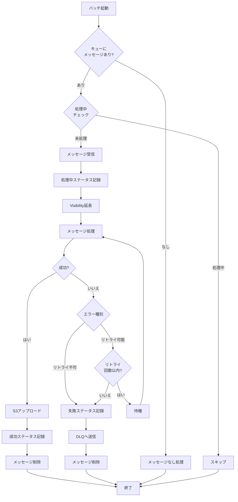
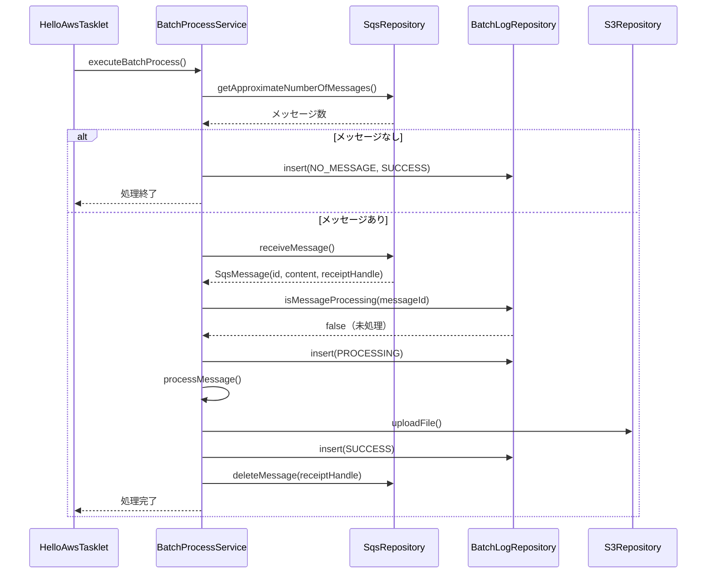
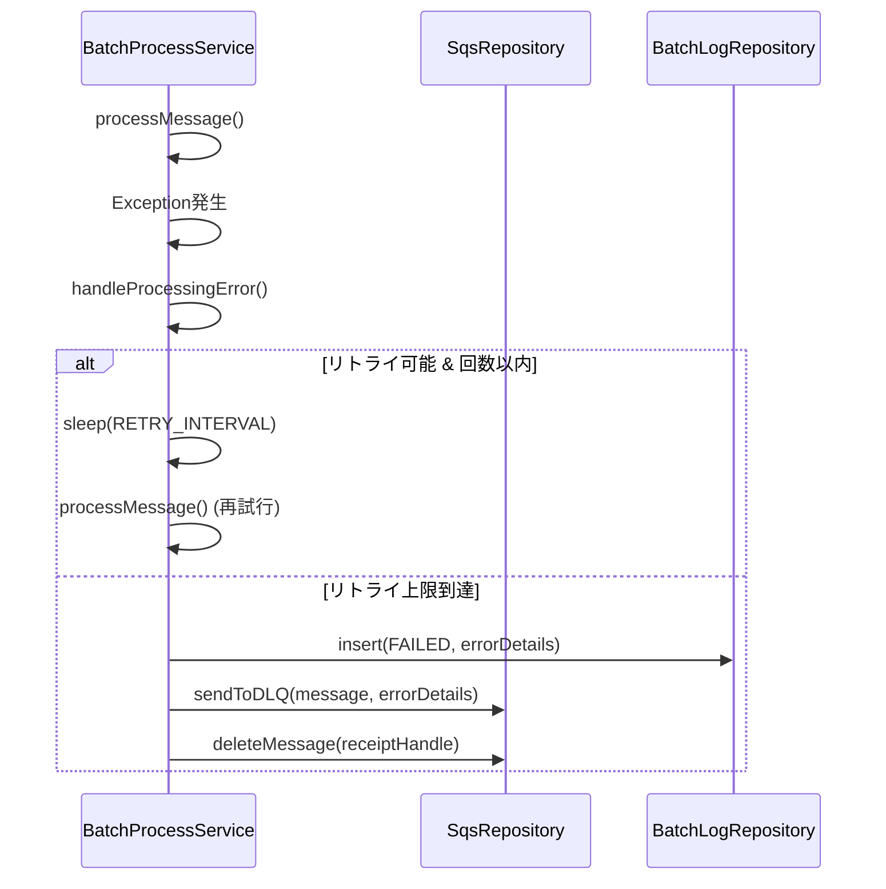

# SQS処理改修計画

## 📋 現状分析

### 実装済みの正常系処理
現在の実装では以下の正常系処理が実装されています：

1. **SQSメッセージ受信** - [`BatchProcessService.receiveMessageWithRetry()`](demo/src/main/java/com/example/demo/application/service/BatchProcessService.java:92)
   - リトライ機能付き（最大3回）
   - リトライ間隔: 1秒

2. **メッセージ処理** - [`BatchProcessService.processMessage()`](demo/src/main/java/com/example/demo/application/service/BatchProcessService.java:112)
   - ビジネスロジックの実行

3. **ステータス記録** - [`BatchProcessService.recordProcessingStatus()`](demo/src/main/java/com/example/demo/application/service/BatchProcessService.java:127)
   - 処理中ステータスをDBに記録

4. **S3アップロード** - [`BatchProcessService.uploadResultToS3()`](demo/src/main/java/com/example/demo/application/service/BatchProcessService.java:136)
   - 処理結果をS3に保存

5. **成功ステータス記録** - [`BatchProcessService.recordSuccessStatus()`](demo/src/main/java/com/example/demo/application/service/BatchProcessService.java:145)
   - 成功ステータスをDBに記録

---

## ⚠️ 問題点の特定

### 1. **キューメッセージ存在チェックの不足**
**問題**: バッチ実行前にキューにメッセージがあるか、または既に処理中かをチェックしていない

**影響**:
- 空のキューに対して無駄な処理が実行される
- 同じメッセージが複数のバッチインスタンスで同時処理される可能性

**現在の動作**:
```java
// BatchProcessService.java:55
String message = receiveMessageWithRetry();
if (message == null) {
    handleNoMessage();  // メッセージなしの場合のみ処理終了
    return;
}
```

### 2. **メッセージ削除（Acknowledge）機能の欠如**
**問題**: 処理成功後にSQSからメッセージを削除する機能がない

**影響**:
- 処理済みメッセージがキューに残り続ける
- Visibility Timeout後に同じメッセージが再度処理される（重複処理）
- キューが処理済みメッセージで溢れる

**現在の実装**:
- [`SqsRepository`](demo/src/main/java/com/example/demo/domain/repository/SqsRepository.java:7)インターフェースに`deleteMessage()`メソッドが存在しない
- [`SqsRepositoryMock`](demo/src/main/java/com/example/demo/infrastructure/repository/SqsRepositoryMock.java:17)でメッセージ削除機能が未実装

### 3. **エラー時の処理が不完全**
**問題**: エラー発生時の詳細なハンドリングとロギングが不足

**影響**:
- エラー原因の特定が困難
- 失敗したメッセージの追跡ができない
- リトライ可能なエラーと不可能なエラーの区別がない

**現在の実装**:
```java
// HelloAwsTasklet.java:51
catch (Exception ex) {
    contribution.setExitStatus(org.springframework.batch.core.ExitStatus.FAILED);
    logger.error("Tasklet異常終了: HelloAwsStep", ex);
    throw ex;  // 例外を再スロー
}
```

**不足している処理**:
- エラー詳細のDB記録
- エラーメッセージのDLQ（Dead Letter Queue）への送信
- エラー種別による処理の分岐

### 4. **重複実行防止機能の欠如**
**問題**: 同じメッセージが複数のバッチインスタンスで同時処理される可能性

**影響**:
- データの二重登録
- 処理の無駄な実行
- リソースの浪費

### 5. **Visibility Timeout管理の欠如**
**問題**: SQSのVisibility Timeout機能を活用していない

**影響**:
- 長時間処理中のメッセージが他のインスタンスで再処理される
- 処理時間の延長ができない

---

## 🎯 改修方針

### アーキテクチャ設計



---

## 📝 改修内容詳細

### 改修1: SQSリポジトリインターフェースの拡張

**対象ファイル**: [`SqsRepository.java`](demo/src/main/java/com/example/demo/domain/repository/SqsRepository.java:7)

**追加メソッド**:
```java
/**
 * メッセージを削除（Acknowledge）
 * @param receiptHandle メッセージのレシートハンドル
 */
void deleteMessage(String receiptHandle);

/**
 * メッセージのVisibility Timeoutを延長
 * @param receiptHandle メッセージのレシートハンドル
 * @param visibilityTimeout 延長する秒数
 */
void changeMessageVisibility(String receiptHandle, int visibilityTimeout);

/**
 * DLQ（Dead Letter Queue）にメッセージを送信
 * @param message 送信メッセージ
 * @param errorDetails エラー詳細
 */
void sendToDLQ(String message, String errorDetails);
```

**理由**: 
- メッセージのライフサイクル管理に必要な機能を追加
- 実際のSQS APIに合わせた設計

---

### 改修2: SqsRepositoryMockの拡張

**対象ファイル**: [`SqsRepositoryMock.java`](demo/src/main/java/com/example/demo/infrastructure/repository/SqsRepositoryMock.java:17)

**追加実装**:
1. **メッセージとレシートハンドルの管理**
   ```java
   private final Map<String, String> messageMap = new ConcurrentHashMap<>();
   private final Queue<String> dlqQueue = new LinkedList<>();
   ```

2. **receiveMessage()の改修**
   - レシートハンドル（UUID）を生成して返却
   - メッセージとレシートハンドルの紐付けを保存

3. **deleteMessage()の実装**
   - レシートハンドルに基づいてメッセージを削除

4. **changeMessageVisibility()の実装**
   - Mock環境ではログ出力のみ

5. **sendToDLQ()の実装**
   - DLQキューにメッセージを追加

---

### 改修3: BatchLogEntityの拡張

**対象ファイル**: [`BatchLogEntity.java`](demo/src/main/java/com/example/demo/domain/entity/BatchLogEntity.java:9)

**追加フィールド**:
```java
private String messageId;          // SQSメッセージID
private String receiptHandle;      // SQSレシートハンドル
private String errorDetails;       // エラー詳細
private Integer retryCount;        // リトライ回数
private LocalDateTime startedAt;   // 処理開始時刻
private LocalDateTime completedAt; // 処理完了時刻
```

**理由**:
- メッセージの追跡とデバッグを容易にする
- 重複実行防止のためのメッセージID管理
- エラー分析のための詳細情報保存

---

### 改修4: schema.sqlの更新

**対象ファイル**: [`schema.sql`](demo/src/main/resources/schema.sql:1)

**追加カラム**:
```sql
ALTER TABLE batch_log ADD COLUMN IF NOT EXISTS message_id VARCHAR(255);
ALTER TABLE batch_log ADD COLUMN IF NOT EXISTS receipt_handle VARCHAR(255);
ALTER TABLE batch_log ADD COLUMN IF NOT EXISTS error_details TEXT;
ALTER TABLE batch_log ADD COLUMN IF NOT EXISTS retry_count INT DEFAULT 0;
ALTER TABLE batch_log ADD COLUMN IF NOT EXISTS started_at TIMESTAMP;
ALTER TABLE batch_log ADD COLUMN IF NOT EXISTS completed_at TIMESTAMP;

-- 重複実行防止用のユニークインデックス
CREATE UNIQUE INDEX IF NOT EXISTS idx_message_id_processing 
ON batch_log(message_id, status) 
WHERE status = 'PROCESSING';
```

---

### 改修5: BatchProcessServiceの大幅改修

**対象ファイル**: [`BatchProcessService.java`](demo/src/main/java/com/example/demo/application/service/BatchProcessService.java:21)

#### 5-1. メッセージ受信処理の改修

**変更前**:
```java
private String receiveMessageWithRetry() {
    // 単純なリトライのみ
}
```

**変更後**:
```java
private SqsMessage receiveMessageWithRetry() {
    // 1. キューのメッセージ数チェック
    // 2. メッセージ受信
    // 3. レシートハンドルの取得
    // 4. メッセージIDの生成
    return new SqsMessage(messageId, content, receiptHandle);
}
```

#### 5-2. 重複実行チェックの追加

**新規メソッド**:
```java
private boolean isMessageProcessing(String messageId) {
    // DBで同じmessageIdのPROCESSINGステータスレコードを検索
    // 存在する場合はtrue（処理中）を返す
}
```

#### 5-3. エラーハンドリングの強化

**新規メソッド**:
```java
private void handleProcessingError(SqsMessage sqsMessage, Exception ex) {
    // 1. エラー種別の判定
    // 2. リトライ可能かチェック
    // 3. 失敗ステータスをDBに記録
    // 4. DLQへの送信（リトライ上限到達時）
    // 5. メッセージ削除
}

private void recordFailureStatus(SqsMessage sqsMessage, Exception ex, int retryCount) {
    BatchLogEntity entity = new BatchLogEntity(
        BATCH_NAME, 
        sqsMessage.getContent(), 
        "FAILED"
    );
    entity.setMessageId(sqsMessage.getMessageId());
    entity.setReceiptHandle(sqsMessage.getReceiptHandle());
    entity.setErrorDetails(getErrorDetails(ex));
    entity.setRetryCount(retryCount);
    entity.setCompletedAt(LocalDateTime.now());
    
    batchLogRepository.insert(entity);
}
```

#### 5-4. Visibility Timeout延長の追加

**新規メソッド**:
```java
private void extendVisibilityIfNeeded(SqsMessage sqsMessage, long processingTimeMs) {
    // 処理時間が長い場合、Visibility Timeoutを延長
    if (processingTimeMs > VISIBILITY_EXTEND_THRESHOLD_MS) {
        sqsRepository.changeMessageVisibility(
            sqsMessage.getReceiptHandle(), 
            VISIBILITY_TIMEOUT_SECONDS
        );
    }
}
```

#### 5-5. メッセージ削除の追加

**変更箇所**:
```java
// 成功時
private void recordSuccessStatus(SqsMessage sqsMessage) {
    // ... ステータス記録 ...
    
    // メッセージ削除を追加
    sqsRepository.deleteMessage(sqsMessage.getReceiptHandle());
    logger.info("SQSメッセージを削除しました - MessageId: %s", sqsMessage.getMessageId());
}

// 失敗時（リトライ上限到達）
private void handleProcessingError(SqsMessage sqsMessage, Exception ex) {
    // ... エラー処理 ...
    
    // DLQへ送信
    sqsRepository.sendToDLQ(sqsMessage.getContent(), getErrorDetails(ex));
    
    // メッセージ削除
    sqsRepository.deleteMessage(sqsMessage.getReceiptHandle());
}
```

---

### 改修6: HelloAwsTaskletの改修

**対象ファイル**: [`HelloAwsTasklet.java`](demo/src/main/java/com/example/demo/presentation/tasklet/HelloAwsTasklet.java:21)

**変更内容**:
```java
@Override
public RepeatStatus execute(StepContribution contribution, ChunkContext chunkContext) 
        throws Exception {
    
    logger.info("Tasklet開始: HelloAwsStep");
    
    try {
        // キューチェックを追加
        if (!batchProcessService.hasMessagesInQueue()) {
            logger.info("キューにメッセージがありません。処理をスキップします。");
            contribution.setExitStatus(org.springframework.batch.core.ExitStatus.COMPLETED);
            return RepeatStatus.FINISHED;
        }
        
        // Application層のServiceにビジネスロジックを委譲
        batchProcessService.executeBatchProcess();
        
        contribution.setExitStatus(org.springframework.batch.core.ExitStatus.COMPLETED);
        logger.info("Tasklet正常終了: HelloAwsStep");
        
        return RepeatStatus.FINISHED;
        
    } catch (Exception ex) {
        // エラー詳細をログに記録（既にServiceで処理済み）
        contribution.setExitStatus(org.springframework.batch.core.ExitStatus.FAILED);
        logger.error("Tasklet異常終了: HelloAwsStep", ex);
        throw ex;
    }
}
```

---

## 🔄 処理フロー（改修後）

### 正常系フロー



### エラー系フロー



---

## 📊 改修対象ファイル一覧

| # | ファイルパス | 改修内容 | 優先度 |
|---|------------|---------|--------|
| 1 | [`SqsRepository.java`](demo/src/main/java/com/example/demo/domain/repository/SqsRepository.java:7) | インターフェース拡張 | 高 |
| 2 | [`SqsRepositoryMock.java`](demo/src/main/java/com/example/demo/infrastructure/repository/SqsRepositoryMock.java:17) | Mock実装の拡張 | 高 |
| 3 | [`BatchLogEntity.java`](demo/src/main/java/com/example/demo/domain/entity/BatchLogEntity.java:9) | フィールド追加 | 高 |
| 4 | [`schema.sql`](demo/src/main/resources/schema.sql:1) | テーブル定義変更 | 高 |
| 5 | [`BatchLogMapper.xml`](demo/src/main/resources/mybatis/mapper/BatchLogMapper.xml:1) | SQL更新 | 高 |
| 6 | [`BatchLogRepository.java`](demo/src/main/java/com/example/demo/domain/repository/BatchLogRepository.java:1) | メソッド追加 | 中 |
| 7 | [`BatchProcessService.java`](demo/src/main/java/com/example/demo/application/service/BatchProcessService.java:21) | 大幅改修 | 高 |
| 8 | [`HelloAwsTasklet.java`](demo/src/main/java/com/example/demo/presentation/tasklet/HelloAwsTasklet.java:21) | キューチェック追加 | 中 |

---

## 🆕 新規作成ファイル

| # | ファイルパス | 内容 | 優先度 |
|---|------------|------|--------|
| 1 | `SqsMessage.java` | SQSメッセージDTO | 高 |
| 2 | `BatchErrorType.java` | エラー種別Enum | 中 |
| 3 | `BatchProcessException.java` | カスタム例外 | 中 |

---

## ✅ 実装チェックリスト

### Phase 1: 基盤整備
- [ ] `SqsMessage` DTOクラスの作成
- [ ] `SqsRepository`インターフェースの拡張
- [ ] `SqsRepositoryMock`の改修
- [ ] `BatchLogEntity`のフィールド追加
- [ ] `schema.sql`の更新
- [ ] `BatchLogMapper.xml`の更新

### Phase 2: リポジトリ層の拡張
- [ ] `BatchLogRepository`に重複チェックメソッド追加
- [ ] `BatchLogRepositoryImpl`の実装

### Phase 3: サービス層の改修
- [ ] `BatchProcessService`のメッセージ受信処理改修
- [ ] 重複実行チェック機能の実装
- [ ] エラーハンドリング強化
- [ ] メッセージ削除機能の実装
- [ ] Visibility Timeout延長機能の実装
- [ ] DLQ送信機能の実装

### Phase 4: プレゼンテーション層の改修
- [ ] `HelloAwsTasklet`のキューチェック追加

### Phase 5: テスト・検証
- [ ] 正常系テスト
- [ ] エラー系テスト
- [ ] 重複実行防止テスト
- [ ] DLQ送信テスト

---

## 🎯 期待される効果

### 1. **信頼性の向上**
- メッセージの重複処理を防止
- 処理済みメッセージの確実な削除
- エラー時の適切なハンドリング

### 2. **運用性の向上**
- エラー原因の追跡が容易
- DLQによる失敗メッセージの管理
- 処理状況の可視化

### 3. **パフォーマンスの向上**
- 無駄な処理の削減
- キューの効率的な管理

### 4. **保守性の向上**
- エラーログの充実
- デバッグの容易化
- コードの可読性向上

---

## 📌 注意事項

### 1. **トランザクション管理**
- メッセージ削除はトランザクション外で実行する必要がある
- DB更新とSQS操作の整合性に注意

### 2. **Visibility Timeout**
- デフォルト値の設定（推奨: 30秒〜5分）
- 処理時間に応じた動的な延長

### 3. **DLQ設定**
- DLQの監視とアラート設定
- DLQメッセージの再処理フロー

### 4. **リトライ戦略**
- リトライ可能なエラーの定義
- リトライ回数と間隔の調整

---

## 🔗 参考資料

- [AWS SQS Best Practices](https://docs.aws.amazon.com/AWSSimpleQueueService/latest/SQSDeveloperGuide/sqs-best-practices.html)
- [Spring Batch Error Handling](https://docs.spring.io/spring-batch/docs/current/reference/html/step.html#errorHandling)
- [Idempotent Processing Patterns](https://microservices.io/patterns/communication-style/idempotent-consumer.html)

---

## 📅 改修スケジュール（目安）

| Phase | 内容 | 依存関係 |
|-------|------|---------|
| Phase 1 | 基盤整備 | なし |
| Phase 2 | リポジトリ層 | Phase 1完了後 |
| Phase 3 | サービス層 | Phase 2完了後 |
| Phase 4 | プレゼンテーション層 | Phase 3完了後 |
| Phase 5 | テスト・検証 | Phase 4完了後 |

---

**作成日**: 2026-04-04  
**バージョン**: 1.0  
**ステータス**: レビュー待ち
