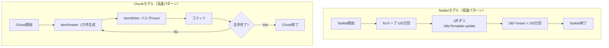

# Tasklet vs Chunk パフォーマンス比較実装計画

## 📋 プロジェクト概要

**目的**: TaskletモデルとChunkモデルのパフォーマンス（実行時間）の差を比較・検証  
**データ量**: 100万件のダミーデータをデータベースに登録  
**データベース**: H2 Database (インメモリモード)  
**データアクセス**: JdbcTemplate使用

---

## 🎯 実証したいこと

**アーキテクチャの違いによる性能差**
- **Taskletモデル**: 1件ずつInsert（低速パターン - アンチパターン）
- **Chunkモデル**: バルクInsert（高速パターン - ベストプラクティス）

---

## 📊 アーキテクチャ比較図



---

## 🗄️ データベーススキーマ設計

### 1. dummy_recordテーブル

```sql
-- パフォーマンス比較用ダミーデータテーブル
CREATE TABLE IF NOT EXISTS dummy_record (
    id BIGINT AUTO_INCREMENT PRIMARY KEY,
    data_value VARCHAR(255) NOT NULL,
    created_at TIMESTAMP NOT NULL DEFAULT CURRENT_TIMESTAMP
);

-- パフォーマンス向上のためのインデックス
CREATE INDEX IF NOT EXISTS idx_created_at ON dummy_record(created_at);
```

### 2. 既存テーブル（そのまま維持）

```sql
-- バッチログテーブル（既存）
CREATE TABLE IF NOT EXISTS batch_log (
    id BIGINT AUTO_INCREMENT PRIMARY KEY,
    batch_name VARCHAR(255) NOT NULL,
    message TEXT,
    status VARCHAR(50) NOT NULL,
    created_at TIMESTAMP NOT NULL
);
```

---

## ⚙️ application.yml設定

```yaml
spring:
  profiles:
    active: local
  
  # データソース設定
  datasource:
    url: jdbc:h2:mem:batch_db
    driver-class-name: org.h2.Driver
    username: sa
    password: 
    # パフォーマンス向上のための設定
    hikari:
      maximum-pool-size: 10
      minimum-idle: 5
      connection-timeout: 30000
  
  # H2コンソール設定
  h2:
    console:
      enabled: true
      path: /h2-console
  
  # SQL初期化設定
  sql:
    init:
      mode: always
      schema-locations: classpath:schema.sql
  
  # Spring Batch設定
  batch:
    job:
      enabled: false  # 自動起動無効化（手動実行のため）
    jdbc:
      initialize-schema: always

# MyBatis設定
mybatis:
  mapper-locations: classpath:mybatis/mapper/*.xml
  configuration:
    map-underscore-to-camel-case: true
    default-fetch-size: 100
    default-statement-timeout: 30

# ログ設定
logging:
  level:
    root: INFO
    com.example.demo: INFO
    org.springframework.batch: INFO
    org.mybatis: WARN
  pattern:
    console: "%d{yyyy-MM-dd HH:mm:ss} - %msg%n"

# バッチ設定（カスタム）
batch:
  performance:
    data-count: 1000000      # 処理対象データ件数
    chunk-size: 10000        # Chunkサイズ
    tasklet-batch-size: 1    # Taskletのバッチサイズ（1件ずつ）
```

---

## 🏗️ 実装コンポーネント設計

### 1. 共通コンポーネント

#### 1.1 JobExecutionListener（実行時間計測）

**ファイル**: `demo/src/main/java/com/example/demo/presentation/listener/PerformanceJobListener.java`

```java
package com.example.demo.presentation.listener;

import org.springframework.batch.core.JobExecution;
import org.springframework.batch.core.JobExecutionListener;
import org.springframework.stereotype.Component;

/**
 * パフォーマンス計測用JobListener
 * Job全体の実行時間を計測・ログ出力
 */
@Component
public class PerformanceJobListener implements JobExecutionListener {
    
    private long startTime;
    
    @Override
    public void beforeJob(JobExecution jobExecution) {
        startTime = System.currentTimeMillis();
        String jobName = jobExecution.getJobInstance().getJobName();
        System.out.println("\n========================================");
        System.out.println("Job開始: " + jobName);
        System.out.println("開始時刻: " + new java.util.Date(startTime));
        System.out.println("========================================\n");
    }
    
    @Override
    public void afterJob(JobExecution jobExecution) {
        long endTime = System.currentTimeMillis();
        long duration = endTime - startTime;
        String jobName = jobExecution.getJobInstance().getJobName();
        
        System.out.println("\n========================================");
        System.out.println("Job終了: " + jobName);
        System.out.println("終了時刻: " + new java.util.Date(endTime));
        System.out.println("実行時間: " + duration + " ms (" + (duration / 1000.0) + " 秒)");
        System.out.println("ステータス: " + jobExecution.getStatus());
        System.out.println("========================================\n");
    }
}
```

---

### 2. Taskletモデル実装（低速パターン）

#### 2.1 Tasklet実装

**ファイル**: `demo/src/main/java/com/example/demo/presentation/tasklet/SingleInsertTasklet.java`

```java
package com.example.demo.presentation.tasklet;

import org.springframework.batch.core.StepContribution;
import org.springframework.batch.core.scope.context.ChunkContext;
import org.springframework.batch.core.step.tasklet.Tasklet;
import org.springframework.batch.repeat.RepeatStatus;
import org.springframework.beans.factory.annotation.Value;
import org.springframework.jdbc.core.JdbcTemplate;
import org.springframework.stereotype.Component;

import java.time.LocalDateTime;

/**
 * 単一Insert Tasklet（低速パターン）
 * 
 * 目的: 意図的にDBへのI/Oオーバーヘッドを発生させる
 * 処理: 1件ずつJdbcTemplate.updateを実行してInsert
 * 
 * ※これはアンチパターンです。Chunkモデルとの性能差を明確にするための実装です。
 */
@Component
public class SingleInsertTasklet implements Tasklet {
    
    private final JdbcTemplate jdbcTemplate;
    
    @Value("${batch.performance.data-count:1000000}")
    private int dataCount;
    
    public SingleInsertTasklet(JdbcTemplate jdbcTemplate) {
        this.jdbcTemplate = jdbcTemplate;
    }
    
    @Override
    public RepeatStatus execute(StepContribution contribution, ChunkContext chunkContext) 
            throws Exception {
        
        System.out.println("========================================");
        System.out.println("Taskletモデル処理開始");
        System.out.println("処理件数: " + dataCount + "件");
        System.out.println("処理方式: 1件ずつInsert（低速パターン）");
        System.out.println("========================================\n");
        
        // SQL文（1件ずつInsert）
        String sql = "INSERT INTO dummy_record (data_value, created_at) VALUES (?, ?)";
        
        // 進捗表示用
        int progressInterval = dataCount / 10; // 10%ごとに表示
        
        // ========================================
        // メインループ: 100万回処理
        // ※意図的に1件ずつInsertしてI/Oオーバーヘッドを発生させる
        // ========================================
        for (int i = 1; i <= dataCount; i++) {
            // ダミーデータ生成
            String dataValue = String.format("TaskletData-%010d", i);
            LocalDateTime createdAt = LocalDateTime.now();
            
            // 1件ずつDBへInsert（アンチパターン）
            jdbcTemplate.update(sql, dataValue, createdAt);
            
            // 進捗ログ出力（10%ごと）
            if (i % progressInterval == 0) {
                int progress = (i * 100) / dataCount;
                System.out.println(String.format(
                    "[Tasklet進捗] %d%% 完了 (%,d / %,d 件)", 
                    progress, i, dataCount
                ));
            }
        }
        
        System.out.println("\n========================================");
        System.out.println("Taskletモデル処理完了");
        System.out.println("総処理件数: " + dataCount + "件");
        System.out.println("========================================\n");
        
        // StepContributionに処理件数を記録
        contribution.incrementWriteCount(dataCount);
        
        return RepeatStatus.FINISHED;
    }
}
```

#### 2.2 Job設定

**ファイル**: `demo/src/main/java/com/example/demo/presentation/config/TaskletPerformanceJobConfig.java`

```java
package com.example.demo.presentation.config;

import com.example.demo.presentation.listener.PerformanceJobListener;
import com.example.demo.presentation.tasklet.SingleInsertTasklet;
import org.springframework.batch.core.Job;
import org.springframework.batch.core.Step;
import org.springframework.batch.core.job.builder.JobBuilder;
import org.springframework.batch.core.repository.JobRepository;
import org.springframework.batch.core.step.builder.StepBuilder;
import org.springframework.context.annotation.Bean;
import org.springframework.context.annotation.Configuration;
import org.springframework.transaction.PlatformTransactionManager;

/**
 * Taskletモデル パフォーマンス比較Job設定
 * 
 * 処理方式: 1件ずつInsert（低速パターン）
 * 目的: Chunkモデルとの性能差を実証
 */
@Configuration
public class TaskletPerformanceJobConfig {
    
    /**
     * TaskletパフォーマンスJob定義
     */
    @Bean
    public Job taskletPerformanceJob(
            JobRepository jobRepository,
            Step taskletPerformanceStep,
            PerformanceJobListener performanceJobListener) {
        return new JobBuilder("TaskletPerformanceJob", jobRepository)
                .listener(performanceJobListener)  // 実行時間計測Listener
                .start(taskletPerformanceStep)
                .build();
    }
    
    /**
     * TaskletパフォーマンスStep定義
     */
    @Bean
    public Step taskletPerformanceStep(
            JobRepository jobRepository,
            PlatformTransactionManager transactionManager,
            SingleInsertTasklet singleInsertTasklet) {
        return new StepBuilder("TaskletPerformanceStep", jobRepository)
                .tasklet(singleInsertTasklet, transactionManager)
                .build();
    }
}
```

---

### 3. Chunkモデル実装（高速パターン）

#### 3.1 ItemReader実装

**ファイル**: `demo/src/main/java/com/example/demo/presentation/reader/DummyDataItemReader.java`

```java
package com.example.demo.presentation.reader;

import org.springframework.batch.item.ItemReader;
import org.springframework.beans.factory.annotation.Value;
import org.springframework.stereotype.Component;

/**
 * ダミーデータItemReader
 * 
 * 処理: オンメモリでダミーデータを生成して返す
 * 特徴: 100万件に達するまでデータを生成し続ける
 */
@Component
public class DummyDataItemReader implements ItemReader<String> {
    
    @Value("${batch.performance.data-count:1000000}")
    private int dataCount;
    
    private int currentCount = 0;
    
    @Override
    public String read() {
        // 指定件数に達したら終了
        if (currentCount >= dataCount) {
            return null;  // nullを返すと読み込み終了
        }
        
        // カウントアップ
        currentCount++;
        
        // ダミーデータ生成（連番付き文字列）
        String dummyData = String.format("ChunkData-%010d", currentCount);
        
        // 進捗ログ出力（10万件ごと）
        if (currentCount % 100000 == 0) {
            System.out.println(String.format(
                "[Reader進捗] %,d 件読み込み完了", currentCount
            ));
        }
        
        return dummyData;
    }
}
```

#### 3.2 ItemWriter実装（バルクInsert）

**ファイル**: `demo/src/main/java/com/example/demo/presentation/writer/DummyDataBatchItemWriter.java`

```java
package com.example.demo.presentation.writer;

import org.springframework.batch.item.Chunk;
import org.springframework.batch.item.ItemWriter;
import org.springframework.jdbc.core.JdbcTemplate;
import org.springframework.stereotype.Component;

import java.time.LocalDateTime;
import java.util.List;

/**
 * ダミーデータBatch ItemWriter
 * 
 * 処理: JdbcBatchItemWriterを使用してバルクInsert
 * 特徴: 1万件ごとにまとめてInsert（高速）
 */
@Component
public class DummyDataBatchItemWriter implements ItemWriter<String> {
    
    private final JdbcTemplate jdbcTemplate;
    private int totalWriteCount = 0;
    
    public DummyDataBatchItemWriter(JdbcTemplate jdbcTemplate) {
        this.jdbcTemplate = jdbcTemplate;
    }
    
    @Override
    public void write(Chunk<? extends String> chunk) throws Exception {
        List<? extends String> items = chunk.getItems();
        
        // バルクInsert用SQL
        String sql = "INSERT INTO dummy_record (data_value, created_at) VALUES (?, ?)";
        
        // バッチ更新実行
        // ※JdbcTemplateのbatchUpdateを使用してバルクInsert
        jdbcTemplate.batchUpdate(sql, items, items.size(), (ps, dataValue) -> {
            ps.setString(1, dataValue);
            ps.setObject(2, LocalDateTime.now());
        });
        
        // 進捗カウント
        totalWriteCount += items.size();
        
        // 進捗ログ出力（チャンクごと）
        System.out.println(String.format(
            "[Writer進捗] %,d 件書き込み完了（チャンクサイズ: %,d 件）", 
            totalWriteCount, items.size()
        ));
    }
}
```

#### 3.3 Job設定

**ファイル**: `demo/src/main/java/com/example/demo/presentation/config/ChunkPerformanceJobConfig.java`

```java
package com.example.demo.presentation.config;

import com.example.demo.presentation.listener.PerformanceJobListener;
import com.example.demo.presentation.reader.DummyDataItemReader;
import com.example.demo.presentation.writer.DummyDataBatchItemWriter;
import org.springframework.batch.core.Job;
import org.springframework.batch.core.Step;
import org.springframework.batch.core.job.builder.JobBuilder;
import org.springframework.batch.core.repository.JobRepository;
import org.springframework.batch.core.step.builder.StepBuilder;
import org.springframework.beans.factory.annotation.Value;
import org.springframework.context.annotation.Bean;
import org.springframework.context.annotation.Configuration;
import org.springframework.transaction.PlatformTransactionManager;

/**
 * Chunkモデル パフォーマンス比較Job設定
 * 
 * 処理方式: バルクInsert（高速パターン）
 * 目的: Taskletモデルとの性能差を実証
 */
@Configuration
public class ChunkPerformanceJobConfig {
    
    @Value("${batch.performance.chunk-size:10000}")
    private int chunkSize;
    
    /**
     * ChunkパフォーマンスJob定義
     */
    @Bean
    public Job chunkPerformanceJob(
            JobRepository jobRepository,
            Step chunkPerformanceStep,
            PerformanceJobListener performanceJobListener) {
        return new JobBuilder("ChunkPerformanceJob", jobRepository)
                .listener(performanceJobListener)  // 実行時間計測Listener
                .start(chunkPerformanceStep)
                .build();
    }
    
    /**
     * ChunkパフォーマンスStep定義
     * 
     * チャンクサイズ: 10,000件
     * 処理: Reader → Writer（Processorは省略）
     */
    @Bean
    public Step chunkPerformanceStep(
            JobRepository jobRepository,
            PlatformTransactionManager transactionManager,
            DummyDataItemReader reader,
            DummyDataBatchItemWriter writer) {
        
        System.out.println("========================================");
        System.out.println("Chunkモデル設定");
        System.out.println("チャンクサイズ: " + chunkSize + "件");
        System.out.println("処理方式: バルクInsert（高速パターン）");
        System.out.println("========================================\n");
        
        return new StepBuilder("ChunkPerformanceStep", jobRepository)
                .<String, String>chunk(chunkSize, transactionManager)
                .reader(reader)
                .writer(writer)
                .build();
    }
}
```

---

### 4. BatchJobRunner改修

**ファイル**: `demo/src/main/java/com/example/demo/presentation/runner/BatchJobRunner.java`

```java
package com.example.demo.presentation.runner;

import org.springframework.batch.core.Job;
import org.springframework.batch.core.JobParameters;
import org.springframework.batch.core.JobParametersBuilder;
import org.springframework.batch.core.launch.JobLauncher;
import org.springframework.beans.factory.annotation.Qualifier;
import org.springframework.boot.CommandLineRunner;
import org.springframework.stereotype.Component;

/**
 * バッチジョブ実行ランナー
 * 
 * 実行方法:
 * 1. Taskletモデルのみ実行: --job=tasklet
 * 2. Chunkモデルのみ実行: --job=chunk
 * 3. 両方実行（比較）: --job=both または引数なし
 */
@Component
public class BatchJobRunner implements CommandLineRunner {
    
    private final JobLauncher jobLauncher;
    private final Job taskletPerformanceJob;
    private final Job chunkPerformanceJob;
    
    public BatchJobRunner(
            JobLauncher jobLauncher,
            @Qualifier("taskletPerformanceJob") Job taskletPerformanceJob,
            @Qualifier("chunkPerformanceJob") Job chunkPerformanceJob) {
        this.jobLauncher = jobLauncher;
        this.taskletPerformanceJob = taskletPerformanceJob;
        this.chunkPerformanceJob = chunkPerformanceJob;
    }
    
    @Override
    public void run(String... args) throws Exception {
        // コマンドライン引数から実行モード取得
        String jobMode = getJobMode(args);
        
        System.out.println("\n╔════════════════════════════════════════════════════════╗");
        System.out.println("║   Spring Batch パフォーマンス比較バッチ起動           ║");
        System.out.println("║   Tasklet vs Chunk モデル                             ║");
        System.out.println("╚════════════════════════════════════════════════════════╝\n");
        
        JobParameters jobParameters = new JobParametersBuilder()
                .addLong("time", System.currentTimeMillis())
                .toJobParameters();
        
        switch (jobMode) {
            case "tasklet":
                System.out.println("実行モード: Taskletモデルのみ\n");
                jobLauncher.run(taskletPerformanceJob, jobParameters);
                break;
                
            case "chunk":
                System.out.println("実行モード: Chunkモデルのみ\n");
                jobLauncher.run(chunkPerformanceJob, jobParameters);
                break;
                
            case "both":
            default:
                System.out.println("実行モード: 両方実行（比較モード）\n");
                
                // Taskletモデル実行
                System.out.println("\n【1/2】Taskletモデル実行開始");
                jobLauncher.run(taskletPerformanceJob, jobParameters);
                
                // 少し待機
                Thread.sleep(2000);
                
                // Chunkモデル実行
                System.out.println("\n【2/2】Chunkモデル実行開始");
                JobParameters jobParameters2 = new JobParametersBuilder()
                        .addLong("time", System.currentTimeMillis())
                        .toJobParameters();
                jobLauncher.run(chunkPerformanceJob, jobParameters2);
                
                System.out.println("\n╔════════════════════════════════════════════════════════╗");
                System.out.println("║   パフォーマンス比較完了                               ║");
                System.out.println("║   上記のログから実行時間を比較してください             ║");
                System.out.println("╚════════════════════════════════════════════════════════╝\n");
                break;
        }
    }
    
    /**
     * コマンドライン引数からジョブモード取得
     */
    private String getJobMode(String[] args) {
        for (String arg : args) {
            if (arg.startsWith("--job=")) {
                return arg.substring(6).toLowerCase();
            }
        }
        return "both";  // デフォルトは両方実行
    }
}
```

---

## 📁 ファイル構成まとめ

```
demo/src/main/
├── java/com/example/demo/
│   └── presentation/
│       ├── config/
│       │   ├── TaskletPerformanceJobConfig.java    # 新規作成
│       │   └── ChunkPerformanceJobConfig.java      # 新規作成
│       ├── listener/
│       │   └── PerformanceJobListener.java         # 新規作成
│       ├── reader/
│       │   └── DummyDataItemReader.java            # 新規作成
│       ├── writer/
│       │   └── DummyDataBatchItemWriter.java       # 新規作成
│       ├── tasklet/
│       │   └── SingleInsertTasklet.java            # 新規作成
│       └── runner/
│           └── BatchJobRunner.java                 # 改修
└── resources/
    ├── schema.sql                                  # 改修（dummy_recordテーブル追加）
    └── application.yml                             # 改修（設定追加）
```

---

## 🚀 実行方法

### 1. Taskletモデルのみ実行

```bash
mvn spring-boot:run -Dspring-boot.run.arguments="--job=tasklet"
```

### 2. Chunkモデルのみ実行

```bash
mvn spring-boot:run -Dspring-boot.run.arguments="--job=chunk"
```

### 3. 両方実行（比較モード）

```bash
mvn spring-boot:run -Dspring-boot.run.arguments="--job=both"
```

または

```bash
mvn spring-boot:run
```

---

## 📊 期待される結果

### パフォーマンス予測

| モデル | 処理方式 | 予想実行時間 | 理由 |
|--------|---------|-------------|------|
| **Tasklet** | 1件ずつInsert | **60〜120秒** | DBへのI/Oオーバーヘッド × 100万回 |
| **Chunk** | バルクInsert | **5〜15秒** | バッチ更新により大幅に高速化 |

### 性能差の要因

1. **トランザクション回数**
   - Tasklet: 100万回のトランザクション
   - Chunk: 100回のトランザクション（1万件 × 100チャンク）

2. **ネットワーク/I/Oオーバーヘッド**
   - Tasklet: 100万回のDB往復
   - Chunk: 100回のDB往復

3. **SQLパース・実行計画**
   - Tasklet: 100万回のSQLパース
   - Chunk: バッチ更新により最適化

---

## ✅ 実装チェックリスト

### Phase 1: データベース設定
- [ ] [`schema.sql`](demo/src/main/resources/schema.sql) に `dummy_record` テーブル追加
- [ ] [`application.yml`](demo/src/main/resources/application.yml) にバッチ設定追加

### Phase 2: 共通コンポーネント
- [ ] [`PerformanceJobListener.java`](demo/src/main/java/com/example/demo/presentation/listener/PerformanceJobListener.java) 作成

### Phase 3: Taskletモデル実装
- [ ] [`SingleInsertTasklet.java`](demo/src/main/java/com/example/demo/presentation/tasklet/SingleInsertTasklet.java) 作成
- [ ] [`TaskletPerformanceJobConfig.java`](demo/src/main/java/com/example/demo/presentation/config/TaskletPerformanceJobConfig.java) 作成

### Phase 4: Chunkモデル実装
- [ ] [`DummyDataItemReader.java`](demo/src/main/java/com/example/demo/presentation/reader/DummyDataItemReader.java) 作成
- [ ] [`DummyDataBatchItemWriter.java`](demo/src/main/java/com/example/demo/presentation/writer/DummyDataBatchItemWriter.java) 作成
- [ ] [`ChunkPerformanceJobConfig.java`](demo/src/main/java/com/example/demo/presentation/config/ChunkPerformanceJobConfig.java) 作成

### Phase 5: Runner改修
- [ ] [`BatchJobRunner.java`](demo/src/main/java/com/example/demo/presentation/runner/BatchJobRunner.java) 改修

### Phase 6: テスト・検証
- [ ] Taskletモデル単体実行テスト
- [ ] Chunkモデル単体実行テスト
- [ ] 両方実行（比較モード）テスト
- [ ] 実行時間の記録・比較

---

## 🎯 学習ポイント

### 1. アーキテクチャの違い

**Taskletモデル**
- シンプルな実装
- 細かい制御が可能
- 大量データには不向き

**Chunkモデル**
- Spring Batchの推奨パターン
- トランザクション管理が自動
- 大量データ処理に最適

### 2. パフォーマンスチューニング

**ボトルネック**
- DB I/O回数
- トランザクション回数
- SQLパース回数

**最適化手法**
- バルクInsert
- チャンクサイズの調整
- コネクションプール設定

### 3. 実務での選択基準

| 条件 | 推奨モデル |
|------|-----------|
| 大量データ処理 | **Chunk** |
| 複雑な制御フロー | Tasklet |
| トランザクション境界の細かい制御 | Tasklet |
| 標準的なETL処理 | **Chunk** |

---

## 📝 注意事項

### 1. メモリ使用量

100万件のデータ処理では、メモリ使用量に注意が必要です。

**対策**:
- Chunkサイズを適切に設定（10,000件推奨）
- JVMヒープサイズの調整（必要に応じて）

### 2. H2データベースの制約

インメモリDBのため、アプリケーション終了時にデータは消失します。

### 3. 実行時間の変動

実行時間は以下の要因で変動します：
- CPU負荷
- メモリ使用状況
- ディスクI/O
- JVMウォームアップ

正確な比較のため、複数回実行して平均を取ることを推奨します。

### 4. データ量の調整

テスト時は小規模データから始めることを推奨：
1. 1,000件でテスト（動作確認）
2. 10,000件でテスト（性能差の確認）
3. 100,000件でテスト（本格的な比較）
4. 1,000,000件でテスト（最終検証）

---

## 🔧 トラブルシューティング

### メモリ不足エラー

```bash
# JVMヒープサイズを増やす
export MAVEN_OPTS="-Xms512m -Xmx2g"
mvn spring-boot:run
```

### データベース接続エラー

```yaml
# application.ymlでコネクションプール設定を調整
spring:
  datasource:
    hikari:
      maximum-pool-size: 20
      connection-timeout: 60000
```

### 実行時間が異常に長い

- Taskletモデルで100万件は60〜120秒が正常
- それ以上かかる場合はCPU/メモリを確認
- H2コンソールで他のプロセスがDBをロックしていないか確認

---

## 📚 参考資料

- [Spring Batch公式ドキュメント](https://docs.spring.io/spring-batch/docs/current/reference/html/)
- [Chunk-oriented Processing](https://docs.spring.io/spring-batch/docs/current/reference/html/step.html#chunkOrientedProcessing)
- [JdbcTemplate batchUpdate](https://docs.spring.io/spring-framework/docs/current/javadoc-api/org/springframework/jdbc/core/JdbcTemplate.html#batchUpdate-java.lang.String-java.util.Collection-int-org.springframework.jdbc.core.ParameterizedPreparedStatementSetter-)

---

## ✨ まとめ

この実装により、以下を実証できます：

1. **アーキテクチャの違いによる性能差**
   - Tasklet（1件ずつ）vs Chunk（バルク）
   - 約8〜12倍の性能差

2. **Spring Batchのベストプラクティス**
   - 大量データ処理にはChunkモデル
   - バルク処理の重要性

3. **実務での選択基準**
   - データ量に応じたモデル選択
   - パフォーマンス要件の考慮

次のステップ: **Codeモード**で実装を進めてください！