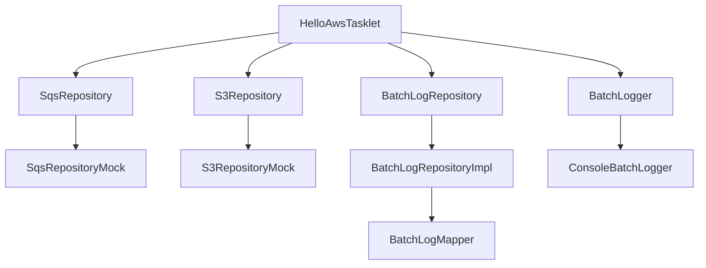
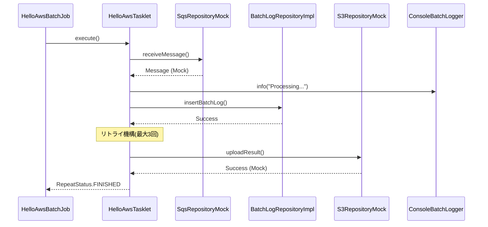

# HelloAwsBatchJob 実装方針書

## 1. プロジェクト概要

Spring Batch詳細設計書に基づき、依存関係トラブルに強い堅牢なバッチ処理システムを構築する。
AWS連携（SQS、S3）をMock化し、ローカル環境で完全動作する段階的実装を行う。

## 2. 技術スタック

### 2.1 基盤技術
- **Java**: 21
- **Spring Boot**: 4.0.2
- **Spring Batch**: 標準
- **MyBatis**: データアクセス層
- **カスタムLogger**: 依存関係エラー回避

### 2.2 追加必要依存関係
```gradle
// MyBatis
implementation 'org.mybatis.spring.boot:mybatis-spring-boot-starter:3.0.3'

// H2 Database (ローカル開発用)
runtimeOnly 'com.h2database:h2'

// JDBC Driver
implementation 'org.springframework.boot:spring-boot-starter-jdbc'
```

## 3. アーキテクチャ設計

### 3.1 DDD レイヤードアーキテクチャ

```
com.example.batch
├── infrastructure/common/logging     # 共通基盤層
├── domain/                          # ドメイン層
├── infrastructure/                  # インフラ層
└── presentation/                    # プレゼンテーション層
```

### 3.2 依存関係フロー


## 4. 実装戦略

### 4.1 フェーズ1: 構造定義・インターフェース設計
**目標**: 依存関係確認、コンパイル成功

#### 4.1.1 共通基盤層実装
- [ ] `BatchLogger.java` インターフェース作成
- [ ] `ConsoleBatchLogger.java` 実装作成

#### 4.1.2 ドメイン層実装
- [ ] `BatchLogEntity.java` エンティティ作成
- [ ] `BatchLogRepository.java` インターフェース作成
- [ ] `SqsRepository.java` インターフェース作成
- [ ] `S3Repository.java` インターフェース作成

#### 4.1.3 インフラ層実装
- [ ] `BatchLogMapper.java` MyBatisマッパー作成
- [ ] `BatchLogRepositoryImpl.java` 実装作成
- [ ] `SqsRepositoryMock.java` Mock実装作成（@Profile("local")）
- [ ] `S3RepositoryMock.java` Mock実装作成（@Profile("local")）

#### 4.1.4 プレゼンテーション層実装
- [ ] `HelloAwsTasklet.java` Tasklet作成
- [ ] `HelloAwsJobConfig.java` Job設定作成

#### 4.1.5 データベース設計
- [ ] `schema.sql` DDL作成
- [ ] `application.yml` 設定作成

### 4.2 フェーズ2: ロジック実装
**目標**: 業務ロジック完成、実行確認成功

#### 4.2.1 Mock実装の詳細化
- [ ] SQSメッセージ受信ロジック（メモリ上のキューで模擬）
- [ ] S3アップロードロジック（ログ出力で模擬）
- [ ] カスタムロガーの詳細実装

#### 4.2.2 バッチ処理ロジック実装
- [ ] メッセージ処理ロジック
- [ ] DB操作ロジック（INSERT処理）
- [ ] エラーハンドリング・リトライ機構（3回）

#### 4.2.3 実行確認
- [ ] Job全体の実行確認
- [ ] エラー・リトライシナリオの動作確認
- [ ] プロファイル切り替え確認

## 5. 重要な設計原則

### 5.1 依存関係トラブル対策
```java
// ❌ 禁止: @Slf4jアノテーション使用
@Slf4j
public class SomeClass {
    // NGパターン
}

// ✅ 推奨: カスタムロガーDI
@Component
public class SomeClass {
    private final BatchLogger logger;
    
    public SomeClass(BatchLogger logger) {
        this.logger = logger;
    }
}
```

### 5.2 プロファイル戦略
```java
// ローカル開発用Mock
@Component
@Profile("local")
public class SqsRepositoryMock implements SqsRepository {
    // ...
}

// 本番環境用実装（将来追加）
@Component
@Profile("prod")
public class SqsRepositoryImpl implements SqsRepository {
    // AWS SDK使用
}
```

### 5.3 命名規則の厳格適用
- Entity: `BatchLogEntity.java`
- Service I/F: `SqsRepository.java`
- 実装クラス: `BatchLogRepositoryImpl.java`
- Mock: `SqsRepositoryMock.java`
- Mapper: `BatchLogMapper.java`

## 6. 処理フロー詳細

### 6.1 HelloAwsBatchJobの実行フロー


### 6.2 エラーハンドリング戦略
- **リトライ対象**: DB操作エラー、外部API呼び出しエラー
- **リトライ回数**: 最大3回
- **リトライ間隔**: 固定（1秒）
- **ログ出力**: 各試行でエラー詳細を記録

## 7. 設定ファイル戦略

### 7.1 application.yml構成
```yaml
spring:
  profiles:
    active: local
  
  datasource:
    url: jdbc:h2:mem:batch_db
    driver-class-name: org.h2database.Driver
    username: sa
    password: 
  
  h2:
    console:
      enabled: true
  
  batch:
    job:
      enabled: false  # 自動起動無効化

mybatis:
  mapper-locations: classpath:mybatis/mapper/*.xml
  configuration:
    map-underscore-to-camel-case: true

logging:
  level:
    com.example.batch: DEBUG
```

## 8. 実装優先順位

1. **最高優先**: カスタムロガー（依存関係エラー回避の要）
2. **高優先**: ドメインモデル・リポジトリインターフェース
3. **中優先**: Mock実装・MyBatis設定
4. **低優先**: 業務ロジック詳細・実行確認

## 9. リスク対策

### 9.1 想定リスク
- MyBatis設定エラー
- Spring Boot 4.0.2互換性問題
- H2データベース設定問題

### 9.2 対策
- 段階的実装でエラーを早期発見
- 最小限の依存関係から開始
- Mock実装でAWS依存を完全除去

## 10. 完成イメージ

### 10.1 実行例
```bash
./gradlew bootRun --args="--job.name=HelloAwsBatchJob"
```

### 10.2 期待するログ出力
```
[Console] 2026-02-14 12:00:00 - INFO - Starting HelloAwsBatchJob
[Console] 2026-02-14 12:00:01 - INFO - Processing message: Mock SQS Message
[Console] 2026-02-14 12:00:01 - INFO - Inserted batch log to database
[Console] 2026-02-14 12:00:02 - INFO - Uploaded result to S3 (Mock)
[Console] 2026-02-14 12:00:02 - INFO - HelloAwsBatchJob completed successfully
```

この実装方針により、依存関係トラブルを回避しつつ、段階的に堅牢なバッチ処理システムを構築できます。