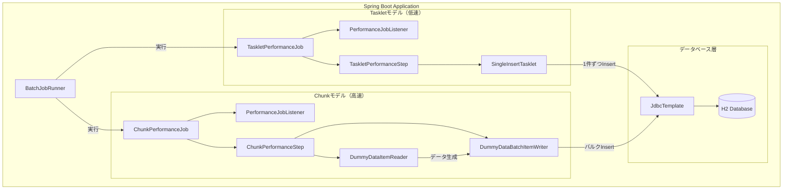
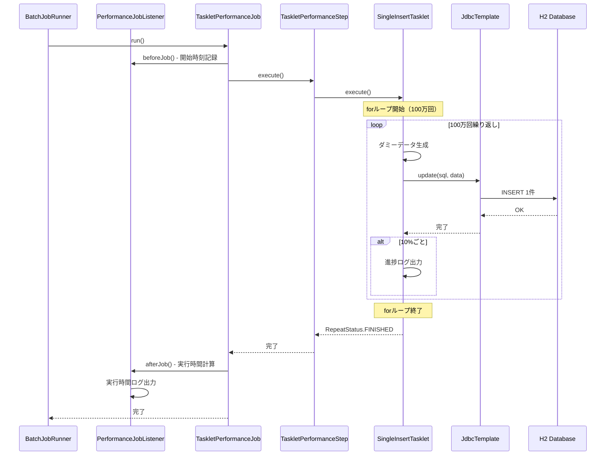
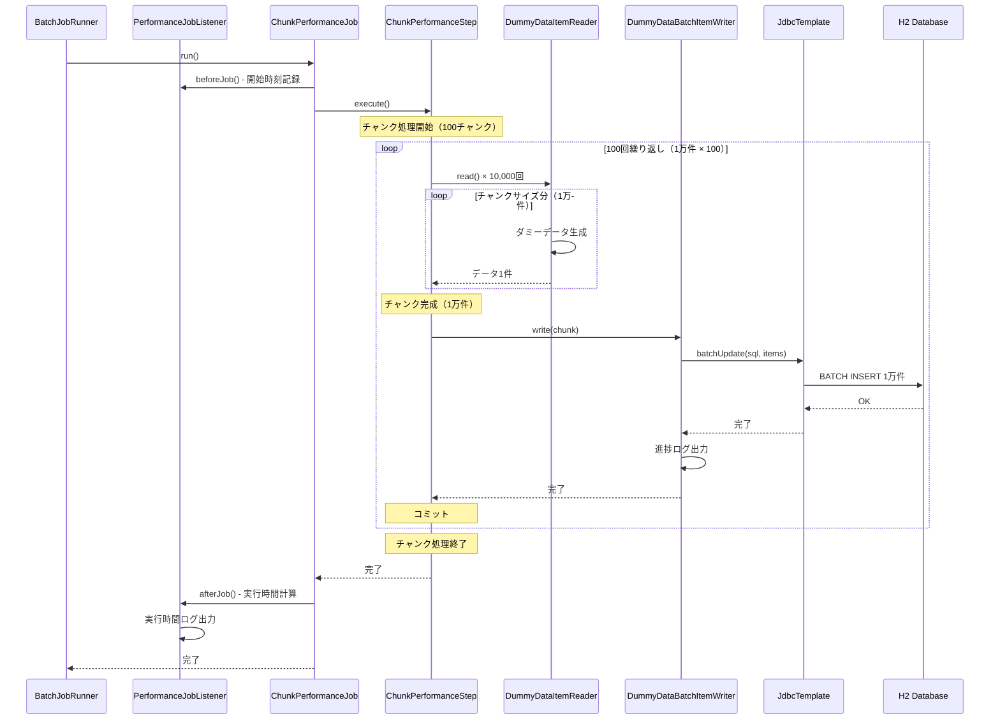
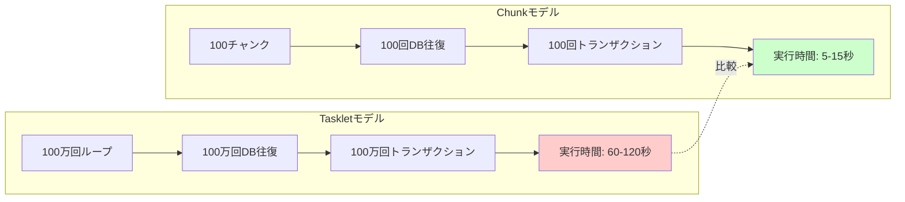
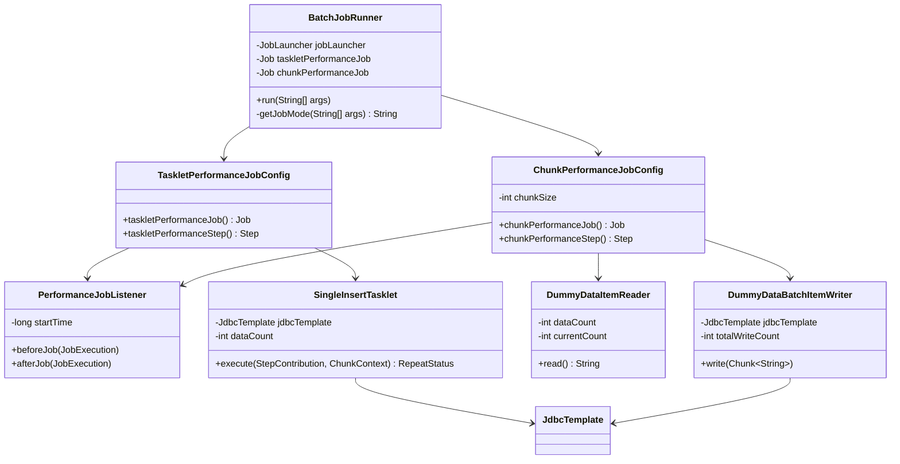
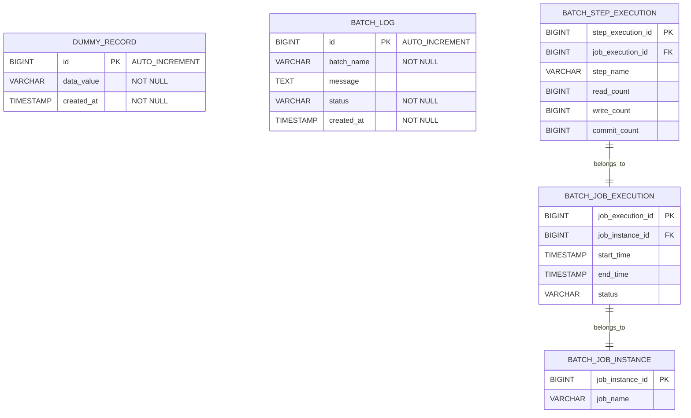
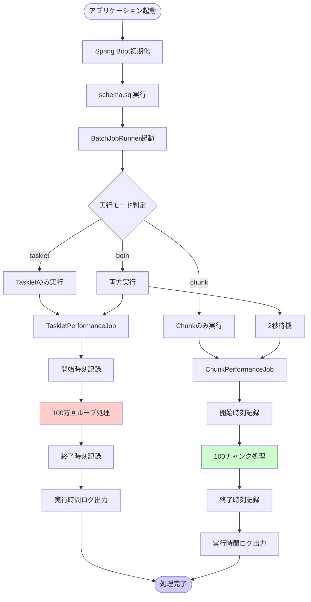
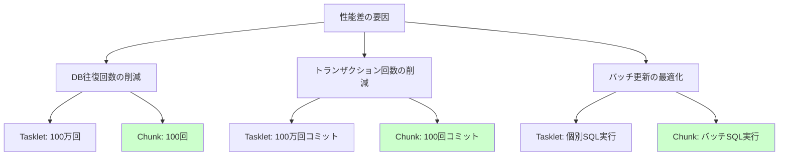

# Tasklet vs Chunk パフォーマンス比較 - アーキテクチャ図

## 📊 システム全体構成



---

## 🔴 Taskletモデル処理フロー（低速パターン）



### Taskletモデルの特徴

**処理方式**:
```java
for (int i = 1; i <= 1000000; i++) {
    String data = "TaskletData-" + i;
    jdbcTemplate.update(
        "INSERT INTO dummy_record (data_value, created_at) VALUES (?, ?)",
        data, LocalDateTime.now()
    );
}
```

**問題点**:
- ✗ 100万回のDB往復
- ✗ 100万回のトランザクション
- ✗ 100万回のSQLパース
- ✗ ネットワーク/I/Oオーバーヘッド大

**予想実行時間**: 60〜120秒

---

## 🟢 Chunkモデル処理フロー（高速パターン）



### Chunkモデルの特徴

**処理方式**:
```java
// Reader: 1件ずつ読み込み（1万回）
public String read() {
    if (currentCount >= 1000000) return null;
    currentCount++;
    return "ChunkData-" + currentCount;
}

// Writer: 1万件まとめてバルクInsert
public void write(Chunk<String> chunk) {
    jdbcTemplate.batchUpdate(sql, chunk.getItems(), ...);
}
```

**利点**:
- ✓ 100回のDB往復（1/10,000）
- ✓ 100回のトランザクション（1/10,000）
- ✓ バッチ更新による最適化
- ✓ ネットワーク/I/Oオーバーヘッド小

**予想実行時間**: 5〜15秒

---

## 📊 パフォーマンス比較



### 性能差の要因

| 項目 | Taskletモデル | Chunkモデル | 改善率 |
|------|--------------|------------|--------|
| **DB往復回数** | 1,000,000回 | 100回 | **10,000倍** |
| **トランザクション回数** | 1,000,000回 | 100回 | **10,000倍** |
| **SQLパース回数** | 1,000,000回 | 100回 | **10,000倍** |
| **予想実行時間** | 60-120秒 | 5-15秒 | **8-12倍高速** |

---

## 🏗️ クラス構成図



---

## 🗄️ データベーススキーマ



### テーブル説明

**dummy_record**:
- パフォーマンス比較用のダミーデータテーブル
- 100万件のデータが格納される

**batch_log**:
- アプリケーション独自のバッチログ（既存）

**BATCH_JOB_INSTANCE / EXECUTION / STEP_EXECUTION**:
- Spring Batchメタデータテーブル（自動生成）
- Job/Stepの実行履歴を記録

---

## 🚀 実行フロー全体像



---

## 📈 期待される出力例

### Taskletモデル実行ログ

```
========================================
Job開始: TaskletPerformanceJob
開始時刻: Sat Apr 04 10:45:00 JST 2026
========================================

========================================
Taskletモデル処理開始
処理件数: 1000000件
処理方式: 1件ずつInsert（低速パターン）
========================================

[Tasklet進捗] 10% 完了 (100,000 / 1,000,000 件)
[Tasklet進捗] 20% 完了 (200,000 / 1,000,000 件)
[Tasklet進捗] 30% 完了 (300,000 / 1,000,000 件)
...
[Tasklet進捗] 100% 完了 (1,000,000 / 1,000,000 件)

========================================
Taskletモデル処理完了
総処理件数: 1000000件
========================================

========================================
Job終了: TaskletPerformanceJob
終了時刻: Sat Apr 04 10:46:30 JST 2026
実行時間: 90000 ms (90.0 秒)
ステータス: COMPLETED
========================================
```

### Chunkモデル実行ログ

```
========================================
Job開始: ChunkPerformanceJob
開始時刻: Sat Apr 04 10:46:32 JST 2026
========================================

========================================
Chunkモデル設定
チャンクサイズ: 10000件
処理方式: バルクInsert（高速パターン）
========================================

[Reader進捗] 100,000 件読み込み完了
[Writer進捗] 10,000 件書き込み完了（チャンクサイズ: 10,000 件）
[Writer進捗] 20,000 件書き込み完了（チャンクサイズ: 10,000 件）
...
[Reader進捗] 1,000,000 件読み込み完了
[Writer進捗] 1,000,000 件書き込み完了（チャンクサイズ: 10,000 件）

========================================
Job終了: ChunkPerformanceJob
終了時刻: Sat Apr 04 10:46:42 JST 2026
実行時間: 10000 ms (10.0 秒)
ステータス: COMPLETED
========================================
```

### 比較結果

```
╔════════════════════════════════════════════════════════╗
║   パフォーマンス比較完了                               ║
║   上記のログから実行時間を比較してください             ║
╚════════════════════════════════════════════════════════╝

【結果】
- Taskletモデル: 90.0秒
- Chunkモデル: 10.0秒
- 性能差: 9倍高速化

【結論】
バルクInsertを使用したChunkモデルが圧倒的に高速！
```

---

## 🎓 学習ポイント

### 1. なぜChunkモデルが速いのか？



### 2. 実務での適用

| シナリオ | 推奨モデル | 理由 |
|---------|-----------|------|
| 大量データ一括登録 | **Chunk** | バルク処理で高速 |
| 複雑な条件分岐 | Tasklet | 柔軟な制御が可能 |
| ETL処理 | **Chunk** | Reader/Writer分離 |
| 単純な集計処理 | Tasklet | シンプルな実装 |

### 3. チューニングポイント

**Chunkサイズの選択**:
- 小さすぎる（100件）: トランザクション回数増加
- 適切（10,000件）: バランス良好
- 大きすぎる（100,000件）: メモリ不足リスク

---

## 📝 まとめ

この実装により、以下を実証できます：

1. **アーキテクチャの違いによる性能差**
   - Tasklet（1件ずつ）vs Chunk（バルク）
   - 約8〜12倍の性能差

2. **Spring Batchのベストプラクティス**
   - 大量データ処理にはChunkモデル
   - バルク処理の重要性

3. **実務での選択基準**
   - データ量に応じたモデル選択
   - パフォーマンス要件の考慮

次のステップ: **Codeモード**で実装を進めてください！
